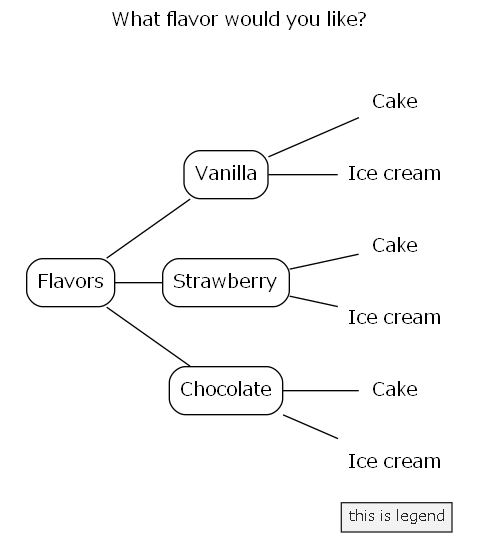
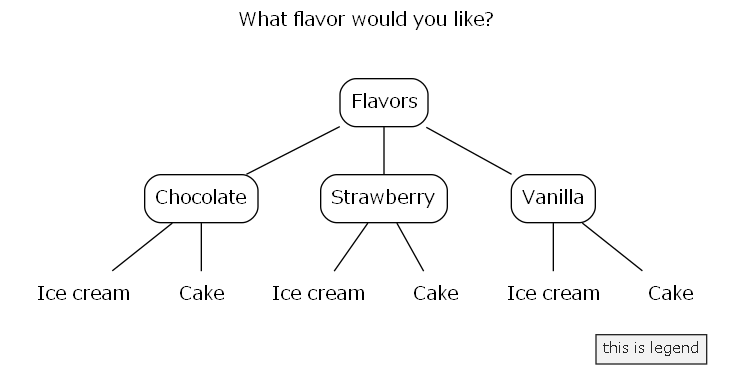
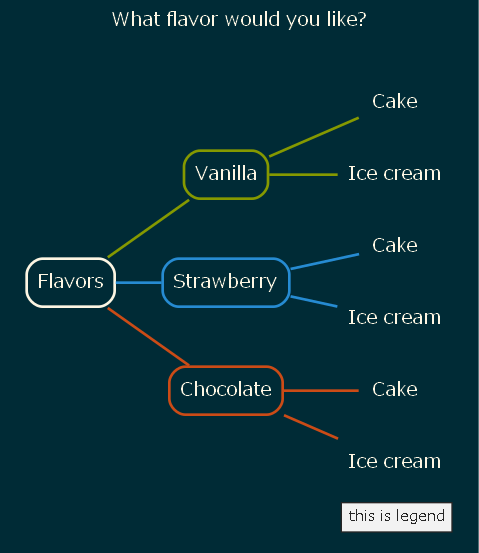
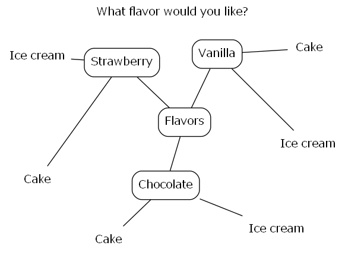
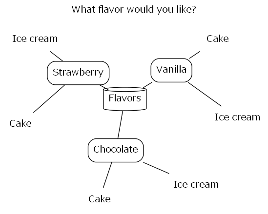
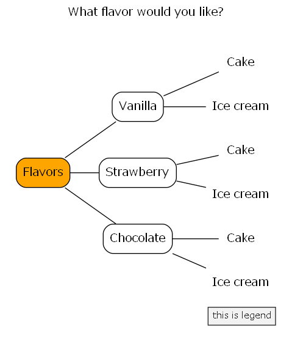
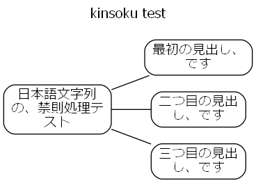
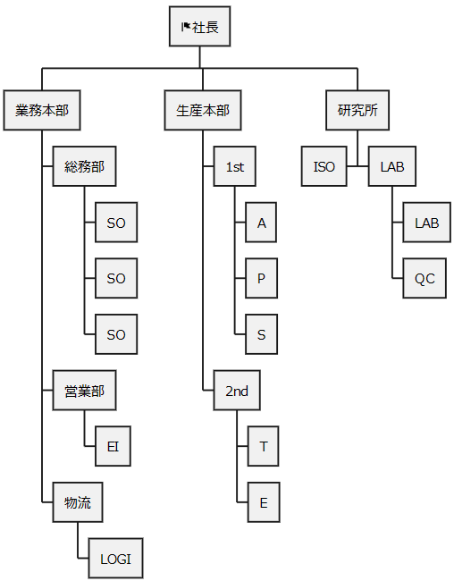

# posh-mocks

A mock-up set of [PowerShell](https://github.com/PowerShell/PowerShell) 7 functions that filter text-object input from the pipeline(stdin) and return text-object (this concept is closer to Bash than PowerShell).Inspired by [Parsing Text with PowerShell (3/3), Steve Lee, January 28th, 2019](https://devblogs.microsoft.com/powershell/parsing-text-with-powershell-3-3/).

- For use in UTF-8 Japanese environments on windows.
- For my personal work and hobby use.
- Note that the code is spaghetti (due to my technical inexperience).
- Insufficient tests and error handlings.

function list:

```powershell
# one-liner to create function list
cat README.md | grep '^#### ' | grep -o '`[^`]+`' | sort | flat -ofs ", " | Set-Clipboard
```

- `Add-CrLf-EndOfFile`, `Add-CrLf`, `addb`, `addl`, `addr`, `addt`, `cat2`, `catcsv`, `chead`, `clip2img`, `clipwatch`, `ConvImage`, `count`, `csv2sqlite`, `csv2txt`, `ctail`, `ctail2`, `delf`, `dot2gviz`, `fillretu`, `flat`, `fwatch`, `Get-OGP(Alias:ml)`, `grep`, `gyo`, `head`, `jl`, `json2txt`, `juni`, `keta`, `kinsoku`, `lcalc`, `linkcheck`, `man2`, `md2mindmap`, `md2mindmap2`, `pu2java`, `pwmake`, `retu`, `rev`, `rev2`, `say`, `sed-i`, `sed`, `self`, `sleepy`, `sm2`, `tac`, `tail`, `tarr`, `tateyoko`, `teatimer`, `tex2pdf`, `toml2psobject`, `uniq`, `yarr`

Inspired by:

- Article
    - [Parsing Text with PowerShell (3/3), Steve Lee, January 28th, 2019](https://devblogs.microsoft.com/powershell/parsing-text-with-powershell-3-3/).
- Unix/Linux commands
    - Commands: `grep`, `sed`, `head`, `tail`, `awk`, `make`, `uniq`, `self`, `delf`, and more...
- [Open-usp-Tukubai - GitHub](https://github.com/usp-engineers-community/Open-usp-Tukubai)
    - License: The MIT License (MIT): Copyright (C) 2011-2022 Universal Shell Programming Laboratory
    - Commands: `man2`, `keta`, `tateyoko`, `gyo`, `fillretu`, `yarr`, `count`, and more...
- [greymd/egzact: Generate flexible patterns on the shell - GitHub](https://github.com/greymd/egzact)
    - License: The MIT License (MIT): Copyright (c) 2016 Yasuhiro, Yamada
    - Commands: `flat`, `addt`, `addb`, `addr`, `addl`, `mirror`, and more...
- [mattn/sleepy - GitHub](https://github.com/mattn/sleepy)
    - License: The MIT License (MIT): Copyright (c) 2022 Yasuhiro Matsumoto
    - Commands: `sleepy`
- [tomnomnom/gron: Make JSON greppable! - GitHub](https://github.com/tomnomnom/gron)
    - License: The MIT License (MIT): Copyright (c) 2016 Tom Hudson
    - Commands: `gron`
- [禁則処理 - PyJaPDF](http://pyjapdf.linxs.org/home/kinsoku)
    - Commands: `kinsoku.py`
- [miyamiya/mypss: My PowerShell scripts - GitHub](https://github.com/miyamiya/mypss)
    - Commands: `Get-Draw.ps1`
- [ImageMagick](https://imagemagick.org/index.php)
    - Commands: `convert`, `magick convert`(on windows)


コード群にまとまりはないが、事務職（非技術職）な筆者の毎日の仕事（おもに文字列処理）を、より素早くさばくための道具としてのコマンドセットを想定している（毎日使用する関数は10個に満たないが）。

基本的に入力としてUTF-8で半角スペース区切り、行指向の文字列データ（テキストオブジェクト）を期待する、主にパターンマッチング処理を行うためのフィルタ群。少しながら、オブジェクトのパイプライン入力を受け付けたり、オブジェクトとして出力する「PowerShellのコマンドレット的といえるもの」も、ある。Windows上でしか動かない関数も、ある。

`src`下のファイルは1ファイル1関数。関数名はファイル名から`_function.ps1`をのぞいた文字列。基本的に他の関数には依存しないようにしているので、関数ファイル単体を移動して利用することもできる。（一部の関数は他の関数ファイルに依存しているものもある）

**充分なエラー処理をしていない**モックアップ。


## Install functions

1. Comment out unnecessary lines (functions) in `operator.ps1`
2. Dot sourcing `operator.ps1` (and optional `operator-extra.ps1`)

```powershell
# install all functions
. path/to/posh-mocks/operator.ps1
. path/to/posh-mocks/operator-extra.ps1
```

関数は一部を除きできるだけ他の関数と依存しないようにしている。
必要な関数単独を直接ドットソースで読み込んでもよい。
この場合、以下のように最初にカレントプロセスのエンコードを`UTF-8`にしておくとよい。
理由は、当関数群が基本的にパイプライン経由の入出力として`UTF-8`を想定しているため。


```powershell
# install favorite functions for japanese environment
# set encode
if ($IsWindows){
    chcp 65001
    [System.Console]::OutputEncoding = [System.Text.Encoding]::GetEncoding("utf-8")
    [System.Console]::InputEncoding  = [System.Text.Encoding]::GetEncoding("utf-8")
    # compartible with multi byte code
    $env:LESSCHARSET = "utf-8"
}
# sourcing dot files
. path/to/posh-mocks/src/hoge_function.ps1
. path/to/posh-mocks/src/piyo_function.ps1
```


## Description of each functions

各関数の挙動と作った動機と簡単な説明。

### Show functions

#### `man2` - Enumerate the function names

`src`配下の関数（ファイル）名を列挙する。
筆者は作った関数をすぐに忘れてしまうため。

- Usage
    - `man2 man2`
    - `man2 [-c <int>] [func-name]`
- 挙動
    - `man2`関数ファイルと同階層にある`*_function.ps1`ファイルから`_function.ps1`を除去して列挙する
- 依存
    - `flat`, `tateyoko`, `keta`
- Examples
    - `man2`
    - `man2 -c 4`
    - `man2 man2`
    - `man2 keta`
- Inspired by [Open-usp-Tukubai - GitHub](https://github.com/usp-engineers-community/Open-usp-Tukubai)
    - License: The MIT License (MIT): Copyright (C) 2011-2022 Universal Shell Programming Laboratory
    - Command: `man2`

### Unix-like text filters

#### `sed` - Stream EDitor

文字列を置換する。Windows用。
Linux環境で使う`sed`のような使用感で文字列を置換するが、劣化コピーである。
`"string" | ForEach-Object{ $_ -replace 'reg','str' }`と同じ効果を得る。
`sed`は（筆者が毎日）よく使うコマンドなので、Bash・PowerShellとも同じ使用感・より短い文字数で利用できるようにした。

- Usage
    - `man2 sed`
    - `sed 's;<regex-pattern>;<replace-strings>;g'`
        - 左から2文字目が区切り文字。`sed 's@hoge@piyo@g'`と書いてもよい
    - `sed 's;<regex-pattern>;<replace-strings>;'`
        - 末尾に`g`がない場合、行の左から右にみて最初にヒットした`regex-pattern`のみ置換する
        - このユースケースでは大文字小文字が区別される点に注意する
    - ```sed "s;`t;<replace-strings>;g"```
        - ダブルクオートで囲むと``` `t ```や``` `r`n ```などの制御文字を置換可能
        - Bashで使う`sed`のように`\t`や`\n`ではない点に注意
- Inspired by Unix/Linux Commands
    - Command: `sed`

#### `sed-i` - Edit files in place

文字列を置換し、かつファイルを上書き。
Linuxでいう`sed -i`（の劣化コピー）。ただし誤爆防止のため`-Execute`スイッチを使用しなければ上書きはしない。
同じ動作をするPowerShellワンライナーがいつも長くなるので。

- Usage
    - `man2 sed-i`
    - `sed-i 's;<before>;<after>;g' file [-Execute] [-Overwrite|-OverwriteBackup]`
    - デフォルトでdry run、かつ、バックアップ作成（.bak）ありの安全動作
- Examples
    - `sed-i 's;abc;def;g' file -Execute`
        - Linux: `sed -i.bak 's;abc;def;g' file` と等価（`.bak`ファイルにオリジナルファイルをバックアップ）
    - `sed-i 's;abc;def;g' file -Execute -OverWrite`
        - Linux: `sed -i 's;abc;def;g' file` と等価（上書き）↓
    - `sed-i 's;<before>;<after>;g','s;<before>;<after>;g',... file`
        - 置換文字列はカンマ区切りで複数指定できる
- Inspired by Unix/Linux Commands
    - Command: `sed`

#### `grep` - Seaches for regex patterns

文字列の検索とヒット行の出力。Windows用。
Linux環境で使う`grep`のような使用感で文字列を検索するが、劣化コピーである。
`Select-String -Pattern <reg>`と同じ効果を得る。
`grep`は（筆者が毎日）よく使うコマンドなので、Bash・PowerShellとも同じ使用感・より短い文字数で利用できるようにした。

デフォルトで大文字小文字を区別しないが、
-CaseSensitiveスイッチで大文字小文字を区別する

指定したパターンはデフォルトで正規表現として解釈するが、
[-s|-SimpleMatch]オプションでパターンを文字列として認識する

- Usage
    - `man2 grep`
    - `grep '<regex>' -H file1,file2,...`
    - `cat file1,file2,... | grep '<regex>' [-v][-f][-s][-C <int>[,<int>]]`
    - `cat file1,file2,... | grep '<regex>' [-o]`
- Inspired by Unix/Linux Commands
    - Command: `grep`
- Learn
    - [about Splatting - PowerShell](https://learn.microsoft.com/en-us/powershell/module/microsoft.powershell.core/about/about_splatting) ([ja-jp](https://learn.microsoft.com/ja-jp/powershell/module/microsoft.powershell.core/about/about_splatting))

検索速度は遅い。筆者の環境ではシンプルに`Select-String`を用いた方が速い。
したがって、あまり引数をもちいないシンプルな用途であれば、
`Set-Alias -name grep -value Select-String`としたほうがより速く動作する
（むしろ`grep`よりも`sls`の方が文字数が少ないので、何もせずそのまま`sls`を用いてもよい）。


```powershell
# Select-String (fast)
1..10 | %{ Measure-Command{ 1..100000 | sls 99999 }} | ft

Days Hours Minutes Seconds Milliseconds
---- ----- ------- ------- ------------
0    0     0       0       437
0    0     0       0       386
0    0     0       0       394
0    0     0       0       385
0    0     0       0       407
0    0     0       0       715
0    0     0       0       424
0    0     0       0       424
0    0     0       0       443
0    0     0       0       423
```

```powershell
# grep (slow)
1..10 | %{ Measure-Command{ 1..100000 | grep 99999 }} | ft

Days Hours Minutes Seconds Milliseconds
---- ----- ------- ------- ------------
0    0     0       1       84
0    0     0       1       74
0    0     0       1       287
0    0     0       1       81
0    0     0       1       186
0    0     0       1       186
0    0     0       1       79
0    0     0       1       382
0    0     0       1       178
0    0     0       1       183
```


Examples

- ref: [Select-String (Microsoft.PowerShell.Utility) - PowerShell](https://learn.microsoft.com/en-us/powershell/module/microsoft.powershell.utility/select-string)

```powershell
# Find a case-sensitive match (grep 'regex' -CaseSensitive)

'Hello', 'HELLO' | grep 'HELLO' -CaseSensitive -SimpleMatch

HELLO
```

```powershell
# Find a pattern match (grep 'regex')

grep '\?' -H "$PSHOME\en-US\*.txt"
    https://go.microsoft.com/fwlink/?LinkID=108518.
    or go to: https://go.microsoft.com/fwlink/?LinkID=210614
    or go to: https://go.microsoft.com/fwlink/?LinkID=113316
      Get-Process -?         : Displays help about the Get-Process cmdlet.
```

```powershell
# Find matches in text files (grep 'regex' -H file,file,...)

Get-Alias   | Out-File -FilePath .\Alias.txt   -Encoding UTF8
Get-Command | Out-File -FilePath .\Command.txt -Encoding UTF8
grep 'Get\-' -H .\*.txt | Select-Object -First 5

Alias.txt:7:Alias           cal2 -> Get-OLCalendar
Alias.txt:8:Alias           cat -> Get-Content
Alias.txt:28:Alias           dir -> Get-ChildItem
Alias.txt:44:Alias           gal -> Get-Alias
Alias.txt:46:Alias           gbp -> Get-PSBreakpoint
```

```powershell
# Skip blank lines (grep ".")

PS> "aaa","","bbb","ccc"
aaa

bbb
ccc

PS> "aaa","","bbb","ccc" | grep .
aaa
bbb
ccc
```

```powershell
# Find a string in subdirectories (grep 'regex' -H file,file,... [-r|Recurse])

grep 'tab' -H '*.md' -r [-FileNameOnly|-FileNameAndLineNumber]

Table: caption
:::{.table2col}
| table |

The following commands are also approximately equivalent

ls *.md -Recurse | grep "table"

table2col.md:10:Table: caption
table2col.md:12::::{.table2col}
table2col.md:66:| table |
```

```powershell
# Find strings that do not match a pattern (grep 'regex' [-v|-NotMatch])

Get-Command | Out-File -FilePath .\Command.txt -Encoding utf8
cat .\Command.txt | grep "Get\-", "Set\-" -NotMatch | Select-Object -Last 5

Cmdlet  rite-Output   7.0.0.0  Microsoft.PowerShell.Utility
Cmdlet  rite-Progress 7.0.0.0  Microsoft.PowerShell.Utility
Cmdlet  rite-Verbose  7.0.0.0  Microsoft.PowerShell.Utility
Cmdlet  rite-Warning  7.0.0.0  Microsoft.PowerShell.Utility
```

```powershell
# Use double quotes when searching for tab characters (grep "`t")

 "1,2,3", "4,5,6", "7,8,9", "" | %{ $_ -replace ',', "`t" } | grep "`t[28]"

1       2       3
7       8       9
```

```powershell
# Find lines before and after a match (grep "regex" -C <int>,<int> )

Get-Command | Out-File -FilePath .\Command.txt -Encoding utf8
cat .\Command.txt | grep 'Get\-Computer' -C 2, 3

  Cmdlet   Get-Command        7.3.1.500  Microsoft.PowerShell.Core
  Cmdlet   Get-ComputeProcess 1.0.0.0    HostComputeService
> Cmdlet   Get-ComputerInfo   7.0.0.0    Microsoft.PowerShell.Management
  Cmdlet   Get-Content        7.0.0.0    Microsoft.PowerShell.Management
  Cmdlet   Get-Counter        7.0.0.0    Microsoft.PowerShell.Diagnostics
  Cmdlet   Get-Credential     7.0.0.0    Microsoft.PowerShell.Security
```

```powershell
# Tips: use Out-String -Stream (alias:oss) to greppable

cat .\Command.txt | grep 'Get\-Computer' -C 2, 3 | oss | grep '>'

> Cmdlet   Get-ComputerInfo   7.0.0.0    Microsoft.PowerShell.Management
```

```powershell
# Find all pattern matches (grep 'regex' -o)

cat "$PSHOME\en-US\*.txt" | grep "PowerShell"

    PowerShell Help System
    Displays help about PowerShell cmdlets and concepts.
    PowerShell Help describes PowerShell cmdlets, functions, scripts, and
    modules, and explains concepts, including the elements of the PowerShell
    PowerShell does not include help files, but you can read the help topics
    You can find help for PowerShell online at
       1. Start PowerShell with the "Run as administrator" option.
      Get-Help About_Modules : Displays help about PowerShell modules.

cat "$PSHOME\en-US\*.txt" | grep "PowerShell" -o
PowerShell
PowerShell
PowerShell
PowerShell
PowerShell
PowerShell
PowerShell
PowerShell
PowerShell
```

これは`Select-String（alias:sls）`を用いて以下のようにも書ける。


```powershell
# パイプラインをつなげているときに
# カッコ()を追加するのは手戻りがあって面倒で楽しくない
(cat "$PSHOME\en-US\*.txt" | sls "PowerShell" -AllMatches).Matches.Value

PowerShell
…(以下略)
```

筆者は、パイプでコマンドをつないでいるときに`()`を書きたくない。
パイプで右に右にとコマンドをつないでいくのは楽しいが、
手戻りして`()`を追加するのは面倒で楽しくない。

`grep`で`Select-String`の（速度の遅い劣化版）ラッパーを作った理由もこのあたりにある。
単に`grep 'regex'`する場合は、`sls 'regex'`とした方が速い。
しかし、ちょっと複雑な（だが筆者的にはよく使う）オプション、
たとえば`grep 'regex' -o`や`grep 'regex' -H <files> -FileNameOnly`などは、
余計なカッコ`()`や長いパイプを書かずに済むので良い。


```powershell
# このように書けばカッコ()は書かなくてよいが、
# grep -oと書けばすむところ、2つも多くパイプを
# つなげることになるのであまり楽しくない
cat "$PSHOME\en-US\*.txt" `
    | sls "PowerShell" -AllMatches `
    | select -ExpandProperty Matches `
    | select -ExpandProperty Value

PowerShell
…(以下略)
```


```powershell
# Convert pipeline objects to strings using Out-String -Stream

$hash = @{
    Name     = 'foo'
    Category = 'bar'
}

# !! NO output, due to .ToString() conversion
$hash | grep 'foo'

# Out-String converts the output to a single multi-line string object
$hash | Out-String | grep 'foo'

Name           Value
----           -----
Name           foo
Category       bar

# Out-String -Stream converts the output to a multiple single-line string objects
$hash | Out-String -Stream | grep 'foo'

Name           foo
```

#### `head`, `tail` - Output the first/last part of files

入力文字列の最初の数行または最後の数行を出力する。
Linux環境で使う`head`、`tail`のような使用感で文字列を置換する。
`"string" | Select-Object -First <int> / -Last <int>`と同じ効果を得る。

- Usage
    - `man2 head`
    - `man2 tail`
- Examples
    - `1..20 | head [-n <int>]`
    - `1..20 | tail [-n <int>]`
    - `head *.*`
    - `tail *.*`
- Inspired by Unix/Linux Commands
    - Command: `head`, `tail`

#### `chead`, `ctail`, `ctail2` - Cut the first/last part of files

入力文字列の最初の数行または最後の数行を削除（カット）して出力する。
`"string" | Select-Object -Skip <int> / -SkipLast <int>`と同じ効果を得る。

- Usage
    - `man2 chead`
    - `man2 ctail`
    - `man2 ctail2`,
- Examples
    - `1..20 | chead  [-n <int>]`
    - `1..20 | ctail2 [-n <int>]`
    - `1..20 | ctail`
        - `ctail`は**末尾1行のみ**削除
        - 場合により`ctail2`よりも高速に動作するかもしれない
- Inspired by Unix/Linux Commands
    - Command: `chead`

#### `uniq` - Report or omit repeated lines

入力から隣接する（連続する）重複行をなくし一意とする。大文字小文字は区別しない。事前ソート必要。
`Group-Object -NoElement`と同じ効果。

- Usage
    - `man2 uniq`
    - `uniq [-c|-d]`
- Examples
    - `1,2,3,4,5,3 | sort | uniq`
    - `1,2,3,4,5,3 | sort | uniq -c`
- Inspired by Unix/Linux Commands
    - Command: `uniq`

#### `cat2` - Concatenate files and print on the standard output

テキストファイルのコンテンツを取得。
複数ファイルを指定する方法は、`Get-Content`の際の「カンマ区切り」ではなく「半角スペース区切り」。
引数にハイフン「`-`」指定で標準入力から読み込み。

- Usage
    - `man2 cat2`
    - `cat2 file1 file2 file3...`
- Inspired by Unix/Linux Commands
    - Command: `cat`

#### `tac` - Output strings in reverse

入力を行単位逆順に出力する。

- Usage
    - `man2 tac`
- Examples
    - `1..5 | tac`
    - `tac a.txt,b.txt`
- Inspired by Unix/Linux Commands
    - Command: `tac`

Examples:

```powoershell
1..5 | tac
5
4
3
2
1
```

#### `rev` - Reverse strings

文字列を行内で反転する。

- Usage
    - `man2 rev`
- Examples
    - `"aiueo" | rev`
- Inspired by Unix/Linux Commands
    - Command: `rev`

Examples:

```powershell
"aiueo" | tac
oeuia
```
#### `rev2` - Reverse strings

半角スペースで区切られた列をリバースする。
列内の文字列はリバースしない。
入力はパイプのみ受け付け。

- Usage
    - `man2 rev2`
- Inspired by Unix/Linux Commands
    - Command: `rev`
- Inspired by [greymd/egzact: Generate flexible patterns on the shell - GitHub](https://github.com/greymd/egzact)
    - License: The MIT License (MIT): Copyright (c) 2016 Yasuhiro, Yamada
    - Command: `mirror`

Examples:

```powershell
.EXAMPLE
PS> Write-Output "01 02 03" | rev2
03 02 01

.EXAMPLE
PS> Write-Output "01 02 03" | rev2 -e
01 02 03
03 02 01
```


### text filters for space-separated input

#### `tateyoko` - Transpose columns and rows

半角スペース区切り行列の転置（半角スペース区切り文字列の縦横変換）。
列数は不揃いでもよい。

- Usage
    - `man2 tateyoko`
- Examples
    - `"1 2 3","4 5 6","7 8 9" | tateyoko`
- Inspired by [Open-usp-Tukubai - GitHub](https://github.com/usp-engineers-community/Open-usp-Tukubai)
    - License: The MIT License (MIT): Copyright (C) 2011-2022 Universal Shell Programming Laboratory
    - Command: `tateyoko`

Examples:

```powershell
"1 2 3","4 5 6","7 8 9"
1 2 3
4 5 6
7 8 9

"1 2 3","4 5 6","7 8 9" | tateyoko
1 4 7
2 5 8
3 6 9
```

#### `fillretu` - Align records to the maximum number of columns

半角スペース区切りレコードの列数を最大列数にそろえる。
不足列を埋める、で、fill（埋める）＋retu（列）。
列数がそろっていると何かと都合よい。

- Usage
    - `man2 fillretu`
    - `cat a.txt | fillretu`

Input:

```powershell
cat a.txt
2018 3 3 3
2017 1 1 1 1 1
2022 5 5
```

Output:

```powershell
cat a.txt | fillretu
2018 3 3 3 _ _
2017 1 1 1 1 1
2022 5 5 _ _ _
```

`tateyoko`とのコンビネーション。

```powershell
cat a.txt | fillretu | tateyoko | keta
2018 2017 2022
   3    1    5
   3    1    5
   3    1    _
   _    1    _
   _    1    _
```

#### `juni` - Enumerate the number of rows in each line

各行の行数を列挙

- Usage
    - `man2 juni`
    - `juni [-z]`
- Examples
    - `cat a.txt | juni`
- Inspired by [Open-usp-Tukubai - GitHub](https://github.com/usp-engineers-community/Open-usp-Tukubai)
    - License: The MIT License (MIT): Copyright (C) 2011-2022 Universal Shell Programming Laboratory
    - Command: `juni`

Output:

```powershell
"a".."d" | juni
1 a
2 b
3 c
4 d
```

#### `self` - Select fields

半角スペース区切りの標準入力から任意の列のみ抽出する。
すべての列は'0'で、最終列は'NF'で指定することもできる

1.2.3と指定すると、1列目の2文字目から3文字を切り出し
切り出し文字数が対象文字数よりも多い場合は切り取れる範囲のみ切り出し。


- Usage
    - `man2 self`
    - `self <num> <num>...`
- Examples
    - `"1 2 3","4 5 6","7 8 9" | self 1 3`
- Inspired by [Open-usp-Tukubai - GitHub](https://github.com/usp-engineers-community/Open-usp-Tukubai)
    - License: The MIT License (MIT): Copyright (C) 2011-2022 Universal Shell Programming Laboratory
    - Command: `self`

Examples detail:

```powershell
# select field 1 and 3
"1 2 3","4 5 6","7 8 9" | self 1 3
1 3
4 6
7 9
```

```powershell
# select 2nd field and and
# cut out 2 characters from the 2nd character
"123 456 789","223 523 823" | self 2.2.2
56
23

# select entire line and add 2nd field,
# and cut out 2 characters from the 2nd character in the 2nd field
"123 456 789","223 523 823" | self 0 2.2.2
123 456 789 56
223 523 823 23
```

```powershell
# select the 1st field from the leftmost field and
# select the 2nd field from the rightmost field(=NF)
"1 2 3 4 5","6 7 8 9 10" | self 1 NF-1
1 4
6 9
```


#### `delf` - Delete fields

半角スペース区切りの標準入力から指定列のみ削除する
最終列を'NF'で指定することもできる


- Usage
    - `man2 delf`
    - `delf <num> <num>...`
- Examples
    - `"1 2 3","4 5 6","7 8 9" | delf 1 3`
- Inspired by [Open-usp-Tukubai - GitHub](https://github.com/usp-engineers-community/Open-usp-Tukubai)
    - License: The MIT License (MIT): Copyright (C) 2011-2022 Universal Shell Programming Laboratory
    - Command: `delf`

Examples detail:

```powershell
# delete field 1 and 2
"1 2 3","4 5 6","7 8 9" | delf 1 2
3
6
9
```

```powershell
# delete field 1 and 2nd field from right
"1 2 3 4 5","6 7 8 9 10" | delf 1 NF-1
2 3 5
7 8 10
```

#### `sm2` - Sum up

半角スペース区切りの標準入力から指定列の合計を算出（サムアップ）する。

`sm2 <k1> <k2> <s1> <s2>`と指定することで、
`<k1>`列から`<k2>`列をキーとして`<s1>`列から`<s2>`列までを合計する。

`sm2 0 0 <s1> <s2>`と指定すると全行サムアップ。
ファイルのキーの事前ソートが必要。
大文字小文字を区別しない。


- Usage
    - `man2 sm2`
    - `sm2 [+count] <k1> <k2> <s1> <s2>`
- Options
    - `+count`: 合計した行数を最左列に出力
- Examples
    - `"A 1 10","B 1 10","A 1 10","C 1 10" | sort | sm2 1 2 3 3`
- Inspired by [Open-usp-Tukubai - GitHub](https://github.com/usp-engineers-community/Open-usp-Tukubai)
    - License: The MIT License (MIT): Copyright (C) 2011-2022 Universal Shell Programming Laboratory
    - Command: `delf`

Examples detail:

```powershell
# input
"A 1 10","B 1 10","A 1 10","C 1 10"
A 1 10
B 1 10
A 1 10
C 1 10

# Sort by key column before connecting pipeline to sm2 command
"A 1 10","B 1 10","A 1 10","C 1 10" | sort | sm2 1 2 3 3
A 1 20
B 1 10
C 1 10

# Result if you forget to sort
"A 1 10","B 1 10","A 1 10","C 1 10" | sm2 1 2 3 3
A 1 10
B 1 10
A 1 10
C 1 10
```

```powershell
# input
"A 1 10","B 1 10","A 1 10","C 1 10"
A 1 10
B 1 10
A 1 10
C 1 10

# +count option
"A 1 10","B 1 10","A 1 10","C 1 10" | sort | sm2 +count 1 2 3 3
2 A 1 20
1 B 1 10
1 C 1 10
```

```powershell
# input
"A 1 10","B 1 10","A 1 10","C 1 10"
A 1 10
B 1 10
A 1 10
C 1 10

# calculator mode
"A 1 10","B 1 10","A 1 10","C 1 10" | sm2 0 0 2 2
4
```

```powershell
# calc average with sm2 and lcalc command

## input
"A 1 10","B 1 10","A 1 10","C 1 10"
A 1 10
B 1 10
A 1 10
C 1 10

## sum up
"A 1 10","B 1 10","A 1 10","C 1 10" | sort | sm2 +count 1 2 3 3
2 A 1 20
1 B 1 10
1 C 1 10

## calc average
"A 1 10","B 1 10","A 1 10","C 1 10" | sort | sm2 +count 1 2 3 3 | lcalc '$0;$NF/$1'
2 A 1 20 10
1 B 1 10 10
1 C 1 10 10
```


#### `lcalc` - Column-to-column calculator

半角スペース区切りの標準入力における列同士の計算。


- Usage
    - `man2 lcalc`
    - `lcalc [-d] 'expr; expr;...'`
- Options
    - `expr`はクオート内において`;`で区切ることで複数の計算式を指定可能
    - `-d`: 電卓モード
- Note
    - 計算列の指定
        - `$1,$2,...` : 列指定は`$`記号＋列数
        - `$0`        : 全列指定
        - `$NF`       : 最終列のみこのように書くことができる。ただし`$NF-1`とは書けない点に注意。
    - 短縮形で使用できる関数
        - 丸め       : `round($1,num)`
        - 平方根     : `sqrt($1)`
        - べき乗     : `pow($1,2)`
        - 絶対値     : `abs($1)`
        - 対数       : `log($1)`
        - 対数base=2 : `log2($1)`
        - 常用対数   : `log10($1)`
        - パイ       : `PI`
- Examples
    - `"8.3 70","8.6 65","8.8 63" | lcalc '$1+1;$2/10'`
    - `lcalc -d '1+1'`
- Inspired by [Open-usp-Tukubai - GitHub](https://github.com/usp-engineers-community/Open-usp-Tukubai)
    - License: The MIT License (MIT): Copyright (C) 2011-2022 Universal Shell Programming Laboratory
    - Command: `lcalc`

Examples detail:

```powershell
# input
"8.3 70","8.6 65","8.8 63"
8.3 70
8.6 65
8.8 63

# lcalc
"8.3 70","8.6 65","8.8 63" | lcalc '$1+1;$2/10'
9.3 7
9.6 6.5
9.8 6.3
```

```powershell
# calculator mode does not require
# standard input (from pipline)
lcalc -d '1+1'
2

lcalc -d '1+sqrt(4)'
3

lcalc -d 'pi'
3.14159265358979

# 短縮形で使用できる関数以外の関数も使用できる
lcalc -d '[math]::Ceiling(1.1)'
2
```

```powershell
# calc average with sm2 and lcalc command

## input
"A 1 10","B 1 10","A 1 10","C 1 10"
A 1 10
B 1 10
A 1 10
C 1 10

## sum up
"A 1 10","B 1 10","A 1 10","C 1 10" | sort | sm2 +count 1 2 3 3
2 A 1 20
1 B 1 10
1 C 1 10

## calc average
"A 1 10","B 1 10","A 1 10","C 1 10" | sort | sm2 +count 1 2 3 3 | lcalc '$0;$NF/$1'
2 A 1 20 10
1 B 1 10 10
1 C 1 10 10
```

#### `retu` - Output column number

半角スペース区切り入力の列数を出力。

- 同じ列数の場合は、重複を削除して列数を出力
- 列数が変化するごとに列数を出力する
- 空行はゼロを出力

すべての行の列数が同じか否かを検知するタスクなどで使う。

- Usage
    - `man2 retu`
    - `retu [-c]`
- Examples
    - `cat a.txt | retu`
- Inspired by [Open-usp-Tukubai - GitHub](https://github.com/usp-engineers-community/Open-usp-Tukubai)
    - License: The MIT License (MIT): Copyright (C) 2011-2022 Universal Shell Programming Laboratory
    - Command: `retu`


Output:

```powershell
# If all column numbers are equal,
# duplicates are removed and
# only one column numbers is output.
"a".."z" | retu
1

# Output for each change in the
# number of columns.
"a a","b b b","c c c","d d" | retu
2
3
2

# With the "-c" switch, all rows
# are output with column numbers.
"a a","b b b","c c c","d d" | retu -c
2 a a
3 b b b
3 c c c
2 d d
```

#### `count` - Count up keys

半角スペース区切り入力のキー数のカウント。
`<k1>`列から`<k2>`列をキーフィールドとみなし、
重複するキーフィールド数をカウントする。
`-c`スイッチで、カウントアップしながら全行出力。

- Usage
    - `man2 count`
    - `count [-c] <k1> <k2>`
- Examples
    - `cat a.txt | count [-c] <k1> <k2>`
- Inspired by [Open-usp-Tukubai - GitHub](https://github.com/usp-engineers-community/Open-usp-Tukubai)
    - License: The MIT License (MIT): Copyright (C) 2011-2022 Universal Shell Programming Laboratory
    - Command: `count`

Input:

```powershell
PS> cat a.txt
01 埼玉県 01 さいたま市 100
01 埼玉県 02 川越市 100
01 埼玉県 03 熊谷市 100
02 東京都 04 新宿区 100
02 東京都 05 中央区 100
02 東京都 06 港区 100
02 東京都 07 千代田区 100
02 東京都 08 八王子市 100
02 東京都 09 立川市 100
03 千葉県 10 千葉市 100
03 千葉県 11 市川市 100
03 千葉県 12 柏市 100
04 神奈川県 13 横浜市 100
04 神奈川県 14 川崎市 100
04 神奈川県 15 厚木市 100
04 神奈川県 16 小田原市 100
```

Output:

```powershell
PS> cat a.txt | grep . | sort | count 1 2
3 01 埼玉県
6 02 東京都
3 03 千葉県
4 04 神奈川県
```

```powershell
PS> cat a.txt | grep . | sort | count -c 1 2
1 01 埼玉県 01 さいたま市 100
2 01 埼玉県 02 川越市 100
3 01 埼玉県 03 熊谷市 100
1 02 東京都 04 新宿区 100
2 02 東京都 05 中央区 100
3 02 東京都 06 港区 100
4 02 東京都 07 千代田区 100
5 02 東京都 08 八王子市 100
6 02 東京都 09 立川市 100
1 03 千葉県 10 千葉市 100
2 03 千葉県 11 市川市 100
3 03 千葉県 12 柏市 100
1 04 神奈川県 13 横浜市 100
2 04 神奈川県 14 川崎市 100
3 04 神奈川県 15 厚木市 100
4 04 神奈川県 16 小田原市 100
```

#### `yarr` - Expand long data to wide

縦型（ロング型）の半角スペース区切りレコードを、
指定列をキーに横型（ワイド型）に変換する。

- Usage
    - `man2 yarr`
    - `cat a.txt | yarr [-n|-num <int>]`
- Inspired by [Open-usp-Tukubai - GitHub](https://github.com/usp-engineers-community/Open-usp-Tukubai)
    - License: The MIT License (MIT): Copyright (C) 2011-2022 Universal Shell Programming Laboratory
    - Command: `yarr`

Input(long type data):

```powershell
cat a.txt
2018 1
2018 2 9
2018 3
2017 1
2017 2
2017 3
2017 4
2017 5 6
2022 1
2022 2
```

Output(wide type data):

```powershell
# num=1で左から1列目をkeyとしてロング型をワイド型に変換。
cat a.txt | grep . | yarr -n 1
2018 1 2 9 3
2017 1 2 3 4 5 6
2022 1 2
```

※ `grep .`で空行をスキップ（＝1文字以上の行のみヒット）

Equivalent in PowerShell

```powershell
cat a.txt | grep . | ForEach-Object -begin{$h=@{}} -process{$a=$_ -split " ", 2; $h[$($a[0])]+=" $($a[1])"} -end {foreach($k in $h.keys){$k+$h[$k]}}
2022 1 2
2018 1 2 9 3
2017 1 2 3 4 5 6
```


#### `tarr` - Expand wide data to long

横長（ワイド型）の半角スペース区切りレコードを、
指定列をキーに縦長（ロング型）に変換する。

- Usage
    - `man2 tarr`
    - `cat a.txt | tarr [-n|-num <int>]`
- Inspired by [Open-usp-Tukubai - GitHub](https://github.com/usp-engineers-community/Open-usp-Tukubai)
    - License: The MIT License (MIT): Copyright (C) 2011-2022 Universal Shell Programming Laboratory
    - Command: `tarr`

Input(wide type data):

```powershell
cat a.txt
2018 1 2 3
2017 1 2 3 4
2022 1 2
```

Output(long type data):

```powershell
# num=1で左から1列目をkeyとしてワイド型をロング型に変換。
cat a.txt | grep . | tarr -n 1
2018 1
2018 2
2018 3
2017 1
2017 2
2017 3
2017 4
2022 1
2022 2
```

※ `grep .`で空行をスキップ（＝1文字以上の行のみヒット）


#### `flat` - Flat columns

半角スペース区切り文字列を任意列数となるように整える。
`-ifs`で入力テキストの区切り文字を、<br />
`-ofs`で出力テキストの区切り文字をそれぞれ指定できる。<br />
それぞれ空文字も指定可能。（`-ifs ""`, `-ofs ""`）

- Usage
    - `man2 flat`
- Examples
    - `1..9 | flat`
    - `1..9 | flat 4`
    - `"aiueo" | flat 3 -ifs "" -ofs ""`
- Inspired by [greymd/egzact: Generate flexible patterns on the shell - GitHub](https://github.com/greymd/egzact)
    - License: The MIT License (MIT): Copyright (c) 2016 Yasuhiro, Yamada
    - Command: `flat`

Examples

```powershell
1..9 | flat
1 2 3 4 5 6 7 8 9
```

```powershell
1..9 | flat 4
1 2 3 4
5 6 7 8
9
```

```powershell
"aiueo" | flat 3 -ifs "" -ofs ""
aiu
eo
```

#### `Add-CrLf`, `Add-CrLf-EndOfFile` - Add LineFeed

改行を挿入する。
`Add-CrLf`は、文字列中に``` `r`n ```を見つけるとそこに改行を挿入する。
`Add-CrLf-EndOfFile`は、入力の最後に改行を1行挿入する。
`Get-Content -Delimiter`と似た挙動である。

- Usage
    - `man2 Add-CrLf`
    - `man2 Add-CrLf-EndOfFile`

#### `addb`, `addl`, `addr`, `addt` - Insert text strings at the top, bottom, left, and right of the input

入力の上下左右に文字列を挿入する。

- `addt`: add-top: 入力行の先頭行の`上`に文字列を追加
- `addb`: add-bottom: 入力行の末尾行の`下`文字列を追加
- `addr`: add-right: 各入力行の最`右`列に文字列を追加
- `addl`: add-left: 各入力行の最`左`列に文字列を追加

`addt`と`addb`は、ヘッダやフッタを追加する。<br />
`addt`と`addb`はカンマ区切りで複数行指定も可能。<br />
`addr`と`addl`は、左や右に列を追加するのに便利。<br />

- Usage
    - `man2 addb`
    - `man2 addl`
    - `man2 addr`
    - `man2 addt`
- Examples
    - `"A B C D" | addt '<table>','' | addb '','</table>'`
    - `"B C D" | addr " E" | addl "A "`
- Inspired by [greymd/egzact: Generate flexible patterns on the shell - GitHub](https://github.com/greymd/egzact)
    - License: The MIT License (MIT): Copyright (c) 2016 Yasuhiro, Yamada
    - Command: `addt`, `addb`, `addr`, `addl`


#### `keta` - Padding per columns

半角スペース区切り入力の桁そろえ。
端末上で半角スペース区切り入力を確認するときに見やすい。
マルチバイト文字対応。

- Usage
    - `man2 keta`
- Examples
    - `"aaa bbb ccc","dddddd eeee ffff" | keta`
        - デフォルトで右揃え
    - `"aaa bbb ccc","dddddd eeee ffff" | keta -l`
        - `-l`スイッチで左揃え
- Inspired by [Open-usp-Tukubai - GitHub](https://github.com/usp-engineers-community/Open-usp-Tukubai)
    - License: The MIT License (MIT): Copyright (C) 2011-2022 Universal Shell Programming Laboratory
    - Command: `keta`


#### `gyo` - Row counter

入力文字列の行数をカウント。
`(1..20 | Measure-Object).Count`と同じ効果。

- Usage
    - `man2 gyo`
- Examples
    - `1..20 | gyo`
    - `gyo *.*`
- Inspired by [Open-usp-Tukubai - GitHub](https://github.com/usp-engineers-community/Open-usp-Tukubai)
    - License: The MIT License (MIT): Copyright (C) 2011-2022 Universal Shell Programming Laboratory
    - Command: `gyo`


### Plot chart and graph

#### `dot2gviz` - Wrapper for Graphviz:dot command

[Graphviz](https://graphviz.org/)の`dot`ファイルを実行し、グラフ（棒グラフのグラフではなく、箱と矢印・ノードとエッジのほうのグラフ）を描画する。`dot -Tpng -o a.png a.dot`と等価。日本語WindowsでUTF-8な環境下での使用を想定。

[Graphviz](https://graphviz.org/)で日本語を用いるときは次のようにフォントを指定せねばならない。

- `dot -Nfontname="Meiryo" -Efontname="Meiryo" -Gfontname="Meiryo" -Tsvg -o a.svg a.dot`

これでは長くて覚えられないので、ラッパースクリプトを作成した。最もシンプルに書くと`dot2gviz a.dot`。デフォルトで入力ファイル名と同ファイル名の`png`画像をカレントディレクトリに出力する。

- Usage
    - `man2 dot2gviz`
    - `dot2gviz [-InputFile] <String> [[-OutputFileType] <String>] [-FontName <String>] [-LayoutEngine <String>] [-NotOverWrite] [-ErrorCheck]`
- Examples
    - `dot2gviz a.dot`
        - `dot -Tpng -o a.png a.dot`と等価
    - `dot2gviz a.dot -OutputFileType png`
        - `dot -Tpng -o a.png a.dot`と等価
    - `dot2gviz a.dot -OutputFileType svg`
        - `dot -Tsvg -o a.png a.dot`と等価
- Options
    - `-LayoutEngine <layout>`でレイアウトエンジンを指定可能
        - `dot2gviz a.dot -LayoutEngine sfdp`
            - `dot -Ksfdp -Tpng -o a.png a.dot`と等価
    - `-FontName <fontname>`でフォントを指定可能
        - `dot2gviz a.dot -FontName 'BIZ UDPGothic'`
            - `dot -Nfontname="BIZ UDPGothic" -Efontname="BIZ UDPGothic" -Gfontname="BIZ UDPGothic" -Tpng -o a.png a.dot`と等価
    - `-ErrorCheck`スイッチで、等価なdotコマンド文字列が出力される
        - `dot2gviz a.dot -OutputFileType svg -FontName Meiryo -ErrorCheck`
            - 出力: `dot -Nfontname="Meiryo" -Efontname="Meiryo" -Gfontname="Meiryo" -Tsvg -o "a.svg" "a.dot"`
- Dependencies
    - [Graphviz](https://graphviz.org/)
    - Install Graphviz (for windows)
        - `winget install --id Graphviz.Graphviz --source winget`
        - and execute `dot -c` with administrator privileges

#### `pu2java` - Wrapper for plantuml.jar command

[plantuml](https://plantuml.com/en/)形式の`.pu`ファイルを読み取り実行するラッパースクリプト。日本語WindowsでUTF-8な環境下での使用を想定。グラフ（棒グラフのグラフではなく、箱と矢印・ノードとエッジのほうのグラフ）を描画する。`java -jar plantuml.jar -charset "UTF-8" -t"svg" a.pu`と等価。日本語を用いるときは`-charset "UTF-8"`を指定する。

`dot2gviz`と同じくコマンド文字列が長くて覚えられないため、このラッパースクリプトを作成した。最もシンプルに書くと`pu2java a.pu`。デフォルトで入力ファイル名と同ファイル名の`png`画像をカレントディレクトリに出力する。

`plantuml.jar`ファイルの場所はデフォルトで`${HOME}/bin/plantuml.jar`を期待する。`-Jar <path/to/the/jar>`で任意の場所の`jar`ファイルを指定することもできる。

- Usage
    - `man2 pu2java`
    - `pu2java [-InputFile] <String> [[-OutputFileType] <String>] [-ConfigFile <String>] [-OutputDir <String>] [-Charset <String>] [-Jar <String>] [-TestDot] [-CheckOnly] [-NoMetadata] [-NotOverWrite] [-ErrorCheck]`
- Examples
    - `pu2java a.pu`
        - `java -jar plantuml.jar" -charset "UTF-8" -t"png" a.pu`と等価
    - `pu2java a.pu -OutputFileType png`
        - `java -jar plantuml.jar" -charset "UTF-8" -t"png" a.pu`と等価
    - `pu2java a.pu -OutputFileType svg`
        - `java -jar plantuml.jar" -charset "UTF-8" -t"svg" a.pu`と等価
- Options
    - `-ErrorCheck`スイッチで、等価なdotコマンド文字列が出力される
        - `pu2java a.pu svg -ErrorCheck`
            - 出力: `java -jar plantuml.jar" -charset "UTF-8" -t"svg" a.pu`
- Dependencies
    - plantuml
        - <https://plantuml.com/en/>
        - plantuml.jar
            - <https://sourceforge.net/projects/plantuml/files/plantuml.jar/download>
    - Graphviz
        - <https://graphviz.org/>
    - Java
        - <https://www.java.com/en/download/>


#### `md2mindmap` - Generate graphviz script to draw a mind map from list data in markdown format

markdown形式のリストデータからマインドマップを描画する`graphviz`スクリプトを生成する。
入力データは「半角スペース4つ」に「ハイフン」で階層構造を期待する
（`-Space 2`とすると、ハイフンの前の半角スペースは2つとして認識する）。

- 文末にアンダースコア`_`を入れると、枠なし文字列になる
- 一行目にmarkdownの第一見出し形式でタイトルを入力する（`# title`）とキャプションとして認識する。

箇条書きをマインドマップに変換すると、とくにグループ分けが視覚的に理解しやすくなる（気がする）。
上の`dot2gviz`と組み合わせて使うと、形式変換から作図までワンライナーで処理できるので便利。
たとえば、`cat a.md | md2mindmap > a.dot; dot2gviz a.dot | ii`とする。

- Usage
    - `man2 md2mindmap`
    - `md2mindmap [[-OutputFile] <String>] [[-Space] <Int32>] [[-GraphType] <String>] [-TopToBottom] [-ReverseEdge] [[-DotFile] <String>] [[-NodeShape] <String>] [[-NodeFillColor] <String>] [[-FirstNodeShape] <String>] [[-FirstNodeFillColor] <String>] [-OffRounded] [[-Title] <String>] [[-TitleLoc] <String>] [[-TitleJust] <String>] [[-FontName] <String>] [[-FontNameWindowsDefault] <String>] [[-FontSize]<Double>] [[-FontColor] <String>] [[-FoldLabel] <Int32>] [[-Kinsoku] <Int32>] [[-LayoutEngine] <String>] [[-Delimiter] <String>] [[-LegendFontSize] <Int32>] [-SolarizedDark] [-SolarizedLight] [[-PenWidth] <Int32>] [[-SkipTop] <String>]`
- Examples
    - `cat a.md | md2mindmap -o a.dot`
    - `cat a.md | md2mindmap > a.dot`
    - `cat a.md | md2mindmap | Out-File a.dot -Encoding utf8`
    - `dot2gviz`との連携
        - `cat a.md | md2mindmap > a.dot; dot2gviz a.dot | ii`
- Options
    - `-LayoutEngine (circo|dot|fdp|neato|osage|sfdp|twopi|patchwork)`でレイアウトエンジンを指定可能
    - `-FontName <fontname>`でフォントを指定可能
    - `-SolarizedDark`, `-SolarizedLight`スイッチでカラースキーマ「[Solarized](https://github.com/altercation/solarized)」をセット
    - `-NodeShape <String>`でノードの形状を変更可能
        `-FirstNodeShape <String>`でルート（一番最初）のノードの形状のみ変更
    - `-Kinsoku <int>`で日本語文書に禁則処理を適用して任意の文字幅で折り返し
        - 全角文字幅は2、半角文字幅は1として折り返し文字幅を指定する
    - `-TopToBottom`スイッチで、レイアウトを左→右ではなく上→下に変更する
- Dependencies
    - `dot2gviz` from posh-mocks (this repository)
    - `kinsoku` from posh-mocks (this repository) if `-Kinsoku <int>` option used
- Credits
    - Solarized color palette from:
        - <https://github.com/altercation/solarized>
        - <http://ethanschoonover.com/solarized>
        - License: MIT License Copyright (c) 2011 Ethan Schoonover

Examples:

```powershell
# input data
# A list in markdown format,
# 4 single-byte spaces plus a hyphen

cat a.md
# What flavor would you like?

- Flavors
    - Chocolate
        - Ice cream_
        - Cake_
    - Strawberry
        - Ice cream_
        - Cake_
    - Vanilla
        - Ice cream_
        - Cake_

legend right
this is legend
end legend
```

```powershell
# output
# Note that fontname="meiryo" is specified by default

cat a.md | md2mindmap
graph mindmap {
 // graph settings
 graph [
  charset = "UTF-8";
  fontname = "Meiryo";
  label = "What flavor would you like?\n\n";
  labelloc = "t";
  labeljust = "c";
  layout = "dot";
  rankdir = "LR";
  newrank = true;
  overlap = "false";
 ];
 // node settings
 node [
  fontname = "Meiryo";
  shape = "plaintext";
  style = "rounded";
 ];
 // edge settings
 edge [
  fontname = "Meiryo";
 ];

 subgraph cluster_legend {

 // set node
"ID0001" [label="Flavors", shape="box" ];
"ID0002" [label="Chocolate", shape="box" ];
"ID0003" [label="Ice cream", shape="plaintext" ];
"ID0004" [label="Cake", shape="plaintext" ];
"ID0005" [label="Strawberry", shape="box" ];
"ID0006" [label="Ice cream", shape="plaintext" ];
"ID0007" [label="Cake", shape="plaintext" ];
"ID0008" [label="Vanilla", shape="box" ];
"ID0009" [label="Ice cream", shape="plaintext" ];
"ID0010" [label="Cake", shape="plaintext" ];

 // set edge
"ID0001" -- "ID0002" [style="solid"];
"ID0002" -- "ID0003" [style="solid"];
"ID0002" -- "ID0004" [style="solid"];
"ID0001" -- "ID0005" [style="solid"];
"ID0005" -- "ID0006" [style="solid"];
"ID0005" -- "ID0007" [style="solid"];
"ID0001" -- "ID0008" [style="solid"];
"ID0008" -- "ID0009" [style="solid"];
"ID0008" -- "ID0010" [style="solid"];

 // set option

 graph [
   labelloc="b";
   labeljust="r";
   color="white";
   label=<
   <TABLE
       BORDER="1"
       CELLBORDER="0"
       COLOR="gray15"
       BGCOLOR="grey95"
   >
   <TR><TD ALIGN="LEFT"><FONT COLOR="gray15" POINT-SIZE="11">this is legend</FONT></TD></TR>
   </TABLE>>;
 ];
 };
}
```

```powershell
# output png using "dot2gviz"
cat a.md | md2mindmap > a.dot; dot2gviz a.dot | ii
# or
cat a.md | md2mindmap > a.dot; dot2gviz a.dot -o png | ii
```



```powershell
# change direction
cat a.md | md2mindmap -TopToBottom  > a.dot; dot2gviz a.dot | ii
```



```powershell
# change color scheme
cat a.md | md2mindmap -SolarizedDark > a.dot; dot2gviz a.dot | ii
```



```powershell
# change layout engine
cat a.md | md2mindmap -SolarizedDark -LayoutEngine sfdp > a.dot; dot2gviz a.dot | ii
```



```powershell
# change FirstNodeShape and layout engine
cat a.md | md2mindmap -FirstNodeShape cylinder -LayoutEngine sfdp > a.dot; dot2gviz a.dot | ii
```



```powershell
# change FirstNodeShapeFillColor
cat a.md | md2mindmap -FirstNodeFillColor orange > a.dot; dot2gviz a.dot | ii
```



`-Kinsoku <int>`オプションで、日本語の文章を禁則処理にしたがい任意幅で折り返し。全角文字列は幅2、半角文字列は幅1として折り返したい幅を指定する。

```powershell
# input
cat a.md
# kinsoku test

- 日本語文字列の、禁則処理テスト
    - 最初の見出し、です
    - 二つ目の見出し、です
    - 三つ目の見出し、です
```

```powershell
# apply kinsoku
# -Kinsoku 14で、全角文字として7文字で折り返し。
# ただし行頭行末に禁則文字が来ないように、
# 折り返し幅が自動調整される
cat a.md | md2mindmap -Kinsoku 14 > a.dot; dot2gviz a.dot -o png | ii
```




#### `md2mindmap2` - Generate plantuml script to draw a mind map from list data in markdown format

markdown形式のリストデータからマインドマップを描画する`plantuml`スクリプトを生成する。
入力データは「半角スペース4つ」に「ハイフン」で階層構造を期待する
（`-Space 2`とすると、ハイフンの前の半角スペースは2つとして認識する）。

- 文末にアンダースコア`_`を入れると、枠なし文字列になる
- 一行目にmarkdownの第一見出し形式でタイトルを入力する（`# title`）と、図全体のキャプションとして認識する。

箇条書きをマインドマップに変換すると、とくにグループ分けが視覚的に理解しやすくなる（気がする）。
上の`pu2java`と組み合わせて使うと、形式変換から作図までワンライナーで処理できるので便利。
たとえば、`cat a.md | md2mindmap2 > a.pu; pu2java a.pu | ii`とする。

- Usage
    - `man2 md2mindmap2`
    - `md2mindmap2 [[-OutputFile] <String>] [[-Space] <Int32>] [[-Title] <String>] [[-Scale] <Double>] [-Monochrome] [-WBS] [-HandWritten] [[-FontName] <String>] [[-FontNameWindowsDefault] <String>] [[-Theme] <String>] [[-FoldLabel] <Int32>] [[-FoldLabelOnlyPlainText] <Int32>] [[-Kinsoku] <Int32>] [[-KinsokuOnlyPlainText] <Int32>] [[-LegendRight] <String[]>] [[-LegendLeft] <String[]>] [-RightToLeft]`
- Examples
    - `cat a.md | md2mindmap2 -o a.pu`
    - `cat a.md | md2mindmap2 > a.pu`
    - `cat a.md | md2mindmap2 | Out-File a.pu -Encoding utf8`
    - `pu2java`との連携
        - `cat a.md | md2mindmap2 > a.pu ; pu2java a.pu | ii`
- Options
    - `-Theme <theme>`でカラースキーマを指定可能
    - `-FontName <fontname>`でフォントを指定可能
    - `-Kinsoku <int>`で日本語文書に禁則処理を適用して任意の文字幅で折り返し
        - 全角文字幅は2、半角文字幅は1として折り返し文字幅を指定する
- Dependencies
    - `pu2java` from posh-mocks (this repository)
    - `kinsoku` from posh-mocks (this repository) if `-Kinsoku <int>` option used
- Credit
    - [mindmap-diagram - plantuml](https://plantuml.com/en/mindmap-diagram)

Examples:

```powershell
# input data
# A list in markdown format,
# 4 single-byte spaces plus a hyphen

cat a.md
# What flavor would you like?

- Flavors
    - Chocolate
        - Ice cream_
        - Cake_
    - Strawberry
        - Ice cream_
        - Cake_
    - Vanilla
        - Ice cream_
        - Cake_

legend right
this is legend
end legend
```

```powershell
# output
# Note that fontname="meiryo" is specified by default

cat a.md | md2mindmap2
@startmindmap

title What flavor would you like?
skinparam DefaultFontName "Meiryo"

* Flavors
** Chocolate
***_ Ice cream
***_ Cake
** Strawberry
***_ Ice cream
***_ Cake
** Vanilla
***_ Ice cream
***_ Cake

legend right
this is legend
end legend

@endmindmap
```

```powershell
# output png using "pu2java"
cat a.md | md2mindmap2 > a.pu; pu2java a.pu | ii
# or
cat a.md | md2mindmap2 > a.pu; pu2java a.pu -o png | ii
```


```powershell
# change color scheme
cat a.md | md2mindmap2 -Theme blueprint > a.pu; pu2java a.pu | ii
```


`-Kinsoku <int>`オプションで、日本語の文章を禁則処理にしたがい任意幅で折り返し。全角文字列は幅2、半角文字列は幅1として折り返したい幅を指定する。

```powershell
# input
cat a.md
# kinsoku test

- 日本語文字列の、禁則処理テスト
    - 最初の見出し、です
    - 二つ目の見出し、です
    - 三つ目の見出し、です
```

```powershell
# apply kinsoku
# -Kinsoku 14で、全角文字として7文字で折り返し。
# ただし行頭行末に禁則文字が来ないように、
# 折り返し幅が自動調整される
cat a.md | md2mindmap2 -Scale 1.3 -Kinsoku 14 > a.pu; pu2java a.pu | ii
```


`-WBS`スイッチでWork Breakdown Structure形式の図を出力。`@startuml`, `@enduml`の代わりに`@startwbs`, `@endwbs`を先頭と末尾に追加

```powershell
# apply WBS (Work Breakdown Structure)
# input
# WBSの例
+ <&flag>社長
    + 業務本部
        + 総務部
            + SO
            + SO
            + SO
        + 営業部
            + EI
        + 物流
            + LOGI
    + 生産本部
        + 1st
            + A
            + P
            + S
        + 2nd
            + T
            + E
    + 研究所
        - ISO
        + LAB
            + LAB
            + QC

# Output
cat wbs.md | md2mindmap2 -WBS | Tee-Object -FilePath a.pu ; pu2java a.pu -OutputFileType svg | ii
@startwbs

'title none
skinparam DefaultFontName "Meiryo"

+ <&flag>社長
++ 業務本部
+++ 総務部
++++ SO
++++ SO
++++ SO
+++ 営業部
++++ EI
+++ 物流
++++ LOGI
++ 生産本部
+++ 1st
++++ A
++++ P
++++ S
+++ 2nd
++++ T
++++ E
++ 研究所
--- ISO
+++ LAB
++++ LAB
++++ QC

@endwbs
```




### Image processing

#### `ConvImage` - Image rotation, flipping, scaling, convert format

画像の回転、リサイズ、拡大縮小、形式変換。Assembly:`System.Drawing`を用いる。
画像の形式変換は入出力に指定するファイルの拡張子から自動認識する

 「リサイズ」と「回転・反転」は同時にはできない点に注意する。
 出力ファイルと同名ファイルがあると強制上書きされる点にも注意する。


- Usage
    - `man2 pu2java`
    - `ConvImage [-inputFile] <String[]> [-outputFile] <String[]> [-resize <String>] [-rotate <String>] [-flip] [-flop] [-Exif] [-ExifOrientationOnly] [-notOverWrite]`
- Examples
    - `ConvImage -inputFile <file> -outputFile <file> [-notOverWrite]`
    - `ConvImage -inputFile <file> -outputFile <file> -resize <num>x<num> [-notOverWrite]`
    - `ConvImage -inputFile <file> -outputFile <file> -rotate <num> [-flip] [-flop] ] [-notOverWrite]`
- Dependencies
    - PowerShell
        - Assembly: `System.Drawing`
- Inspired by:
    - Get-Draw.ps1 - miyamiya/mypss: My PowerShell scripts - GitHub
        - <https://github.com/miyamiya/mypss>
        - License: The MIT License (MIT): Copyright (c) 2013 miyamiya
   - ImageMagick (command)
       - <https://imagemagick.org/index.php>

Examples:

```powershell
ConvImage before.jpg after.png

説明
========================
最も簡単な例。
before.jpg を after.png に形式変換する。
```

```powershell
ConvImage before.jpg after.png -resize 500x500

説明
========================
最も簡単な例その2。
before.jpg を after.png に形式変換し、かつ、
サイズが 500px×500pxに収まるように
アスペクト比（縦横比）を保ちリサイズする
```

```powershell
ConvImage -inputFile before.jpg -outputFile after.png -resize 100x100

説明
========================
オプションを正確に記述した例。上記「簡単な例その2」と同じ結果を得る。
before.jpg を after.png に形式変換し、かつ、
サイズが 100px×100pxに収まるように、
アスペクト比（縦横比）を保ちリサイズする
```

```powershell
ConvImage -inputFile before.jpg -outputFile after.png -resize 100x100 -notOverWrite

説明
========================
before.jpg を after.png に形式変換し、かつ、
サイズが 100px×100pxに収まるように、
アスペクト比（縦横比）を保ちリサイズする
-notOverWriteオプションにより、
もし after.png が存在していても上書きしない.
```

```powershell
ConvImage before.jpg after.png -resize 10%

説明
========================
before.jpg を after.png に形式変換し、かつ、
縦横のピクセルが 10%（1/10）に縮小される
アスペクト比（縦横比）は保たれる
```

```powershell
ConvImage before.jpg after.png -resize 100

説明
========================
before.jpg を after.png に形式変換し、かつ、
縦（高さ）のピクセルが 100pxにリサイズされる
アスペクト比（縦横比）は保たれる
```

```powershell
ConvImage before.jpg after.png -rotate 90

説明
========================
before.jpg を after.png に形式変換し、かつ、
90度回転される
```

```powershell
ConvImage before.jpg after.png -rotate 90 -flip

説明
========================
before.jpg を after.png に形式変換し、かつ、
90度回転され、かつ、
上下反転される
```

```powershell
ConvImage before.jpg after.png -rotate 90 -flop

説明
========================
before.jpg を after.png に形式変換し、かつ、
90度回転され、かつ、
左右反転される
```

### Writing

#### `tex2pdf` - Compile tex to pdf

`.tex`から`.pdf`ファイルをコンパイルする、`lualatex`と`uplatex`のラッパースクリプト。

`lualatex`を使用する場合は、

- `lualatex a.tex`

を実行し、`uplatex`を使用する場合は、

- uplatex a.tex
- uplatex a.tex
- dvipdfmx -o a.pdf a.dvi

を実行する。

- Usage
    - `man2 tex2pdf`
    - `tex2pdf [-file] <String> [-lualatex] [-uplatex]`
- Examples
    - `tex2pdf a.tex`
- Dependencies
    - [LaTeX - A document preparation system](https://www.latex-project.org/)
        - `lualatex`, `uplatex`


#### `kinsoku` - Japanese text wrapper

日本語文章の文字列折り返し。
入力行1行ごとに禁則処理を施し、任意の幅で折り返す。
入力はパイプライン経由を期待。
`-Expand`スイッチでぶら下げ処理。

用途は、筆者の場合、[Graphviz](https://graphviz.org/)や[plantuml](https://plantuml.com/)などの外部ツールに日本語を流し込み、かつ、折り返したい場合によく用いる。
単純に文字数をカウントして折り返すと、日本語の場合は句読点などが行頭にきて読みにくいことがあるため。


- Usage
    - `man2 kinsoku`
    - `kinsoku [-Width] <Int32> [-Expand] [-Yoon] [-Join <String>] [-OffTrim] [-SkipTop <String>] [-SkipTopJoinStr <String>]`
- Options:
    - `-Width <int>`で折返し文字幅を指定（全角2、半角1）
    - `-Expand`でぶら下げ禁則処理ON
    - `-Yoon`で「ゃゅょ」と促音「っ」禁則処理ON（デフォルトでON）
    - `-Join '\n'`で改行ポイントに`\n`を挿入。出力は改行なし
    - `-AddLastChar <str>`で行末のみに任意文字列を追加
    - `-OffTrim`で行頭行末の空白を削除しない
        - 禁則処理後、行の前後の空白は削除される
- Examples:
    - `"aa aa aa aaa aa aa, hoge fuga." | kinsoku 18`
    - `"あいうえおかきくけこ、さしすせそたち。" | kinsoku 20 -Expand`
- Inspired by [禁則処理 - PyJaPDF](http://pyjapdf.linxs.org/home/kinsoku)
    - Command: `kinsoku.py`

Examples detail:

```powershell
# How to use kinsoku command
"aa aa aa aaa aa aa, hoge fuga." | kinsoku 18
"aa aa aa aaa aa aa, hoge fuga." | kinsoku -Width 18

aa aa aa aaa aa
aa, hoge fuga.

# How to use -Expamd
"aa aa aa aaa aa aa, hoge fuga." | kinsoku 18 -Expand
aa aa aa aaa aa aa,
hoge fuga.
```

```powershell
# How to use -Expand and -Join <str> option
"あいうえおかきくけこ、さしすせそたち。" | kinsoku 20
あいうえおかきくけ
こ、さしすせそたち。

"あいうえおかきくけこ、さしすせそたち。" | kinsoku 22
あいうえおかきくけこ、
さしすせそたち。

"あいうえおかきくけこ、さしすせそたち。" | kinsoku 20 -Expand
あいうえおかきくけこ、
さしすせそたち。

"あいうえおかきくけこ、さしすせそたち。" | kinsoku 22 -Expand -Join '\n'
あいうえおかきくけこ、\nさしすせそたち。
```

```powershell
# How to use -SkipTop option
"ID0001:あああああ、いいいいい、ううううう" | kinsoku 10 -Expand
ID0001:ああ
あああ、い
いいいい、
ううううう

# -SkipTop 'ID....:'で、ID文字列はノーカウント。
# 先頭にIDがあり、それをカウントしたくない場合などに使う。
"ID0001:あああああ、いいいいい、ううううう" | kinsoku 10 -Expand -SkipTop 'ID....:'
ID0001:あああああ、
いいいいい、
ううううう

"ID0001:あああああ、いいいいい、ううううう" | kinsoku 10 -Expand -SkipTop 'ID....:' -SkipTopJoinStr '\n'
ID0001:\nあああああ、
いいいいい、
ううううう

"ID0001:あああああ、いいいいい、ううううう" | kinsoku 10 -Expand -SkipTop 'ID....:' -SkipTopJoinStr '\n' -Join '\n'
ID0001:\nあああああ、\nいいいいい、\nううううう

"ID0001:あああああ、いいいいい、ううううう" | kinsoku 10 -Expand -SkipTop 'ID....:' -SkipTopJoinStr '\n' -Join '\n' -AddLastChar '\r\n'
ID0001:\nあああああ、\nいいいいい、\nううううう\r\n
```


#### `Get-OGP(Alias:ml)` - Make Link with markdown format

指定したURIからサイトプレビュー用Open Graph protocol（OGP）の要素（主にmetaタグの要素）を取得する。
標準入力、第一引数でUriを指定しない場合はクリップボードの値を使おうとする。

気になるサイトのUriをクリップボードにコピーした状態でコマンドを打つと、マークダウン形式やhtml形式に変換してくれる。
ブログ記事の作成などに便利な道具。

- Usage (`Set-Alias -name ml -value Get-OGP`)
    - `man2 Get-OGP`
    - `man2 ml`
- Examples
    - `ml -m | Set-Clipboard`
        - クリップボードのUriをマークダウン形式のリンクに変換して再度クリップボードに格納
    - `ml | Format-List`
        - クリップボードのUriからOGP要素（metaタグの要素）を取得
- Inspired by [goark/ml - GitHub](https://github.com/goark/ml)
    - License: Apache License Version 2.0, January 2004, https://www.apache.org/licenses/LICENSE-2.0
    - Command: `Get-OGP (Alias: ml)`

#### `linkcheck` - Broken link checker

引数に指定したuriのリンク切れをチェックする。

- Usage
    - `man2 linkcheck`
    - `linkcheck [-Uris] <String[]> [-Header] [-WaitSeconds <Int32>] [-VerboseOutput]`
- Examples
    - `"https://www.example.com/", "www.microsoft.com/unkownhost" | linkcheck`


Examples:

```powershell
# basic usage
"https://www.example.com/", "www.microsoft.com/unkownhost" | linkcheck
Detect broken links.
[ng] www.microsoft.com/unkownhost

# verbose output
"https://www.example.com/", "www.microsoft.com/unkownhost" | linkcheck -VerboseOutput
[ok] https://www.example.com/
[ng] www.microsoft.com/unkownhost
Detect broken links.
[ng] www.microsoft.com/unkownhost

# filename and uri
"a.html https://www.example.com/", "m.html www.microsoft.com/unkownhost" | linkcheck -Header -VerboseOutput
[ok] a.html https://www.example.com/
[ng] m.html www.microsoft.com/unkownhost
Detect broken links in m.html
[ng] m.html www.microsoft.com/unkownhost
```


#### `jl` - Join the next Line with the keyword

キーワードで終わる行に次の行を連結する。たとえばHTMLで日本語を使うとき、「、」で改行した場合に余計な空白がはいることがあるが、このコマンドで下処理しておけば大丈夫。
デフォルトで「、」で終わる行のみ検知して次の行を連結。そうでない行はそのまま出力。


- Usage
    - `man2 jl`
    - `jl [[-Key] <String>] [-Delimiter <String>] [-SkipBlank] [-AddCrLf]`
- Note
    - `-Key <regex>`で任意の末尾文字列を指定できる。ただし正規表現regexである点に注意
    - たとえば`-Key .`を指定すると、すべての行（空行以外）が連結される
    - 文字列としての`.`や`-`を指定する場合は`\.`、`\-`のようにエスケープすること

Input:

```powershell
Write-Output "あいう、","えお”,"かきくけ","こさし"
あいう、
えお
かきくけ
こさし
```

Output:

```powershell
Write-Output "あいう、","えお”,"かきくけ","こさし" | jl
あいう、えお
かきくけ
こさし

説明
=============
デフォルトで、全角読点「、」で終わる行に次の行を連結する
```

オプションの工夫で「空行区切り」のリストを「タブ区切り」に変換できる。

Input

```powershell
cat data.txt
bumon-A
filter
17:45 2017/05/10
hoge
fuga

bumon-B
eva
17:46 2017/05/10
piyo
piyo

bumon-C
tank
17:46 2017/05/10
fuga
fuga
```

Output

```powershell
cat data.txt | jl . -d "`t"
bumon-A filter  17:45 2017/05/10        hoge    fuga
bumon-B eva     17:46 2017/05/10        piyo    piyo
bumon-C tank    17:46 2017/05/10        fuga    fuga

説明
=============
空行区切りレコードをタブ区切りに変換
```


### csv / toml / json handling

#### `toml2psobject` - Parser for toml-like configuration files

[TOML(Tom's Obvious Minimal Language)](https://toml.io/en/)風設定ファイルの簡易パーサ。
TOML風の設定情報を読み込みPSCustomObjectとして返す。

ユースケースとしては、筆者は職務をTOML形式でリストアップする場合などに用いている。
配列とハッシュを用いて1カラムの中に複数の要素を格納できるので、
CSV形式などの「1行1レコード形式」では表現しにくい情報を表現できるかもしれない。
（Excelのセル内改行のイメージ）

基本的にTOML的な記法を期待するが、もっとも違う点は
ブラケット`[ ]`で囲む文字列を`key`ではなく`key="id"`として認識する点と、
ブラケット内でドット`.`を用いても要素の親子関係を表現せずひとつの文字列として解釈する点、
その代わり、マルチバイト文字をブラケット内に用いることができる。

`-ToJson`スイッチで出力をJson形式に変換したり、
`ConvertTo-Csv`でCSV形式に変換したりできる。
（PowerShellを使わない同僚のためにリストをエクスポートできる）

- Usage
    - `man2 toml2psobject`
    - `toml2psobject [[-File] <String>] [-DateFormat <String>] [-ToJson] [-JsonDepth <Int32>] [-Simplify] [-Quote] [-NoPoshListAndHash] [-Execute]`
- Examples
    - `cat a.toml | toml2psobject`

Input(TOML-like format):

```
## comment
[あいうえお]
    bumon = haccp # comment
    cat   = "haccp"
    act   = review
    freq  = weekly
    tag   = [haccp, verification]
    stat  = true
    ref   = 224_617.445_991_228
    link  = {
        y2021="https://github.com/",
        y2022="https://github.com/",
        rep = ["hoge", "fuga"],
        }
    note  = """
      multi-line note1
      multi-line note2
      multi-line note3
      """
```

Output(PSObject):

```powershell
cat a.toml | toml2psobject

id    : あいうえお
bumon : haccp
cat   : "haccp"
act   : review
freq  : weekly
tag   : @("haccp", "verification")
stat  : True
ref   : 224617.445991228
link  : @{y2021="https://github.com/"; y2022="https://github.com/"; rep = @("hoge", "fuga")}
note  : multi-line note1\nmulti-line note2\nmulti-line note3
```

#### `json2txt` - Transform json into key-value format with one record per line.

Json形式のテキスト入力を1行1レコード形式に変換し`grep`しやすくする。
逆変換はできない。
PowerShell7.3以降に実装された`ConvertFrom-Json -AsHashTable`を使用する。

動機は、「[GitHub - jiro4989/gsv: gsv transforms a multi-line CSV into one-line JSON to make it easier to grep.](https://github.com/jiro4989/gsv)」およびその発想元である「[GitHub - tomnomnom/gron: Make JSON greppable!](https://github.com/tomnomnom/gron)」のコンセプトが面白かったため。
とくに具体的なユースケースを想定していない。

- Usage
    - `man2 json2txt`
- Example
    - `cat a.json | json2txt`
- Inspired by [tomnomnom/gron: Make JSON greppable! - GitHub](https://github.com/tomnomnom/gron)
    - License: The MIT License (MIT): Copyright (c) 2016 Tom Hudson

Input(Json):

```json
{"widget": {
    "debug": "on",
    "window": {
        "title": "Sample Konfabulator Widget",
        "name": "main_window",
        "width": 500,
        "height": 500
    },
    "image": {
        "src": "Images/Sun.png",
        "name": "sun1",
        "hOffset": 250,
        "vOffset": 250,
        "alignment": "center"
    },
    "text": {
        "data": "Click Here",
        "size": 36,
        "style": "bold",
        "name": "text1",
        "hOffset": 250,
        "vOffset": 100,
        "alignment": "center",
        "onMouseUp": "sun1.opacity = (sun1.opacity / 100) * 90;"
    }
}}
```

from: https://json.org/example.html

Output(greppable!):

```powershell
cat a.json | json2txt
.widget.debug = on
.widget.window.title = "Sample Konfabulator Widget"
.widget.window.name = "main_window"
.widget.window.width = 500
.widget.window.height = 500
.widget.image.src = "Images/Sun.png"
.widget.image.name = "sun1"
.widget.image.hOffset = 250
.widget.image.vOffset = 250
.widget.image.alignment = "center"
.widget.text.data = "Click Here"
.widget.text.size = 36
.widget.text.style = "bold"
.widget.text.name = "text1"
.widget.text.hOffset = 250
.widget.text.vOffset = 100
.widget.text.alignment = "center"
.widget.text.onMouseUp = "sun1.opacity = (sun1.opacity / 100) * 90;"
```

#### `csv2txt` - Parse csv to text

CSVを半角スペース区切りの1行1レコード形式（SSV）に変換する。
改行含みのCSVデータを1行にして`grep`する、などの用途に便利。

- Usage
    - `man2 csv2txt`
- Example
    - `cat a.csv | csv2txt [-z | -NaN]`
- Inspired by [csv2txt.py - ryuichiueda/MyCommands - GitHub](https://github.com/ryuichiueda/MyCommands)
    - The MIT License: Copyright (C) 2014, Ryuichi Ueda

#### `catcsv` - Concatenate csv files

任意のフォルダにあるUTF-8なCSVファイル群をひとつのCSVファイルにまとめる。
空行はスキップ。CSVヘッダは「有or無」どちらかに統一されている必要あり。
ヘッダ「無し」の場合`-NoHeader`オプションをつける

- Usage
    - `man2 catcsv`
    - `catcsv [[-Path] <String>] [-Output <String>] [-List] [-OffList] [-OverWrite] [-NoHeader]`
- Examples
    - `catcsv`
        - カレントディレクトリの`*.csv`を`out.csv`に出力する
    - `catcsv a*.csv -Output out.csv`
        - カレントディレクトリの`a*.csv`を`out.csv`に出力する

#### `csv2sqlite` - Apply sqlite-sql to csv files

CSVファイルに対して`sqlite`のSQL文を発行する。
CSVファイルをSQLで操作し、集計したり検索できる。

- Usage
    - `man2 csv2sqlite`
- Examples
    - `csv2sqlite csv,csv,... "<sqlstring>"`
    - `csv2sqlite csv,csv,... -ReadFile <sqlfile>`
    - `"<sqlstring>" | csv2sqlite csv,csv,...`
    - `cat <sqlfile> | csv2sqlite csv,csv,...`
    - `csv2sqlite db "<sqlstring>"`
    - `csv2sqlite db -ReadFile <sqlfile>`
    - `"<sqlstring>" | csv2sqlite db`
    - `cat <sqlfile> | csv2sqlite db`

### Clipboard operation

#### `clip2img` - Save clip board image as an image file

クリップボードの画像データを画像ファイルとして保存。
`printscreen`で画像をキャプチャして画像ファイルに保存する、という作業を想定。
クリップボードに画像がなければエラーを返す。

デフォルトの保存場所は`~/Pictures`

- Usage
    - `man2 clip2img`
    - `clip2img [directory] [-DirView] [-MSPaint] [-View]`
- Examples
    - `clip2img -d ~/Documents`
    - `clip2img -n a.png`

#### `clipwatch` - A clipboard watcher using Compare-Object

`Compare-Object`を用いたクリップボードウォッチャー。
クリップボードの変化を検知すると`-Action {scriptblock}`に指定したアクションを実行する。

- Usage
    - `man2 clipwatch`
- Examples
    - `clipwatch -Action {Get-ClipBoard | say}`
        - 文字列をクリップボードにコピーするたび`say`コマンド（後述）を実行する
    - `clipwatch -Action {Get-Clipboard | say -EN -Speed 2}`

### file watcher

#### `fwatch` - A filewatcher using LastWriteTime and FileHash

ファイル監視。実行したディレクトリ配下のファイルの変更を、
更新時刻またはハッシュ値の比較で検知する。
`-Action {scriptblock}`を指定すると、変化を検知した際にアクションを実行する。

ユースケースとしては、筆者の場合LaTeXやMarkdownで文章を書きながら
ソースファイルの変更を監視し、上書き保存ごとにコンパイルする、というふうに用いている。

- Usage
    - `man2 fwatch`
    - `fwatch [-Path] <String> [[-Action] <ScriptBlock>] [-Interval <String>] [-Log <String>] [-Message <String>] [-Recurse] [-Hash] [-OutOnlyLog] [-Quiet]`
- Examples
    - `fwatch -Path index.md -Action {cat index.md | md2html > a.html; ii a.html}`
    - `fwatch -Path . -Action {cat a.md | md2html > a.html; ii a.html} -Recurse`


### misc

#### `pwmake` - Pwsh implementation of gnu make command

PowerShell版make-like command。劣化コピー。
カレントディレクトリにあるMakefileを読み実行する。
ただし、GNU make用のMakefileとの互換性はほとんどない。

特徴は、実行コマンドにPowerShellコマンドを使用できる点、およびタスクランナーとしてカレントプロセスで動作する点。
たとえば、カレントプロセスのPowerShellにドットソースで読み込んだ関数も、Makefileに記述して走らせることができる。

筆者のユースケースとしては、たまにしか使わない自作コマンドのメモ（覚え書き）として用いている。

- Usage
    - `man2 pwmake`
    - `pwmake [[-Target] <String>] [[-Variables] <String[]>] [-File <String>] [-Delimiter <String>] [-TargetDelimiter <String>] [-ErrAction<String>] [-Help] [-DryRun]`
- Inspired by Unix/Linux Commands
    - Command: `make`


#### `say` - Speech Synthesizer

入力された文字列を読み上げる（文字列入力を音声出力に変換する）。

- Usage
    - `man2 say`
- Examples
    - `Get-Clipboard | say -JA`
    - `clipwatch -Action {Get-Clipboard | say -EN -Speed 2}`


#### `sleepy` - A pomodoro timer using progress bar

`Start-Sleep`にプログレスバーを付与したもの。
経過時間や残り時間が**視覚的に**わかる。
デフォルトで`-Minutes 25`（ポモドーロタイマー）。

筆者は`Windows Terminal`を`Alt > Shift > +/-`で分割し、
常に端末の片隅に表示して使っている。

- Usage
    - `man2 sleepy`
- Examples
    - `sleepy`
        - pomodoro timer (`-Minute 25`)
    - `sleepy -s 3`
        - count 3 seconds.
    - `sleepy -s 3 -p`
        - count 3 seconds and then start past timer.
    - `sleepy -s 3 -p -t`
        - count 3 seconds and popup notification and then start past timer.
        - depends on `teatimer` function
    - `sleepy -t`
        - enable time-up notification.
        - depends on `teatimer` function
    - `sleepy -i`
        - infinit timer.
    - `sleepy -c`
        - clock mode
- Inspired by [mattn/sleepy - GitHub](https://github.com/mattn/sleepy)
    - License: The MIT License (MIT): Copyright (c) 2022 Yasuhiro Matsumoto
    - Command: `sleepy`

#### `teatimer` - Time-up notification

Windows環境用ティータイマー。時間がきたら通知トレイからポップアップ通知してくれる。
仕事に没頭すると休憩するタイミングをのがしやすいので。

- Usage
    - `man2 teatimer`
    - `teatimer [[-Minutes] <Int32>] [[-Hours] <Int32>] [[-Seconds] <Int32>] [[-At] <DateTime>] [[-Title] <String>] [[-Text] <String>] [[-Timeout] <Int32>] [[-EventTimeout] <Int32>] [-ShowPastTime] [-Quiet] [[-IconType]`
