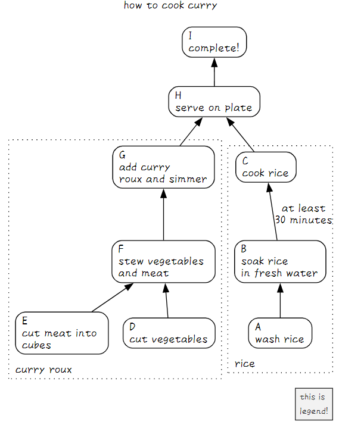

# posh-mocks

A mock-up set of [PowerShell](https://github.com/PowerShell/PowerShell) 7 functions that filter text-object input from the pipeline(stdin) and return text-object (this concept is closer to Bash than PowerShell).Inspired by [Parsing Text with PowerShell (3/3), Steve Lee, January 28th, 2019](https://devblogs.microsoft.com/powershell/parsing-text-with-powershell-3-3/).

- A set of functions for interactive text processing with connecting pipes.
- For my personal work and hobby use.
- For use in UTF-8 Japanese environments on windows.
- Required PowerShell 7+ on Windows
    - Some script may work with PowerShell 5
    - Some script may work with PowerShell 7+ on Linux
- Note:
    - The code is spaghetti (due to my technical inexperience).
    - Insufficient tests and error handlings.
    - Processing speed is slow.

function list:

```powershell
# one-liner to create function list
cat README.md | grep '^#### ' | grep -o '\[[^[]+\]' | sort | flat -ofs ", " | Set-Clipboard
```

- [Add-CrLf-EndOfFile], [Add-CrLf], [addb], [addl], [addr], [addt], [cat2], [catcsv], [chead], [clip2img], [clipwatch], [conv], [ConvImage], [count], [csv2sqlite], [csv2txt], [ctail], [decil], [delf], [dot2gviz], [filehame], [fillretu], [flat], [flow2pu], [fpath], [fval], [fwatch], [gantt2pu], [gdate], [Get-AppShortcut], [Get-OGP], [getfirst], [getlast], [grep], [gyo], [han], [head], [i], [image2md], [jl], [json2txt], [juni], [keta], [kinsoku], [lastyear], [lcalc], [linkcheck], [linkextract], [logi2dot], [logi2pu], [man2], [map2], [mdgrep], [mind2dot], [mind2pu], [movw], [nextyear], [Override-Yaml], [pawk], [percentile], [pu2java], [pwmake], [retu], [rev], [rev2], [say], [sed-i], [sed], [self], [seq2pu], [sleepy], [sm2], [summary], [table2md], [tac], [tail], [tarr], [tateyoko], [teatimer], [tenki], [tex2pdf], [thisyear], [toml2psobject], [uniq], [vbStrConv], [watercss], [wrap], [yarr], [ycalc], [ysort], [zen]

Inspired by:

- Article
    - [Parsing Text with PowerShell (3/3), Steve Lee, January 28th, 2019](https://devblogs.microsoft.com/powershell/parsing-text-with-powershell-3-3/).
- Unix/Linux commands
    - Commands: `grep`, `sed`, `head`, `tail`, `awk`, `make`, `uniq`, and more...
- [Open-usp-Tukubai - GitHub](https://github.com/usp-engineers-community/Open-usp-Tukubai)
    - License: The MIT License (MIT): Copyright (C) 2011-2022 Universal Shell Programming Laboratory
    - Commands: `man2`, `keta`, `tateyoko`, `gyo`, `fillretu`, `yarr`, `count`, `han`, `zen`, `filehame`, `self`, `delf`, `count`, `getfirst`, `getlast`, and more...
- [greymd/egzact: Generate flexible patterns on the shell - GitHub](https://github.com/greymd/egzact)
    - License: The MIT License (MIT): Copyright (c) 2016 Yasuhiro, Yamada
    - Commands: `flat`, `addt`, `addb`, `addr`, `addl`, `mirror`,`wrap`, and more...
- [mattn/sleepy - GitHub](https://github.com/mattn/sleepy)
    - License: The MIT License (MIT): Copyright (c) 2022 Yasuhiro Matsumoto
    - Commands: `sleepy`
- [tomnomnom/gron: Make JSON greppable! - GitHub](https://github.com/tomnomnom/gron)
    - License: The MIT License (MIT): Copyright (c) 2016 Tom Hudson
    - Commands: `gron`
- [禁則処理 - PyJaPDF](http://pyjapdf.linxs.org/home/kinsoku)
    - Commands: `kinsoku.py`
- [miyamiya/mypss: My PowerShell scripts - GitHub](https://github.com/miyamiya/mypss)
    - Commands: `Get-Draw.ps1`
- [ImageMagick](https://imagemagick.org/index.php)
    - Commands: `convert`, `magick convert`(on windows)
- [Water.css](https://watercss.kognise.dev/)
    - GitHub: <https://github.com/kognise/water.css>
    - License: The MIT License (MIT) Copyright © 2019 Kognise


主に現実世界の不定形文字列に対してパターンマッチング処理を行うためのフィルタ群。基本的な入力として、UTF-8＋半角スペース区切り＋行指向のパイプライン経由文字列データ（テキストオブジェクト）を期待する。出力もPowerShellらしいオブジェクトではなく、文字列である。一部の関数はオブジェクトのパイプライン入力を受け付けたり、オブジェクトとして出力する「PowerShellのコマンドレット的といえるもの」もあるが、動作としてはUnix/LinuxのBashなどのシェルに寄せている。

`src`下のファイル構成は、1ファイル1関数。関数名はファイル名から`_function.ps1`をのぞいた文字列。基本的に他の関数には依存しないようにしているので、関数ファイル単体を移動して利用することもできる。（一部の関数は他の関数ファイルに依存しているものもある）また、一部、Windows上・PowerShell7+でしか動かない関数がある点に注意する。

**充分なエラー処理をしていない**モックアップ。事務職（非技術職）な筆者の毎日の仕事（おもに文字列処理）を、簡単便利に楽しくさばくための道具としてのコマンドセット。


## Install functions

1. Comment out unnecessary lines (functions) in `operator.ps1`
2. Dot sourcing `operator.ps1` (and optional `operator-extra.ps1`)
    - (However, this only works for the current process. When you close the window (end the process), the dot-sourced functions are forgotten)

```powershell
# install all functions
. path/to/posh-mocks/operator.ps1
# option
. path/to/posh-mocks/operator-extra.ps1
```

関数は一部を除きできるだけ他の関数と依存しないようにしている。
必要な関数単独を直接ドットソースで読み込んでもよい。
この場合、以下のように最初にカレントプロセスのエンコードを`UTF-8`にしておくとよい。
理由は、当関数群が基本的にパイプライン経由の入出力として`UTF-8`を想定しているため。


```powershell
# install favorite functions for japanese environment
# set encode
if ($IsWindows){
    chcp 65001
    [System.Console]::OutputEncoding = [System.Text.Encoding]::GetEncoding("utf-8")
    [System.Console]::InputEncoding  = [System.Text.Encoding]::GetEncoding("utf-8")
    # compartible with multi byte code
    $env:LESSCHARSET = "utf-8"
}
# sourcing dot files
. path/to/posh-mocks/src/hoge_function.ps1
. path/to/posh-mocks/src/piyo_function.ps1
```


## Description of each functions

各関数の挙動と作った動機と簡単な説明。

### Show functions

#### [man2] - Enumerate the function names

[man2]: src/man2_function.ps1

`src`配下の関数（ファイル）名を列挙する。
筆者は作った関数をすぐに忘れてしまうため。

- Usage
    - `man2`
    - `man2 [func-name] [-p|-paging]`
    - `man2 [[-FunctionName] <String>] [-c|-Column <Int32>] [-Exclude <String>] [-p|-Paging] [-Include <String>] [-Examples] [-l|-Line]`
- 挙動
    - `man2`関数ファイルと同階層にある`*_function.ps1`ファイルのファイル名から`_function.ps1`を除去して列挙する
- 依存
    - [flat], [tateyoko], [keta]
- Examples
    - `man2`
    - `man2 man2`
    - `man2 man2 -p`
- Inspired by [Open-usp-Tukubai - GitHub](https://github.com/usp-engineers-community/Open-usp-Tukubai)
    - License: The MIT License (MIT): Copyright (C) 2011-2022 Universal Shell Programming Laboratory
    - Command: `man2`

### Unix-like text filters

#### [sed] - Stream EDitor

[sed]: src/sed_function.ps1

文字列を置換する。Windows用。
Linux環境で使う`sed`のような使用感で文字列を置換するが、劣化コピーである。
`"string" | ForEach-Object{ $_ -replace 'reg','str' }`と同じ効果を得る。
`sed`は（筆者が毎日）よく使うコマンドなので、Bash・PowerShellとも同じ使用感・より短い文字数で利用できるようにした。

- Usage
    - `man2 sed`
    - `sed 's;<regex-pattern>;<replace-strings>;g'`
        - 左から2文字目が区切り文字。`sed 's@hoge@piyo@g'`と書いてもよい
    - `sed 's;<regex-pattern>;<replace-strings>;'`
        - 末尾に`g`がない場合、行の左から右にみて最初にヒットした`regex-pattern`のみ置換する
        - このユースケースでは大文字小文字が区別される点に注意する
    - ```sed "s;`t;<replace-strings>;g"```
        - ダブルクオートで囲むと``` `t ```や``` `r`n ```などの制御文字を置換可能
        - Bashで使う`sed`のように`\t`や`\n`ではない点に注意
- Inspired by Unix/Linux Commands
    - Command: `sed`

Examples:

```powershell
# g flag - replace all strings mathing pattern
'a1b1c1' | sed 's;1;2;g'
a2b2c2

# replace only first match
'a1b1c1' | sed 's;1;2;'
a2b1c1

# delete tab (use double quote)
cat a.txt | sed "s;`t;;g"

# replace CrLf to space
(cat a.txt) -join " "
```

```powershell
# print mode.

# input data
$dat = "aaa", "bbb", "ccc", "ddd", "eee"
aaa
bbb
ccc
ddd
eee

# Output between "bbb" and "ddd"
$dat | sed 'p;^bbb;^ddd;'
bbb
ccc
ddd
```

```powershell
# delete mode.

# input data
$dat = "aaa", "bbb", "ccc", "ddd", "eee"
aaa
bbb
ccc
ddd
eee

# Delete between "bbb" and "ddd"
$dat | sed 'p;^bbb;^ddd;'
aaa
eee
```

#### [sed-i] - Edit files in place

[sed-i]: src/sed-i_function.ps1

文字列を置換し、かつファイルを上書き。
Linuxでいう`sed -i`（の劣化コピー）。ただし誤爆防止のため`-Execute`スイッチを使用しなければ上書きはしない。
同じ動作をするPowerShellワンライナーがいつも長くなるので。

- Usage
    - `man2 sed-i`
    - `sed-i 's;pattern;replace;g' file [-Execute] [-DoNotCreateBackup|-OverwriteBackup]`
    - デフォルトでdry run、かつ、バックアップ作成（.bak）ありの安全動作
- Examples
    - `sed-i 's;abc;def;g' file -Execute`
        - Linux: `sed -i.bak 's;abc;def;g' file` と等価（`.bak`ファイルにオリジナルファイルをバックアップ）
    - `sed-i 's;abc;def;g' file -Execute -DoNotCreateBackup`
        - Linux: `sed -i 's;abc;def;g' file` と等価（上書き）↓
    - `sed-i 's;pattern1;replace1;g','s;pattern2;replace2;g',... file`
        - 置換文字列はカンマ区切りで複数指定できる
- Inspired by Unix/Linux Commands
    - Command: `sed`

Examples:

```powershell
PS > "abcde" > a.txt; sed-i 's;abc;def;g' a.txt
ifile: ./a.txt
ofile: ./a.txt.bak
defde
```

```powershell
PS > ls *.txt
Mode                 LastWriteTime         Length Name
----                 -------------         ------ ----
-a---          2022/09/29    21:41              7 a.txt
-a---          2022/09/29    21:41              7 b.txt

PS > ls *.txt | %{ sed-i 's;abc;def;g' $_.FullName }
ifile: a.txt
ofile: a.txt.bak
defde
```

```powershell
# Replace and overwrite original file and create backup
PS > ls *.txt | %{ sed-i 's;abc;hoge;g' $_.FullName -Execute }
./a.txt > ./a.txt.bak
./b.txt > ./b.txt.bak

# Replace and overwrite original file and *do not* create backup
PS > ls *.txt | %{ sed-i 's;abc;hoge;g' $_.FullName -Execute -DoNotCreateBackup }
./a.txt > ./a.txt
./b.txt > ./b.txt
```


#### [grep] - Single-line oriented searcher for regex patterns

[grep]: src/grep_function.ps1

文字列の検索とヒット行の出力。Windows用。
Linux環境で使う`grep`のような使用感で文字列を検索するが、劣化コピーである。
`Select-String -Pattern <reg>`と同じ効果を得る。
`grep`は（筆者が毎日）よく使うコマンドなので、Bash・PowerShellとも同じ使用感・より短い文字数で利用できるようにした。

デフォルトで大文字小文字を区別しないが、
-CaseSensitiveスイッチで大文字小文字を区別する

指定したパターンはデフォルトで正規表現として解釈するが、
[-s|-SimpleMatch]オプションでパターンを文字列として認識する

- Usage
    - `man2 grep`
    - `grep '<regex>' -H file1,file2,...`
    - `cat file1,file2,... | grep '<regex>' [-v][-f][-s][-C <int>[,<int>]]`
    - `cat file1,file2,... | grep '<regex>' [-o]`
- Inspired by Unix/Linux Commands
    - Command: `grep`
- Learn
    - [about Splatting - PowerShell][about_splatting] ([ja-jp][about_splatting_jp])

[about_splatting]: https://learn.microsoft.com/en-us/powershell/module/microsoft.powershell.core/about/about_splatting
[about_splatting_jp]: https://learn.microsoft.com/ja-jp/powershell/module/microsoft.powershell.core/about/about_splatting

検索速度は遅い。筆者の環境ではシンプルに`Select-String`を用いた方が速い。
したがって、あまり引数をもちいないシンプルな用途であれば、
`Set-Alias -name grep -value Select-String`としたほうがより速く動作する
（むしろ`grep`よりも`sls`の方が文字数が少ないため、何もせずそのまま`sls`を用いてもよい）。


```powershell
# Select-String (fast)
1..10 | %{ Measure-Command{ 1..100000 | sls 99999 }} | ft

Days Hours Minutes Seconds Milliseconds
---- ----- ------- ------- ------------
0    0     0       0       437
0    0     0       0       386
0    0     0       0       394
0    0     0       0       385
0    0     0       0       407
0    0     0       0       715
0    0     0       0       424
0    0     0       0       424
0    0     0       0       443
0    0     0       0       423
```

```powershell
# grep (slow)
1..10 | %{ Measure-Command{ 1..100000 | grep 99999 }} | ft

Days Hours Minutes Seconds Milliseconds
---- ----- ------- ------- ------------
0    0     0       1       84
0    0     0       1       74
0    0     0       1       287
0    0     0       1       81
0    0     0       1       186
0    0     0       1       186
0    0     0       1       79
0    0     0       1       382
0    0     0       1       178
0    0     0       1       183
```

`grep`, `Select-String`ともにパイプライン経由の入力を読むよりも、引数にファイルを指定して検索する方が高速。
そのため、大きなデータを処理する場合は、
最初のコマンドで引数にファイルを指定する形で処理量を減らしてからパイプラインにつなぐとよい。

```powershell
# slow
cat big.data | grep "hoge" | grep "piyo"
cat big.data | sls  "hoge" | sls  "piyo"

# fast!
grep "hoge" big.data | grep "piyo"
sls  "hoge" big.data | sls  "piyo"
```

Examples

- ref: [Select-String (Microsoft.PowerShell.Utility) - PowerShell](https://learn.microsoft.com/en-us/powershell/module/microsoft.powershell.utility/select-string)

```powershell
# Find a case-sensitive match (grep 'regex' -CaseSensitive)

'Hello', 'HELLO' | grep 'HELLO' -CaseSensitive -SimpleMatch

HELLO
```

```powershell
# Find a pattern match (grep 'regex')

grep '\?' -H "$PSHOME\en-US\*.txt"
    https://go.microsoft.com/fwlink/?LinkID=108518.
    or go to: https://go.microsoft.com/fwlink/?LinkID=210614
    or go to: https://go.microsoft.com/fwlink/?LinkID=113316
      Get-Process -?         : Displays help about the Get-Process cmdlet.
```

```powershell
# Find matches in text files (grep 'regex' -H file,file,...)

Get-Alias   | Out-File -FilePath .\Alias.txt   -Encoding UTF8
Get-Command | Out-File -FilePath .\Command.txt -Encoding UTF8
grep 'Get\-' -H .\*.txt | Select-Object -First 5

Alias.txt:7:Alias       cal2 -> Get-OLCalendar
Alias.txt:8:Alias       cat  -> Get-Content
Alias.txt:28:Alias      dir  -> Get-ChildItem
Alias.txt:44:Alias      gal  -> Get-Alias
Alias.txt:46:Alias      gbp  -> Get-PSBreakpoint
```

```powershell
# Skip blank lines (grep ".")

PS> "aaa","","bbb","ccc"
aaa

bbb
ccc

PS> "aaa","","bbb","ccc" | grep .
aaa
bbb
ccc
```

```powershell
# Find a string in subdirectories (grep 'regex' -H file,file,... [-r|Recurse])
grep 'tab' -H '*.md' -r [-FileNameOnly|-FileNameAndLineNumber]

Table: caption
{.table2col}
| table |

# The following commands are also approximately equivalent
ls *.md -Recurse | grep "table"

table2col.md:10:Table: caption
table2col.md:12:{.table2col}
table2col.md:66:| table |
```

```powershell
# Find strings that do not match a pattern (grep 'regex' [-v|-NotMatch])

Get-Command | Out-File -FilePath .\Command.txt -Encoding utf8
cat .\Command.txt | grep "Get\-", "Set\-" -NotMatch | Select-Object -Last 5

Cmdlet Write-Output   7.0.0.0  Microsoft.PowerShell.Utility
Cmdlet Write-Progress 7.0.0.0  Microsoft.PowerShell.Utility
Cmdlet Write-Verbose  7.0.0.0  Microsoft.PowerShell.Utility
Cmdlet Write-Warning  7.0.0.0  Microsoft.PowerShell.Utility
```

```powershell
# Use double quotes when searching for tab characters (grep "`t")
 "1,2,3", "4,5,6", "7,8,9", "" | %{ $_ -replace ',', "`t" } | grep "`t[28]"
1       2       3
7       8       9
```

```powershell
# Find lines before and after a match (grep "regex" -C <int>,<int> )
Get-Command | Out-File -FilePath .\Command.txt -Encoding utf8
cat .\Command.txt | grep 'Get\-Computer' -C 2, 3

  Cmdlet   Get-Command        7.3.1.500  Microsoft.PowerShell.Core
  Cmdlet   Get-ComputeProcess 1.0.0.0    HostComputeService
> Cmdlet   Get-ComputerInfo   7.0.0.0    Microsoft.PowerShell.Management
  Cmdlet   Get-Content        7.0.0.0    Microsoft.PowerShell.Management
  Cmdlet   Get-Counter        7.0.0.0    Microsoft.PowerShell.Diagnostics
  Cmdlet   Get-Credential     7.0.0.0    Microsoft.PowerShell.Security
```

```powershell
# Tips: use Out-String -Stream (alias:oss) to greppable
cat .\Command.txt | grep 'Get\-Computer' -C 2, 3 | oss | grep '>'

> Cmdlet   Get-ComputerInfo   7.0.0.0    Microsoft.PowerShell.Management
```

```powershell
# Find all pattern matches (grep 'regex' -o)

cat "$PSHOME\en-US\*.txt" | grep "PowerShell"

    PowerShell Help System
    Displays help about PowerShell cmdlets and concepts.
    PowerShell Help describes PowerShell cmdlets, functions, scripts, and
    modules, and explains concepts, including the elements of the PowerShell
    PowerShell does not include help files, but you can read the help topics
    You can find help for PowerShell online at
       1. Start PowerShell with the "Run as administrator" option.
      Get-Help About_Modules : Displays help about PowerShell modules.

cat "$PSHOME\en-US\*.txt" | grep "PowerShell" -o
PowerShell
PowerShell
PowerShell
PowerShell
PowerShell
PowerShell
PowerShell
PowerShell
PowerShell
```

これは`Select-String（alias:sls）`を用いて以下のようにも書ける。


```powershell
# パイプラインをつなげているときに
# カッコ()を追加するのは手戻りがあって面倒で楽しくない
(cat "$PSHOME\en-US\*.txt" | sls "PowerShell" -AllMatches).Matches.Value

PowerShell
…(以下略)
```

筆者は、パイプでコマンドをつないでいるときに`()`を書きたくない。
パイプで右に右にとコマンドをつないでいくのは楽しいが、
手戻りして`()`を追加するのは面倒で楽しくない。

`grep`で`Select-String`の（速度の遅い劣化版）ラッパーを作った理由もこのあたりにある。
単に`grep 'regex'`する場合は、`sls 'regex'`とした方が速い。
しかし、ちょっと複雑な（だが筆者的にはよく使う）オプション、
たとえば`grep 'regex' -o`や`grep 'regex' -H <files> -FileNameOnly`などは、
余計なカッコ`()`や長いパイプを書かずに済むので良い。


```powershell
# このように書けばカッコ()は書かなくてよいが、
# grep -oと書けばすむところ、2つも多くパイプを
# つなげることになるのであまり楽しくない
cat "$PSHOME\en-US\*.txt" `
    | sls "PowerShell" -AllMatches `
    | select -ExpandProperty Matches `
    | select -ExpandProperty Value

PowerShell
…(以下略)
```


```powershell
# Convert pipeline objects to strings using Out-String -Stream

$hash = @{
    Name     = 'foo'
    Category = 'bar'
}

# !! NO output, due to .ToString() conversion
$hash | grep 'foo'

# Out-String converts the output to a single multi-line string object
$hash | Out-String | grep 'foo'

Name           Value
----           -----
Name           foo
Category       bar

# Out-String -Stream converts the output to a multiple single-line string objects
$hash | Out-String -Stream | grep 'foo'

Name           foo
```

#### [head], [tail] - Output the first/last part of files

[head]: src/head_function.ps1
[tail]: src/tail_function.ps1

入力文字列の最初の数行または最後の数行を出力する。
Linux環境で使う`head`、`tail`のような使用感で文字列を置換する。
`"string" | Select-Object -First <int> / -Last <int>`と同じ効果を得る。

- Usage
    - `man2 head`
    - `man2 tail`
- Examples
    - `1..20 | head [-n <int>]`
    - `1..20 | tail [-n <int>]`
    - `head *.*`
    - `tail *.*`
- Inspired by Unix/Linux Commands
    - Command: `head`, `tail`

#### [chead], [ctail] - Cut the first/last part of files

[chead]: src/chead_function.ps1
[ctail]: src/ctail_function.ps1


入力文字列の最初の数行または最後の数行を削除（カット）して出力する。
`"string" | Select-Object -Skip <int> / -SkipLast <int>`と同じ効果を得る。

- Usage
    - `man2 chead`
        - `chead [-Num <Int32>] [[-Files] <String[]>]`
    - `man2 ctail`
        - `ctail [-Num <Int32>] [[-Files] <String[]>] [-InputText <String[]>]`
- Examples
    - `1..20 | chead [-n <int>]`
    - `1..20 | ctail [-n <int>]`
- Inspired by Unix/Linux Commands
    - Command: `chead`


Examples:

[chead] - Cut the first part of files

```powershell
# read from stdin

1..5 | chead
2
3
4
5

1..5 | chead -n 2
3
4
5
```

```powershell
# read from file

1..5 > a.txt; chead a.txt
2
3
4
5

1..5 > a.txt; chead -n 2 a.txt
3
4
5
```

[ctail] - Cut the last part of files

```powershell
# read from stdin

1..5 | ctail
1
2
3
4

1..5 | ctail -n 2
1
2
3
```

```powershell
# read from file

1..5 > a.txt; ctail a.txt
1
2
3
4

1..5 > a.txt; ctail -n 2 a.txt
1
2
3
```

#### [uniq] - Report or omit repeated lines

[uniq]: src/uniq_function.ps1


入力から隣接する（連続する）重複行をなくし一意とする。大文字小文字は区別しない。事前ソート必要。
`Group-Object -NoElement`、`Get-Unique`と似ている。

- Usage
    - `man2 uniq`
    - `uniq [-c|-d]`
- Examples
    - `1,2,3,4,5,3 | sort | uniq`
    - `1,2,3,4,5,3 | sort | uniq -c`
- Inspired by Unix/Linux Commands
    - Command: `uniq`

#### [cat2] - Concatenate files and print on the standard output

[cat2]: src/cat2_function.ps1

テキストファイルのコンテンツを取得。
複数ファイルを指定する方法は、`Get-Content`の際の「カンマ区切り」ではなく「半角スペース区切り」。
引数にハイフン「`-`」指定で標準入力から読み込み。

- Usage
    - `man2 cat2`
    - `cat2 file1 file2 file3...`
- Inspired by Unix/Linux Commands
    - Command: `cat`

#### [tac] - Output strings in reverse

[tac]: src/tac_function.ps1

入力を行単位逆順に出力する。

- Usage
    - `man2 tac`
- Examples
    - `1..5 | tac`
    - `tac a.txt,b.txt`
- Inspired by Unix/Linux Commands
    - Command: `tac`

Examples:

```powoershell
1..5 | tac
5
4
3
2
1
```

#### [rev] - Reverse strings

[rev]: src/rev_function.ps1

文字列を行内で反転する。

- Usage
    - `man2 rev`
- Examples
    - `"aiueo" | rev`
- Inspired by Unix/Linux Commands
    - Command: `rev`

Examples:

```powershell
"aiueo" | rev
oeuia
```

#### [rev2] - Reverse columns

[rev2]: src/rev2_function.ps1

半角スペースで区切られた列をリバースする。
列内の文字列はリバースしない。
入力はパイプのみ受け付け。

- Usage
    - `man2 rev2`
- Inspired by Unix/Linux Commands
    - Command: `rev`
- Inspired by [greymd/egzact: Generate flexible patterns on the shell - GitHub](https://github.com/greymd/egzact)
    - License: The MIT License (MIT): Copyright (c) 2016 Yasuhiro, Yamada
    - Command: `mirror`

Examples:

```powershell
.EXAMPLE
Write-Output "01 02 03" | rev2
03 02 01

.EXAMPLE
Write-Output "01 02 03" | rev2 -e
01 02 03
03 02 01
```


### text filters for space-separated input

#### [tateyoko] - Transpose columns and rows

[tateyoko]: src/tateyoko_function.ps1

半角スペース区切り行列の転置（半角スペース区切り文字列の縦横変換）。
列数は不揃いでもよい。

- Usage
    - `man2 tateyoko`
- Examples
    - `"1 2 3","4 5 6","7 8 9" | tateyoko`
- Inspired by [Open-usp-Tukubai - GitHub](https://github.com/usp-engineers-community/Open-usp-Tukubai)
    - License: The MIT License (MIT): Copyright (C) 2011-2022 Universal Shell Programming Laboratory
    - Command: `tateyoko`

Examples:

```powershell
"1 2 3","4 5 6","7 8 9"
1 2 3
4 5 6
7 8 9

"1 2 3","4 5 6","7 8 9" | tateyoko
1 4 7
2 5 8
3 6 9
```

#### [fillretu] - Align records to the maximum number of columns

[fillretu]: src/fillretu_function.ps1


半角スペース区切りレコードの列数を最大列数にそろえる。
不足列を埋める、で、fill（埋める）＋retu（列）。
列数がそろっていると何かと都合よい。

- Usage
    - `man2 fillretu`
    - `cat dat.txt | fillretu`

Input:

```powershell
PS > cat dat.txt
2018 3
2018 3
2018 3
2017 1
2017 1
2017 1
2017 1
2017 1
2022 5
2022 5

PS > cat dat.txt | grep . | yarr
2018 3 3 3
2017 1 1 1 1 1
2022 5 5

PS > cat dat.txt | grep . | yarr | fillretu
2018 3 3 3 _ _
2017 1 1 1 1 1
2022 5 5 _ _ _

PS > cat dat.txt | grep . | yarr | fillretu -NaN 0
2018 3 3 3 0 0
2017 1 1 1 1 1
2022 5 5 0 0 0
```

`tateyoko`とのコンビネーション。

```powershell
PS > cat dat.txt | yarr | fillretu | tateyoko | keta
2018 2017 2022
   3    1    5
   3    1    5
   3    1    _
   _    1    _
   _    1    _
```

#### [juni] - Enumerate the number of rows in each line

[juni]: src/juni_function.ps1

各行の行数を列挙

- Usage
    - `man2 juni`
    - `juni [-z]`
- Examples
    - `cat a.txt | juni`
- Inspired by [Open-usp-Tukubai - GitHub](https://github.com/usp-engineers-community/Open-usp-Tukubai)
    - License: The MIT License (MIT): Copyright (C) 2011-2022 Universal Shell Programming Laboratory
    - Command: `juni`

Output:

```powershell
"a".."d" | juni
1 a
2 b
3 c
4 d
```

#### [self] - Select fields

[self]: src/self_function.ps1

半角スペース区切りの標準入力から任意の列のみ抽出する。
すべての列は`0`で、最終列は`NF`で指定することもできる

`1.2.3`と指定すると、1列目の2文字目から3文字を切り出し
切り出し文字数が対象文字数よりも多い場合は切り取れる範囲のみ切り出し。


- Usage
    - `man2 self`
    - `self <num> <num>...`
- Examples
    - `"1 2 3","4 5 6","7 8 9" | self 1 3`
        - **How to read** : Select fields 1st and 3rd columns.
- Inspired by [Open-usp-Tukubai - GitHub](https://github.com/usp-engineers-community/Open-usp-Tukubai)
    - License: The MIT License (MIT): Copyright (C) 2011-2022 Universal Shell Programming Laboratory
    - Command: `self`

Examples:

```powershell
# select field 1 and 3
"1 2 3","4 5 6","7 8 9"
1 2 3
4 5 6
7 8 9

"1 2 3","4 5 6","7 8 9" | self 1 3
1 3
4 6
7 9
```

```powershell
# select 2nd field and and
# cut out 2 characters from the 2nd character
"123 456 789","223 523 823"
123 456 789
223 523 823

"123 456 789","223 523 823" | self 2.2.2
56
23

# select entire line and add 2nd field,
# and cut out 2 characters from the 2nd character in the 2nd field
"123 456 789","223 523 823" | self 0 2.2.2
123 456 789 56
223 523 823 23
```

```powershell
# select the 1st field from the leftmost field and
# select the 2nd field from the rightmost field(=NF)
"1 2 3 4 5","6 7 8 9 10"
1 2 3 4 5
6 7 8 9 10

"1 2 3 4 5","6 7 8 9 10" | self 1 NF-1
1 4
6 9
```


#### [delf] - Delete fields

[delf]: src/delf_function.ps1

半角スペース区切りの標準入力から指定列のみ削除する
最終列を`NF`で指定することもできる


- Usage
    - `man2 delf`
    - `delf <num> <num>...`
- Examples
    - `"1 2 3","4 5 6","7 8 9" | delf 1 3`
        - **How to read** : Delete fields 1st and 3rd column.
- Inspired by [Open-usp-Tukubai - GitHub](https://github.com/usp-engineers-community/Open-usp-Tukubai)
    - License: The MIT License (MIT): Copyright (C) 2011-2022 Universal Shell Programming Laboratory
    - Command: `delf`

Examples:

```powershell
# delete field 1 and 2
"1 2 3","4 5 6","7 8 9"
1 2 3
4 5 6
7 8 9

"1 2 3","4 5 6","7 8 9" | delf 1 2
3
6
9
```

```powershell
# delete field 1 and 2nd field from right
"1 2 3 4 5","6 7 8 9 10"
1 2 3 4 5
6 7 8 9 10

"1 2 3 4 5","6 7 8 9 10" | delf 1 NF-1
2 3 5
7 8 10
```

#### [sm2] - Sum up

[sm2]: src/sm2_function.ps1

半角スペース区切りの標準入力から指定列の合計を算出（サムアップ）する。

`sm2 <k1> <k2> <s1> <s2>`と指定することで、
`<k1>`列から`<k2>`列をキーとして`<s1>`列から`<s2>`列までを合計する。

`sm2 0 0 <s1> <s2>`と指定すると全行サムアップ。
ファイルのキーの事前ソートが必要。
大文字小文字を区別しない。


- Usage
    - `man2 sm2`
    - `sm2 [+count] <k1> <k2> <s1> <s2>`
- Options
    - `+count`: Output the total number of rows in the leftmost column. 合計した行数を最左列に出力
- Examples
    - `"A 1 10","B 1 10","A 1 10","C 1 10" | sort | sm2 1 2 3 3`
        - **How to read** : Using the value obtained by concatenating from 1st to 2nd columns as a key, sum-up for each column values from 3rd to 3rd columns.
- Inspired by [Open-usp-Tukubai - GitHub](https://github.com/usp-engineers-community/Open-usp-Tukubai)
    - License: The MIT License (MIT): Copyright (C) 2011-2022 Universal Shell Programming Laboratory
    - Command: `sm2`

Examples:

```powershell
# input
"A 1 10","B 1 10","A 1 10","C 1 10"
A 1 10
B 1 10
A 1 10
C 1 10

# Sort by key column before connecting pipeline to sm2 command
"A 1 10","B 1 10","A 1 10","C 1 10" | sort | sm2 1 2 3 3
A 1 20
B 1 10
C 1 10

# Result if you forget to sort
"A 1 10","B 1 10","A 1 10","C 1 10" | sm2 1 2 3 3
A 1 10
B 1 10
A 1 10
C 1 10
```

```powershell
# input
"A 1 10","B 1 10","A 1 10","C 1 10"
A 1 10
B 1 10
A 1 10
C 1 10

# +count option
"A 1 10","B 1 10","A 1 10","C 1 10" | sort | sm2 +count 1 2 3 3
2 A 1 20
1 B 1 10
1 C 1 10
```

```powershell
# input
"A 1 10","B 1 10","A 1 10","C 1 10"
A 1 10
B 1 10
A 1 10
C 1 10

# calculator mode
"A 1 10","B 1 10","A 1 10","C 1 10" | sm2 0 0 2 2
4
```

```powershell
# calc average with sm2 and lcalc command

## input
"A 1 10","B 1 10","A 1 10","C 1 10"
A 1 10
B 1 10
A 1 10
C 1 10

## sum up
"A 1 10","B 1 10","A 1 10","C 1 10" | sort | sm2 +count 1 2 3 3
2 A 1 20
1 B 1 10
1 C 1 10

## calc average
"A 1 10","B 1 10","A 1 10","C 1 10" | sort | sm2 +count 1 2 3 3 | lcalc '$0;$NF/$1'
2 A 1 20 10
1 B 1 10 10
1 C 1 10 10
```

#### [map2] - Cross tabulation of long-type data

[map2]: src/map2_function.ps1

半角スペース区切りのロング型データをクロス集計する。入力データはヘッダなし、かつ、キーが事前に一意に集計されていること。

Input data must be preprocessed to ensure unique keys and no header line.

- Usage
    - `man2 map2`
    - `map2 -n <n>[,<m>]`
        - e.g. `map2 -n 2,1` means: Cross tablate the `2` columns from the left as vertical-key, `1` column as horizontal-key, and the `rest` as value fields
- Inspired by [Open-usp-Tukubai - GitHub](https://github.com/usp-engineers-community/Open-usp-Tukubai)
    - License: The MIT License (MIT): Copyright (C) 2011-2022 Universal Shell Programming Laboratory
    - Command: `map`

Examples:

値列が1列のみの場合。

```powershell
# Input data example1:
# (Case: vkey1, vkey2, hkey, value)

cat data.txt
location-A store-A target-A 1
location-A store-B target-B 2
location-A store-C target-C 3
location-B store-A target-A 4
location-B store-B target-B 5
location-B store-C target-C 6
location-C store-A target-A 7
location-C store-B target-B 8
location-C store-C target-C 9

cat data.txt | map2 -n 2,1 | keta
         *       * target-A target-B target-C
location-A store-A        1        0        0
location-A store-B        0        2        0
location-A store-C        0        0        3
location-B store-A        4        0        0
location-B store-B        0        5        0
location-B store-C        0        0        6
location-C store-A        7        0        0
location-C store-B        0        8        0
location-C store-C        0        0        9

cat data.txt | map2 -n 1,2 | keta
         *  store-A  store-B  store-C
         * target-A target-B target-C
location-A        1        2        3
location-B        4        5        6
location-C        7        8        9
```

値列が複数列の場合。

```powershell
# Input data example2:
# (Case: vkey, hkey, value1, value2)

cat data.txt
loc-1 tar-1 1 10
loc-1 tar-2 2 20
loc-1 tar-3 3 30
loc-2 tar-1 4 40
loc-2 tar-2 5 50
loc-2 tar-3 6 60
loc-3 tar-1 7 70
loc-3 tar-2 8 80
loc-3 tar-3 9 90

# ("A".."Z" is given according to the number of value-columns)
cat data.txt | map2 -n 1,1 -ifs " " -ofs "`t"
*       *       tar-1   tar-2   tar-3
loc-1   A       1       2       3
loc-1   B       10      20      30
loc-2   A       4       5       6
loc-2   B       40      50      60
loc-3   A       7       8       9
loc-3   B       70      80      90

# -yarr switch
cat data.txt | map2 -n 1,1 -ifs " " -ofs "`t" -yarr
*       tar-1   tar-1   tar-2   tar-2   tar-3   tar-3
*       a       b       a       b       a       b
loc-1   1       10      2       20      3       30
loc-2   4       40      5       50      6       60
loc-3   7       70      8       80      9       90
```


#### [lcalc] - Column-to-column calculator

[lcalc]: src/lcalc_function.ps1


半角スペース区切りの標準入力における列同士の計算。


- Usage
    - `man2 lcalc`
    - `lcalc [-d] 'expr; expr;...'`
- Options
    - `expr`はクオート内において`;`区切りで複数の計算式を指定可能
    - `-d`: calculator mode. 電卓(`dentaku`)モード
- Note
    - 計算列の指定
        - `$1,$2,...` : 列指定は`$`記号＋列数
        - `$0`        : 全列指定
        - `$NF`       : 最終列のみこのように書くことができる。ただし`$NF-1`とは書けない点に注意。
    - 短縮形で使用できる関数
        - 丸め       : `round($1,num)`
        - 平方根     : `sqrt($1)`
        - べき乗     : `pow($1,2)`
        - 絶対値     : `abs($1)`
        - 対数       : `log($1)`
        - 対数base=2 : `log2($1)`
        - 常用対数   : `log10($1)`
        - パイ       : `PI`
- Examples
    - `"8.3 70","8.6 65","8.8 63" | lcalc '$1+1;$2/10'`
    - `lcalc -d '1+1'`
- Inspired by [Open-usp-Tukubai - GitHub](https://github.com/usp-engineers-community/Open-usp-Tukubai)
    - License: The MIT License (MIT): Copyright (C) 2011-2022 Universal Shell Programming Laboratory
    - Command: `lcalc`

Examples:

```powershell
# input
"8.3 70","8.6 65","8.8 63"
8.3 70
8.6 65
8.8 63

# lcalc
"8.3 70","8.6 65","8.8 63" | lcalc '$1+1;$2/10'
9.3 7
9.6 6.5
9.8 6.3
```

```powershell
# calculator mode does not require
# standard input (from pipline)
lcalc -d '1+1'
2

lcalc -d '1+sqrt(4)'
3

lcalc -d 'pi'
3.14159265358979

# 短縮形で使用できる関数以外の関数も使用できる
lcalc -d '[math]::Ceiling(1.1)'
2
```

```powershell
# calc average with sm2 and lcalc command

## input
"A 1 10","B 1 10","A 1 10","C 1 10"
A 1 10
B 1 10
A 1 10
C 1 10

## sum up
"A 1 10","B 1 10","A 1 10","C 1 10" | sort | sm2 +count 1 2 3 3
2 A 1 20
1 B 1 10
1 C 1 10

## calc average
"A 1 10","B 1 10","A 1 10","C 1 10" | sort | sm2 +count 1 2 3 3 | lcalc '$0;$NF/$1'
2 A 1 20 10
1 B 1 10 10
1 C 1 10 10
```

#### [pawk] - Pattern-Action processor like GNU AWK

[pawk]: src/pawk_function.ps1

半角スペース区切りの標準入力に対する行指向のパターンマッチングプロセッサ。

```powershell
pawk [-fs "delim"] [-Pattern { condition }] -Action { action }
```

pawk reads the input a line at a time, scans for pattern,
and executes the associated action if pattern matched.

As a feature, pipeline processing can be applied only to
specific columns for multiple column inputs.

```powershell
# input line (csv: comma separated values)
PS> $dat = "abc,def,ghi","jkl,mno,pqr","stu,vwz,012"
abc,def,ghi
jkl,mno,pqr
stu,vwz,012

# apply rev commnand only 2nd columns
PS> $dat | pawk -fs "," -Pattern {$1 -match "^j"} -Action { $2=$2|rev;$0 }
jkl,onm,pqr

# -Begin, -Process and -End block like AWK
PS> 1..10 | pawk -Begin { $sum=0 } -Action { $sum+=$1 } -End { $sum }
55
```

- Usage
    - `man2 pawk`
    - `pawk [-fs "delim"] [-Pattern { condition }] -Action { action }`
- Options
    - `[[-a|-Action] <ScriptBlock>]` ...action script
    - `[-p|-Pattern <ScriptBlock>]` ...pattern criteria
    - `[-b|-Begin <ScriptBlock>]` ...run before reading input
    - `[-e|-End] <ScriptBlock`> ...run after reading input
    - `[-fs|-Delimiter <String>]` ...input/output field separator
    - `[-ifs|-InputDelimiter <String>]` ...input field separator
    - `[-ofs|-OutputDelimiter <String>]` ...output field separator
        - If `-ifs` or `-ofs` are not specified,`-fs` delimiter will be used as both the input and output delimiter.
        - If `-ifs` and/or `-ofs` are specified together, `-fs` value will be overridden.
    - `[-AllLine]` ...output all input even if not match pattern (but action is only apply to matching rows)
    - `[-SkipBlank]` ...continue processing when empty row is detected
- Note
    - `-Action { action }`, `-Pattern { criteria }`, `-Begin { action }`, `-End { action }` options should be specified in the script block.
    - The column specification symbols are `$1,$2,...,$NF`. (The left most column number is 1 and counts up to the right.)
        - Specifying `$0` means the entire row.
        - Note that it is not allowed to assign value to `$0` (`$0=$val` is not allowed in script block).
    - Each column value is interpreted as System.Double if it looks like a number, and otherwise, as System.String.
        - Note that zero starting numbers are treated as system.string exceptionally.
        - Underscore `_` can also be used as a numeric delimiter. (e.g. `123_456`)
    - Built-in variables and options:
        - `$NF` : the last element of the current line. (This is one of the behaviors that is different from awk)
        - `$NR` : current row number
- Inspired by Unix/Linux Commands
    - Command: `awk`, `gawk`

Examples:

```powershell
# sum from 1 to 10 and output the result
PS> 1..10 | pawk -Begin {$sum=0} -Action {$sum+=$1} -End {$sum}
55

# output all line using $0 in -Action script block
PS> 1..10 | pawk -Begin {$sum=0} -Action {$sum+=$1;$0} -End {"=====","sum: $sum"}
1
2
3
4
5
6
7
8
9
10
=====
sum: 55
```

```powershell
# If both -Action {$0} and -AllLine switch are
# used at the same time, the outputs are duplicated.
PS> 1..3 | pawk -Begin {$sum=0} -Action {$sum+=$1;$0} -End {"=====","sum: $sum"} -AllLine
1
1
2
2
3
3
=====
sum: 6

# All of the following get all line output
PS> 1..3 | pawk -Begin {$sum=0} -Action {$sum+=$1} -End {"=====","sum: $sum"} -AllLine
PS> 1..3 | pawk -Begin {$sum=0} -Action {$sum+=$1;$0} -End {"=====","sum: $sum"}
1
2
3
=====
sum: 6

# Although -Action {$0} and -AllLine switch have different outputs, 
# there is no difference in that the action
# is executed only pattern-mathed rows.

## Case1: -Action {$0} 
PS> 1..3 | pawk -Begin {$sum=0} -Action {$sum+=$1 ; $0} -End {"=====","sum: $sum"} -Pattern {$1 % 2 -eq 1}
1
3
=====
sum: 4

## Case2: -AllLine switch. Total value is the same as above. (sum=4)
## (Action skipped not mathed rows)
PS> 1..3 | pawk -Begin {$sum=0} -Action {$sum+=$1} -End {"=====","sum: $sum"} -Pattern {$1 % 2 -eq 1} -AllLine
1
2
3
=====
sum: 4

# Note that if -AllLine switch is used,
# it duplicates the output if there is
# an output with -Action {action}
```

```powershell
# notes on interpreting numbers and strings

# input data (zero padding numbers)
PS> $dat = 1..5 | %{ "{0:d3}" -f $_ }
001
002
003
004
005

PS> $dat | pawk -Pattern {$1 -eq 1}
match nothing.
because numbers starting with zero are considered strings.

# Cast [string]"001" to [int]"001"       
PS> $dat | pawk -Pattern {[int]$1 -eq 1}
001   # matched!

# Match if you compare a zero-filled number as a string
PS> $dat | pawk -Pattern {$1 -eq "001"}
001

# Inversion of the above criteria ( -eq to -ne )
PS> $dat | pawk -Pattern {$1 -ne "001"}
002
003
004
005

# Zero-filled numbers are strings,
# so their sum with a number is a
# concatenation of strings.
PS> $dat | pawk -Pattern {$1 -eq "001"} -Action {$1+1}
0011

# -AllLine switch outputs all lines that
#  do not match the pattern. However, 
# the action is executed only on lines that
# match the pattern
PS> $dat | pawk -Pattern {$1 -eq "001"} -Action {$1=$1+1} -AllLine
0011
002
003
004
005

# Cast 1st column of zero-filled numbers to an integer
# and then takeing the numeric sum gives the expected behaviour.
PS> $dat | pawk -Pattern {$1 -eq "001"} -Action {[int]$1+1}
2

# -AllLine switch
PS> $dat | pawk -Pattern {$1 -eq "001"} -Action {$1=[int]$1+1} -AllLine
2
002
003
004
005
```

```powershell
# Column specification using $0

PS> $dat = "a b c 1","d e f 2","g h i 3"
a b c 1
d e f 2
g h i 3

PS> $dat | pawk -Action {$0 + " zzz"}
a b c 1 zzz
d e f 2 zzz
g h i 3 zzz

# Replace 2nd column
PS> $dat | pawk -Action {$2="zzz" ; $0}
PS> $dat | pawk -Action {$2="zzz"} -AllLine
a zzz c 1
d zzz f 2
g zzz i 3
```

```powershell
# Read csv data

PS> $dat = "a b c 1","d e f 2","g h i 3" | %{ $_ -replace " ",","}
a,b,c,1
d,e,f,2
g,h,i,3

PS> $dat | pawk -fs "," -Action {$2=$2*3 ; $0}
a,bbb,c,1
d,eee,f,2
g,hhh,i,3

# Convert csv to tsv
PS> $dat | pawk -fs "," -Action {$0} -ofs "`t"
a       b       c       1
d       e       f       2
g       h       i       3
```

```powershell
# Pattern match and execute Action

PS> $dat = "a b c 1","d e f 2","g h i 3" | %{ $_ -replace " ",","}
a,b,c,1
d,e,f,2
g,h,i,3

# Pattern match
PS> $dat | pawk -fs "," -Pattern {$NF -gt 1}
d,e,f,2
g,h,i,3

PS> $dat | pawk -fs "," -Pattern {$NF -gt 1 -and $2 -match 'e'}
d,e,f,2

PS> $dat | pawk -fs "," -Pattern {$NF -le 1}
a,b,c,1

# Pattern match and replace 1st field
PS> $dat | pawk -fs "," -Pattern {$NF -gt 1} -Action {$1="aaa";$0}
aaa,e,f,2
aaa,h,i,3

# Pattern match and replace 1st field and output all rows,
# but -Action script is applied only pattern matched rows.
PS> $dat | pawk -fs "," -Pattern {$NF -gt 1} -Action {$1="aaa"} -AllLine
a,b,c,1
aaa,e,f,2
aaa,h,i,3
```

```powershell
# Handling zero padding numbers

PS> $dat = "001,aaa,1","002,bbb,2","003,ccc,4","005,ddd,5"
001,aaa,1
002,bbb,2
003,ccc,4
005,ddd,5

# Zero padding numbers are not double but string
PS> $dat | pawk -fs "," -Pattern {$1 -eq 2}
# not match

PS> $dat | pawk -fs "," -Pattern {$1 -eq "002"}
002,bbb,2

# Cast as double
PS> $dat | pawk -fs "," -Pattern {[int]$1 -eq 2}
002,bbb,2
```

```powershell
# Use -begin -end example

PS> $dat = "001,aaa,1","002,bbb,2","003,ccc,4","005,ddd,5"
001,aaa,1
002,bbb,2
003,ccc,4
005,ddd,5

# Add 3rd field values and output result
PS> $dat | pawk -fs "," -Begin {$sum=0} -Action {$sum+=$3} -End {$sum}
12

PS> $dat | pawk -fs "," -Begin {$sum=0} -Action {$sum+=[math]::Pow($3,2);$0+","+[math]::Pow($3,2)} -End {$sum}
001,aaa,1,1
002,bbb,2,4
003,ccc,4,16
005,ddd,5,25
46
```

```powershell
# As a feature, pipeline processing can be applied only to
# specific columns for multiple column inputs, like below.

# Input
PS> $dat = "abc,def,ghi","jkl,mno,pqr","stu,vwz,012"
abc,def,ghi
jkl,mno,pqr
stu,vwz,012

# Apply rev commnand only 2nd columns
PS> $dat | pawk -fs "," -Action {$2=$2|rev;$0}
PS> $dat | pawk -fs "," -Action {$2=$2|rev} -AllLine
abc,fed,ghi # reverse 2nd column
jkl,onm,pqr # reverse 2nd column
stu,zwv,012 # reverse 2nd column

# Apply rev commnand only 2nd columns and only pattern matched rows
PS> $dat | pawk -fs "," -Action {$2=$2|rev} -Pattern {$1 -match '^j'} -AllLine
abc,def,ghi  # not match
jkl,onm,pqr  # reverse 2nd column
stu,vwz,012  # not match
```

```powershell
# Select column

# Input data
PS> $dat = "abc,def,ghi","jkl,mno,pqr","stu,vwz,012"
abc,def,ghi
jkl,mno,pqr
stu,vwz,012

# The following is probably not expected behavior
PS> $dat | pawk -fs "," -Action {$1,$2}
abc
def
jkl
mno
stu
vwz

# Use -join operator
PS> $dat | pawk -fs "," -Action {$1,$2 -join ","}
abc,def
jkl,mno
stu,vwz

# Use @() to specify an array
PS> $dat | pawk -fs "," -Action {@($1,$2) -join ","}
abc,def
jkl,mno
stu,vwz

# Equivalent alternate solution.Using the fact that input rows　are
# separated by delimiters and stored in a variable of array named "$self".
# note that the index is zero start in this case.
PS> $dat | pawk -fs "," -Action {$self[0..1] -join ","}
abc,def
jkl,mno
stu,vwz
```

```powershell
# Various column selections

# Input data
PS> $dat = "abc,def,ghi","jkl,mno,pqr","stu,vwz,012"
abc,def,ghi
jkl,mno,pqr
stu,vwz,012

# Duplicate columns
PS> $dat | pawk -fs "," -Action {$1,$1,$1,$1 -join ","}
abc,abc,abc,abc
jkl,jkl,jkl,jkl
stu,stu,stu,stu

# Select max Number of field(column)
PS> $dat | pawk -fs "," -Action {$NF}
ghi
pqr
012

# Select max Number -1 of field(column)
PS> $dat | pawk -fs "," -Action {$self[-2]}
def
mno
vwz

PS> $dat | pawk -fs "," -Action {$self[$self.count-2]}
def
mno
vwz

# Select n to last columns
PS> $dat |pawk -fs "," -Action {$self[1..($self.count-1)] -join ","}
def,ghi
mno,pqr
vwz,012
```

```powershell
# Manipulation of specific columns

# Input
PS> $dat = "001,aaa,2022-01-01","002,bbb,2022-01-02","003,ccc,2022-01-03","005,ddd,2022-01-04"
001,aaa,2022-01-01
002,bbb,2022-01-02
003,ccc,2022-01-03
005,ddd,2022-01-04

# Add days -10 to 3rd column (cast [datetime])
PS> $dat | pawk -fs "," -Action {$3=(Get-Date $3).AddDays(-10).ToString('yyyy-MM-dd')} -AllLine
001,aaa,2021-12-22
002,bbb,2021-12-23
003,ccc,2021-12-24
005,ddd,2021-12-25
```

```powershell
# Manipulation of specific columns using pipe

# Input
PS> $dat = "001,aaa,20220101","002,bbb,20220102","003,ccc,20220103","005,ddd,20220104"
001,aaa,20220101
002,bbb,20220102
003,ccc,20220103
005,ddd,20220104

# Format date for 3rd column.
# (Column symbols ($1,$2,...) in single quotes are escaped.
# so that $1,$2,... symbols in the ForEach-Object command has the expected behavior.)
$dat | pawk -fs "," -Action {$3=$3|ForEach-Object{$_ -replace '([0-9]{4})([0-9]{2})([0-9]{2})','$1-$2-$3'}; $0}
001,aaa,2022-01-01
002,bbb,2022-01-02
003,ccc,2022-01-03
005,ddd,2022-01-04

# Equivalent alternative solution using [datetime]::ParseExact
PS> $dat | pawk -fs "," -Action {$3=([datetime]::ParseExact($3,"yyyyMMdd",$null)).ToString('yyyy-MM-dd'); $0}
001,aaa,2022-01-01
002,bbb,2022-01-02
003,ccc,2022-01-03
005,ddd,2022-01-04
```

```powershell
# Usage of build-in variables ($NF, $NR)

# Input
PS> $dat = "1,aaa,111","2,bbb,222","3,ccc,333"
1,aaa,111
2,bbb,222
3,ccc,333

PS> $dat | pawk -fs "," -Pattern {$NF -ge 222}
2,bbb,222
3,ccc,333

PS> $dat | pawk -fs "," -Pattern {$NR -ge 1}
1,aaa,111
2,bbb,222
3,ccc,333
```

```powershell
# Re-arrange 2-4 characters of an undelimited strings.

# Input
PS> "aiueo","12345","abcde"
aiueo
12345
abcde

# Re-arrange 2-4 chars of each row.
PS> "aiueo","12345","abcde" | pawk -fs '' -Action {$self[0,3,2,1,4] -join ''}
aeuio
14325
adcbe

# Equivalent to the above
PS> "aiueo","12345","abcde" | pawk -fs '' -Action {@($1,$4,$3,$2,$5) -join ''}
aeuio
14325
adcbe

# If an empty string is specified as the delimiter,
# the first and last elements are dropped from the array.
```

#### [retu] - Output column number

[retu]: src/retu_function.ps1

半角スペース区切り入力の列数を出力。

- 同じ列数の場合は、重複を削除して列数を出力
- 列数が変化するごとに列数を出力する
- 空行はゼロを出力

すべての行の列数が同じか否かを検知するタスクなどで使う。

- Usage
    - `man2 retu`
    - `retu [-c]`
- Examples
    - `cat a.txt | retu`
- Inspired by [Open-usp-Tukubai - GitHub](https://github.com/usp-engineers-community/Open-usp-Tukubai)
    - License: The MIT License (MIT): Copyright (C) 2011-2022 Universal Shell Programming Laboratory
    - Command: `retu`


Output:

```powershell
# If all column numbers are equal,
# duplicates are removed and
# only one column numbers is output.
"a".."z" | retu
1

# Output for each change in the
# number of columns.
"a a","b b b","c c c","d d"
a a
b b b
c c c
d d

"a a","b b b","c c c","d d" | retu
2
3
2

# With the "-c" switch, all rows
# are output with column numbers.
"a a","b b b","c c c","d d" | retu -c
2 a a
3 b b b
3 c c c
2 d d
```

#### [count] - Count up keys

[count]: src/count_function.ps1

半角スペース区切り入力のキー数のカウント。
`<k1>`列から`<k2>`列をキーフィールドとみなし、
重複するキーフィールド数をカウントする。
`-c`スイッチで、カウントアップしながら全行出力。

- Usage
    - `man2 count`
    - `count [-c] <k1> <k2>`
- Examples
    - `cat a.txt | count [-c] <k1> <k2>`
        - **How to read** : Count the number of duplicate records using the value obtained by concatenating from 1st to 2nd columns as a key.
- Inspired by [Open-usp-Tukubai - GitHub](https://github.com/usp-engineers-community/Open-usp-Tukubai)
    - License: The MIT License (MIT): Copyright (C) 2011-2022 Universal Shell Programming Laboratory
    - Command: `count`

Input:

```powershell
PS> cat a.txt
01 埼玉県 01 さいたま市 100
01 埼玉県 02 川越市 100
01 埼玉県 03 熊谷市 100
02 東京都 04 新宿区 100
02 東京都 05 中央区 100
02 東京都 06 港区 100
02 東京都 07 千代田区 100
02 東京都 08 八王子市 100
02 東京都 09 立川市 100
03 千葉県 10 千葉市 100
03 千葉県 11 市川市 100
03 千葉県 12 柏市 100
04 神奈川県 13 横浜市 100
04 神奈川県 14 川崎市 100
04 神奈川県 15 厚木市 100
04 神奈川県 16 小田原市 100
```

Output:

```powershell
PS> cat a.txt | grep . | sort | count 1 2
3 01 埼玉県
6 02 東京都
3 03 千葉県
4 04 神奈川県
```

```powershell
PS> cat a.txt | grep . | sort | count -c 1 2
1 01 埼玉県 01 さいたま市 100
2 01 埼玉県 02 川越市 100
3 01 埼玉県 03 熊谷市 100
1 02 東京都 04 新宿区 100
2 02 東京都 05 中央区 100
3 02 東京都 06 港区 100
4 02 東京都 07 千代田区 100
5 02 東京都 08 八王子市 100
6 02 東京都 09 立川市 100
1 03 千葉県 10 千葉市 100
2 03 千葉県 11 市川市 100
3 03 千葉県 12 柏市 100
1 04 神奈川県 13 横浜市 100
2 04 神奈川県 14 川崎市 100
3 04 神奈川県 15 厚木市 100
4 04 神奈川県 16 小田原市 100
```

#### [getfirst] - Get the first row of the same key

[getfirst]: src/getfirst_function.ps1

半角スペース区切り入力から、
同一キーの最初行のデータを出力。
大文字小文字を区別しない。

- Usage
    - `man2 getfirst`
    - `getfirst <k1> <k2>`
        - `<k1>`列から`<k2>`列をキーとみなす
- Examples
    - `cat a.txt | getfirst 1 2`
        - **How to read** : Get only the first row with the same key with the value concatenated from 1st to 2nd column as the key.
- Inspired by [Open-usp-Tukubai - GitHub](https://github.com/usp-engineers-community/Open-usp-Tukubai)
    - License: The MIT License (MIT): Copyright (C) 2011-2022 Universal Shell Programming Laboratory
    - Command: `getfirst`

Output:

```powershell
cat a.txt
01 埼玉県 01 さいたま市 100
01 埼玉県 02 川越市 100
01 埼玉県 03 熊谷市 100
02 東京都 04 新宿区 100
02 東京都 05 中央区 100
02 東京都 06 港区 100
02 東京都 07 千代田区 100
02 東京都 08 八王子市 100
02 東京都 09 立川市 100
03 千葉県 10 千葉市 100
03 千葉県 11 市川市 100
03 千葉県 12 柏市 100
04 神奈川県 13 横浜市 100
04 神奈川県 14 川崎市 100
04 神奈川県 15 厚木市 100
04 神奈川県 16 小田原市 100

cat a.txt | getfirst 1 2
01 埼玉県 01 さいたま市 100
02 東京都 04 新宿区 100
03 千葉県 10 千葉市 100
04 神奈川県 13 横浜市 100
```

#### [getlast] - Get the last row of the same key

[getlast]: src/getlast_function.ps1

半角スペース区切り入力から、
同一キーの最下行のデータを出力。
大文字小文字を区別しない。

- Usage
    - `man2 getlast`
    - `getlast <k1> <k2>`
        - `<k1>`列から`<k2>`列をキーとみなす
- Examples
    - `cat a.txt | getlast 1 2`
        - **How to read** : Get only the last row of the same key with the value concatenated from 1st to 2nd column as the key.
- Inspired by [Open-usp-Tukubai - GitHub](https://github.com/usp-engineers-community/Open-usp-Tukubai)
    - License: The MIT License (MIT): Copyright (C) 2011-2022 Universal Shell Programming Laboratory
    - Command: `getlast`

Output:

```powershell
cat a.txt
01 埼玉県 01 さいたま市 100
01 埼玉県 02 川越市 100
01 埼玉県 03 熊谷市 100
02 東京都 04 新宿区 100
02 東京都 05 中央区 100
02 東京都 06 港区 100
02 東京都 07 千代田区 100
02 東京都 08 八王子市 100
02 東京都 09 立川市 100
03 千葉県 10 千葉市 100
03 千葉県 11 市川市 100
03 千葉県 12 柏市 100
04 神奈川県 13 横浜市 100
04 神奈川県 14 川崎市 100
04 神奈川県 15 厚木市 100
04 神奈川県 16 小田原市 100

cat a.txt | getlast 1 2
01 埼玉県 03 熊谷市 100
02 東京都 09 立川市 100
03 千葉県 12 柏市 100
04 神奈川県 16 小田原市 100
```


#### [yarr] - Expand long data to wide

[yarr]: src/yarr_function.ps1

縦型（ロング型）の半角スペース区切りレコードを、
指定列をキーに横型（ワイド型）に変換する。

- Usage
    - `man2 yarr`
    - `cat a.txt | yarr [-n|-num <int>]`
- Inspired by [Open-usp-Tukubai - GitHub](https://github.com/usp-engineers-community/Open-usp-Tukubai)
    - License: The MIT License (MIT): Copyright (C) 2011-2022 Universal Shell Programming Laboratory
    - Command: `yarr`

Input(long type data):

```powershell
cat a.txt
2018 1
2018 2 9
2018 3
2017 1
2017 2
2017 3
2017 4
2017 5 6
2022 1
2022 2
```

Output(wide type data):

```powershell
# num=1で左から1列目をkeyとしてロング型をワイド型に変換。
cat a.txt | grep . | yarr -n 1
2018 1 2 9 3
2017 1 2 3 4 5 6
2022 1 2
```

※ `grep .`で空行をスキップ（＝1文字以上の行のみヒット）

Equivalent in PowerShell

```powershell
cat a.txt | grep . | ForEach-Object -begin{$h=@{}} -process{$a=$_ -split " ", 2; $h[$($a[0])]+=" $($a[1])"} -end {foreach($k in $h.keys){$k+$h[$k]}}
2022 1 2
2018 1 2 9 3
2017 1 2 3 4 5 6
```


#### [tarr] - Expand wide data to long

[tarr]: src/tarr_function.ps1

横長（ワイド型）の半角スペース区切りレコードを、
指定列をキーに縦長（ロング型）に変換する。

- Usage
    - `man2 tarr`
    - `cat a.txt | tarr [-n|-num <int>]`
- Inspired by [Open-usp-Tukubai - GitHub](https://github.com/usp-engineers-community/Open-usp-Tukubai)
    - License: The MIT License (MIT): Copyright (C) 2011-2022 Universal Shell Programming Laboratory
    - Command: `tarr`

Input(wide type data):

```powershell
cat a.txt
2018 1 2 3
2017 1 2 3 4
2022 1 2
```

Output(long type data):

```powershell
# num=1で左から1列目をkeyとしてワイド型をロング型に変換。
cat a.txt | grep . | tarr -n 1
2018 1
2018 2
2018 3
2017 1
2017 2
2017 3
2017 4
2022 1
2022 2
```

※ `grep .`で空行をスキップ（＝1文字以上の行のみヒット）


#### [flat] - Flat columns

[flat]: src/flat_function.ps1

半角スペース区切り文字列を任意列数となるように整える。
`-ifs`で入力テキストの区切り文字を、<br />
`-ofs`で出力テキストの区切り文字をそれぞれ指定できる。<br />
それぞれ空文字も指定可能。（`-ifs ""`, `-ofs ""`）

- Usage
    - `man2 flat`
- Examples
    - `1..9 | flat`
    - `1..9 | flat 4`
    - `"aiueo" | flat 3 -ifs "" -ofs ""`
- Inspired by [greymd/egzact: Generate flexible patterns on the shell - GitHub](https://github.com/greymd/egzact)
    - License: The MIT License (MIT): Copyright (c) 2016 Yasuhiro, Yamada
    - Command: `flat`

Examples

```powershell
1..9 | flat
1 2 3 4 5 6 7 8 9
```

```powershell
1..9 | flat 4
1 2 3 4
5 6 7 8
9
```

```powershell
"aiueo" | flat 3 -ifs "" -ofs ""
aiu
eo
```

#### [wrap] - Wrap each fields in specified format

[wrap]: src/wrap_function.ps1

半角スペース区切り文字列を任意の書式で**くるむ**。
`-ifs`で入力テキストの区切り文字を、
`-ofs`で出力テキストの区切り文字をそれぞれ指定できる。
それぞれ空文字も指定可能。（`-ifs ""`, `-ofs ""`）

- Usage
    - `man2 wrap`
    - `wrap [[--f|Format] <String>] [-p|-Placeholder <String>] [-fs|-Delimiter <String>]`
- Examples
    - `"A B C D" | wrap '[*]'`
    - `"A B C D" | wrap '[?]' -Placeholder '?'`
    - `"A B C D" | wrap '[*]' -fs "_"`
    - `"ABCD" | wrap '[*]' -fs ''`
- Inspired by [greymd/egzact: Generate flexible patterns on the shell - GitHub](https://github.com/greymd/egzact)
    - License: The MIT License (MIT): Copyright (c) 2016 Yasuhiro, Yamada
    - Command: `wrap`

Examples

```powershell
"A B C D" | wrap '[*]'
[A] [B] [C] [D]

"A B C D" | wrap '[?]' -Placeholder '?'
[A] [B] [C] [D]

"A B C D" | wrap '[*]' -fs "_"
[A B C D]

"ABCD" | wrap '[*]' -fs ""
[A][B][C][D]
```

```powershell
"A B C D","E F G H" | wrap '<td>*</td>' | addt '<table>','<tr>' | addb '</tr>','</table>'
<table>
<tr>
<td>A</td> <td>B</td> <td>C</td> <td>D</td>
<td>E</td> <td>F</td> <td>G</td> <td>H</td>
</tr>
</table>
```

#### [Add-CrLf] , [Add-CrLf-EndOfFile] - Add LineFeed

[Add-CrLf]: src/Add-CrLf_function.ps1
[Add-CrLf-EndOfFile]: src/Add-CrLf-EndOfFile_function.ps1

改行を挿入する。
`Add-CrLf`は、文字列中に``` `r`n ```を見つけるとそこに改行を挿入する。
`Add-CrLf-EndOfFile`は、入力の最後に改行を1行挿入する。
`Get-Content -Delimiter`と似た挙動である。

- Usage
    - `man2 Add-CrLf`
    - `man2 Add-CrLf-EndOfFile`

#### [addb], [addl], [addr], [addt] - Insert text strings at the top, bottom, left, and right of the input

[addb]: src/addb_function.ps1
[addl]: src/addl_function.ps1
[addr]: src/addr_function.ps1
[addt]: src/addt_function.ps1

入力の上下左右に文字列を挿入する。

- `addt`: add-top: 入力行の先頭行の`上`に文字列を追加
- `addb`: add-bottom: 入力行の末尾行の`下`文字列を追加
- `addr`: add-right: 各入力行の最`右`列に文字列を追加
- `addl`: add-left: 各入力行の最`左`列に文字列を追加

`addt`と`addb`は、ヘッダやフッタを追加する。<br />
`addt`と`addb`はカンマ区切りで複数行指定も可能。<br />
`addr`と`addl`は、左や右に列を追加するのに便利。<br />

- Usage
    - `man2 addb`
    - `man2 addl`
    - `man2 addr`
    - `man2 addt`
- Examples
    - `"A B C D" | addt '<table>','' | addb '','</table>'`
    - `"B C D" | addr " E" | addl "A "`
- Inspired by [greymd/egzact: Generate flexible patterns on the shell - GitHub](https://github.com/greymd/egzact)
    - License: The MIT License (MIT): Copyright (c) 2016 Yasuhiro, Yamada
    - Command: `addt`, `addb`, `addr`, `addl`


#### [conv] - Convolution operation or find N-gram of text

[conv]: src/conv_function.ps1

入力行を任意列数ごとに畳み込み演算（convolution）のように折り返す。
文章のN-gramを求める。

Convolution operation with the specified number of columns 
for each input record. Instead of just wrapping lines, each
lines shifts the previous line to the left by one element.

Default field separator is space.
    

- Usage
    - `man2 conv`
    - `conv <num> [-fs DELIMITER] [-r] [-f]`
- Option
    - `-r` : output number of records(rows) in the left column
    - `-f` : output number of fields(columns) in the left column
    - `-fs` : input/output field separator
    - `-ifs` : input field separator
    - `-ofs` : output field separator
    - `-nfs` : field separator for only "-r" and "-f" option
- Examples
    - `@(1..10) -join " " | conv 3`
    - `"にわにはにわにわとりがいる" | conv -fs '' 2`
        - N-gram of text
- Inspired by [greymd/egzact: Generate flexible patterns on the shell - GitHub](https://github.com/greymd/egzact)
    - License: The MIT License (MIT): Copyright (c) 2016 Yasuhiro, Yamada
    - Command: `conv`

Examples:

convolution operation

```powershell
@(1..10) -join " " | conv 3
# or 1..10 | flat | conv 3
1 2 3
2 3 4
3 4 5
4 5 6
5 6 7
6 7 8
7 8 9
8 9 10
```

N-gram of text

```powershell
Write-Output "にわにはにわにわとりがいる" | conv -fs '' 2
にわ
わに
には
はに
にわ
わに
にわ
わと
とり
りが
がい
いる

# output -n (NumOfRecord), and -f (NumOfFiild)
Write-Output "にわにはにわにわとりがいる" | conv -fs '' 2 -r -f
1 1 にわ
1 2 わに
1 3 には
1 4 はに
1 5 にわ
1 6 わに
1 7 にわ
1 8 わと
1 9 とり
1 10 りが
1 11 がい
1 12 いる
```


#### [keta] - Padding per columns

[keta]: src/keta_function.ps1

半角スペース区切り入力の桁そろえ。
端末上で半角スペース区切り入力を確認するときに見やすい。
マルチバイト文字対応。

- Usage
    - `man2 keta`
- Examples
    - `"aaa bbb ccc","dddddd eeee ffff" | keta`
        - デフォルトで右揃え
    - `"aaa bbb ccc","dddddd eeee ffff" | keta -l`
        - `-l`スイッチで左揃え
- Inspired by [Open-usp-Tukubai - GitHub](https://github.com/usp-engineers-community/Open-usp-Tukubai)
    - License: The MIT License (MIT): Copyright (C) 2011-2022 Universal Shell Programming Laboratory
    - Command: `keta`

Examples:

```powershell
# input
"aaa bbb ccc","dddddd eeee ffff"
aaa bbb ccc
dddddd eeee ffff

# right padding (default)
"aaa bbb ccc","dddddd eeee ffff" | keta
   aaa  bbb  ccc
dddddd eeee ffff

# left padding (-l switch)
"aaa bbb ccc","dddddd eeee ffff" | keta -l
aaa    bbb  ccc 
dddddd eeee ffff
```


#### [gyo] - Row counter

[gyo]: src/gyo_function.ps1

入力文字列の行数をカウント。
`(1..20 | Measure-Object).Count`と同じ効果。

- Usage
    - `man2 gyo`
- Examples
    - `1..20 | gyo`
    - `gyo *.*`
- Inspired by [Open-usp-Tukubai - GitHub](https://github.com/usp-engineers-community/Open-usp-Tukubai)
    - License: The MIT License (MIT): Copyright (C) 2011-2022 Universal Shell Programming Laboratory
    - Command: `gyo`

Examples:

```powershell
# simple usage
1..20 | gyo
20

# output row numbers for each text files
# in current directory
gyo *.*
11 .textlintrc
16 a.md
76 b.md
72 c.md
29 a.json
29 t.md
118 table2col.md
2 uri-list.txt
```

#### [han] - Convert full-width kana to half-width kana using Microsoft.VisualBasic.VbStrConv.Wide

[han]: src/han_function.ps1

全角文字を半角に変換。For japanese locale on windows。
`[-k|-Kana]`スイッチで全角カタカナは変換しない
（半角カナを全角に変換するわけではない）

- Usage
    - `man2 han`
- Options
    - `[-k|-Kana]` - Do not convert full-width(zenkaku) KANA
- Examples
    - `"input" | han | zen -k`
        - → 英数字記号を半角に、カナのみ全角に変換
- Inspired by [Open-usp-Tukubai - GitHub](https://github.com/usp-engineers-community/Open-usp-Tukubai)
    - License: The MIT License (MIT): Copyright (C) 2011-2022 Universal Shell Programming Laboratory
    - Command: `han`
- Thanks
    - [【PowerShell】全角英数字記号を半角に変換する方法 - buralog](https://buralog.jp/powershell-zenkaku-eisuukigou-conver-to-hankaku/)
 - Learn
    - Regex.Replace Method (.NET 7)  - Replace(String, String, MatchEvaluator)
        - [Regex.Replace Method (System.Text.RegularExpressions)](https://learn.microsoft.com/en-us/dotnet/api/system.text.regularexpressions.regex.replace?view=net-7.0)
        - [Regex.Replace メソッド (System.Text.RegularExpressions)](https://learn.microsoft.com/ja-jp/dotnet/api/system.text.regularexpressions.regex.replace)


Examples:

```powershell
"パピプペポ１２３４５６７８９＝Ａ" | han | zen -k
パピプペポ0123456789=A

説明
==============
入力から英数字記号を半角に、カナのみ全角に変換
```

```powershell
"パピプペポ０１２３４５６７８９＝Ａ" | han
ﾊﾟﾋﾟﾌﾟﾍﾟﾎﾟ0123456789=A

"パピプペポ０１２３４５６７８９＝Ａ" | han | zen
パピプペポ０１２３４５６７８９＝Ａ

"パピプペポ０１２３４５６７８９＝Ａ" | han -k
パピプペポ0123456789=A

"パピプペポ０１２３４５６７８９＝Ａ" | han -k | zen
パピプペポ０１２３４５６７８９＝Ａ

"パピプペポ０１２３４５６７８９＝Ａ" | han | zen -k
パピプペポ0123456789=A
```

#### [zen] - Convert half-width kana to full-width kana using Microsoft.VisualBasic.VbStrConv.Wide

[zen]: src/zen_function.ps1

全角文字を半角に変換する。For japanese locale on windows。
`[-k|-Kana]`スイッチで半角カタカナのみ全角カタカナに変換

- Usage
    - `man2 zen`
- Options
    - `[-k|-Kana]` - Convert only half-width kana to full-width kana
- Examples
    - `"input" | han | zen -k`
        - → 英数字記号を半角に、カナのみ全角に変換
- Inspired by [Open-usp-Tukubai - GitHub](https://github.com/usp-engineers-community/Open-usp-Tukubai)
    - License: The MIT License (MIT): Copyright (C) 2011-2022 Universal Shell Programming Laboratory
    - Command: `zen`
- Thanks
    - [【PowerShell】全角英数字記号を半角に変換する方法 - buralog](https://buralog.jp/powershell-zenkaku-eisuukigou-conver-to-hankaku/)
 - Learn
    - Regex.Replace Method (.NET 7)  - Replace(String, String, MatchEvaluator)
        - [Regex.Replace Method (System.Text.RegularExpressions)](https://learn.microsoft.com/en-us/dotnet/api/system.text.regularexpressions.regex.replace?view=net-7.0)
        - [Regex.Replace メソッド (System.Text.RegularExpressions)](https://learn.microsoft.com/ja-jp/dotnet/api/system.text.regularexpressions.regex.replace)

Examples:

```powershell
"パピプペポ０１２３４５６７８９＝Ａ" | han | zen -k
パピプペポ0123456789=A

説明
==============
入力から英数字記号を半角に、カナのみ全角に変換
```

```powershell
"パピプペポ０１２３４５６７８９＝Ａ" | han
ﾊﾟﾋﾟﾌﾟﾍﾟﾎﾟ0123456789=A

"パピプペポ０１２３４５６７８９＝Ａ" | han | zen
パピプペポ０１２３４５６７８９＝Ａ

"パピプペポ０１２３４５６７８９＝Ａ" | han -k
パピプペポ0123456789=A

"パピプペポ０１２３４５６７８９＝Ａ" | han -k | zen
パピプペポ０１２３４５６７８９＝Ａ

"パピプペポ０１２３４５６７８９＝Ａ" | han | zen -k
パピプペポ0123456789=A
```

#### [vbStrConv] - Convert strings using Microsoft.VisualBasic.VbStrConv

[vbStrConv]: src/vbStrConv_function.ps1

文字列の変換。

- Usage
    - `man2 vbStrConv`
    - `vbStrConv [-Lowercase] [-Uppercase] [-ProperCase] [-Wide] [-Narrow] [-Hiragana] [-Katakana]`
- Options
    - `-Lowercase`
    - `-Uppercase`
    - `-ProperCase`
    - `-Wide`
    - `-Narrow`
    - `-Hiragana`
    - `-Katakana`
- Examples
    - `"input" | vbStrConv -ProperCase`

Examples:

```powershell
"input" | vbStrConv -ProperCase
Input
```

#### [thisyear], [nextyear], [lastyear], [gdate] - Add this/next/last year to month/day input. To prevent mistyping the number of year.

[thisyear]: src/gdate_function.ps1
[lastyear]: src/gdate_function.ps1
[nextyear]: src/gdate_function.ps1
[gdate]: src/gdate_function.ps1

シンプルな日付の入力（e.g. 1/23）に年を付与して出力。
筆者は「年数」をしばしばミスタイプしてしまうため。

Add this/next/last year to month/day input.
To prevent mistyping the number of year.

Output to both clipboard and stdout by default.
with `-stdout` switch, output only to stdout.

```powershell
# Result of execution on a certain day in **2023**.

thisyear 2/28
2023-02-28

nextyear 2/29
2024-02-29

lastyear 2/28
2022-02-28
```

- Usage
    - `man2 thisyear`
    - `man2 nextyear`
    - `man2 lastyear`
    - `man2 *year`
- Syntax
    - `thisyear [-Date] <String[]> [-RedirectTo <String>] [-Prefix <String>] [-Suffix <String>] [-Format <String>] [-FormatJP] [-FormatJPZeroPadding] [-Slash] [-GetDateTimeFormat] [-Year2] [-DayOfWeek] [-DayOfWeekWithRound] [-AddDays <Int32>] [-AddMonths <Int32>] [-AddYears <Int32>] [-Duplicate <Int32>] [-NoSeparator] [-EndOfMonth]`
    - `nextyear [-Date] <String[]> [-RedirectTo <String>] [-Prefix <String>] [-Suffix <String>] [-Format <String>] [-FormatJP] [-FormatJPZeroPadding] [-Slash] [-GetDateTimeFormat] [-Year2] [-DayOfWeek] [-DayOfWeekWithRound] [-AddDays <Int32>] [-AddMonths <Int32>] [-AddYears <Int32>] [-Duplicate <Int32>] [-NoSeparator] [-EndOfMonth]`
    - `lastyear [-Date] <String[]> [-RedirectTo <String>] [-Prefix <String>] [-Suffix <String>] [-Format <String>] [-FormatJP] [-FormatJPZeroPadding] [-Slash] [-GetDateTimeFormat] [-Year2] [-DayOfWeek] [-DayOfWeekWithRound] [-AddDays <Int32>] [-AddMonths <Int32>] [-AddYears <Int32>] [-Duplicate <Int32>] [-NoSeparator] [-EndOfMonth]`
- Examples
    - `thisyear 1/23`
    - `nextyear 1/23`
    - `lastyear 1/23`

Examples:

```powershell
# Result of execution on a certain day in **2023**.

thisyear 2/28 -s "_this_year"
2023-02-28_this_year

nextyear 2/29 -s "_next_year"
2024-02-29_next_year

lastyear 2/28 -s "_last_year"
2022-02-28_last_year
```

#### [fval] - Format values of specified column

[fval]: src/fval_function.ps1

任意列の値を整形する。

```powershell
"1111 2222 3333" | fval '#,0.0' 2, 3
1111 2,222.0 3,333.0
```

- Usage
    - `man2 fval`
    - `fval [-f|-Format] <String> [[-n|-Num] <Int32[]>] [-SkipHeader]`

Example:

```powershell
"1111 2222 3333" | fval '#,0.0' 2, 3
1111 2,222.0 3,333.0
```

### Statistics

#### [percentile] - Ranking with percentile and quartile

[percentile]: src/percentile_function.ps1

半角スペース区切りデータにpercentileまたは四分位数（quartile）を適用してランク付け。

[percentile]と[summary]はどちらも「ヘッダありスペース区切りデータの縦一列ぶんの要約統計量を算出する」点は同じ。
[percentile]はCategory列を指定するとCategoryごとに要約統計量を計算できる。

Calculate and ranking with percentile and quartiles on space-delimited data with/without headers.


- Usage
    - `man2 percentile`
    - `percentile [[-Val] <Int32>] [[-Key] <Int32[]>] [-Rank|-Level5] [-NoHeader] [-Cast <String>]`

Examples:

```powershell
cat iris.csv | percentile -v 1 -k 5 -d "," | ft

field        key        count    sum mean stdev  min Qt25 Qt50 Qt75
-----        ---        -----    --- ---- -----  --- ---- ---- ----
sepal_length setosa        50 250.30 5.01  0.35 4.30 4.80 5.00 5.20
sepal_length versicolor    50 296.80 5.94  0.52 4.90 5.60 5.90 6.30
sepal_length virginica     50 329.40 6.59  0.64 4.90 6.20 6.50 7.00
```

Input

```powershell
## Input
"a".."d" | %{ $s=$_; 1..5 | %{ "$s $_" } }

a 1
a 2
a 3
a 4
a 5
b 1
b 2
b 3
b 4
b 5
c 1
c 2
c 3
c 4
c 5
d 1
d 2
d 3
d 4
d 5
```

Output

```powershell
## calc summary of 2nd field
"a".."d" | %{ $s=$_; 1..5 | %{ "$s $_" } } | percentile 2 -NoHeader

field : F2
count : 20
sum   : 60
mean  : 3
stdev : 1.45095250022002
min   : 1
Qt25  : 2
Qt50  : 3
Qt75  : 4
max   : 5
IQR   : 2
HiIQR : 7
LoIQR : -1

## same as below (calc rightmost field by default)
"a".."d" | %{ $s=$_; 1..5 | %{ "$s $_" } } | percentile -NoHeader

## percentile 2 -k 1 :
##  means summary 2nd field using 1st field as key
"a".."d" | %{ $s=$_; 1..5 | %{ "$s $_" } } | percentile 2 -k 1 -NoHeader | ft

field key count   sum mean stdev  min Qt25 Qt50 Qt75
----- --- -----   --- ---- -----  --- ---- ---- ----
F2    a       5 15.00 3.00  1.58 1.00 1.50 3.00 4.50
F2    b       5 15.00 3.00  1.58 1.00 1.50 3.00 4.50
F2    c       5 15.00 3.00  1.58 1.00 1.50 3.00 4.50
F2    d       5 15.00 3.00  1.58 1.00 1.50 3.00 4.50

## -k 1,2 means fields from 1st to 2nd are considered keys
"a".."d" | %{ $s=$_; 1..5 | %{ "$s $s $_" } } | percentile 3 -k 1,2 -NoHeader | ft

field key count   sum mean stdev  min Qt25 Qt50 Qt75
----- --- -----   --- ---- -----  --- ---- ---- ----
F3    a a     5 15.00 3.00  1.58 1.00 1.50 3.00 4.50
F3    b b     5 15.00 3.00  1.58 1.00 1.50 3.00 4.50
F3    c c     5 15.00 3.00  1.58 1.00 1.50 3.00 4.50
F3    d d     5 15.00 3.00  1.58 1.00 1.50 3.00 4.50
```

```powershell
## -Rank means ranking with quartile
##   add cumulative-ratio and quartile-labels
"a".."d" | %{ $s=$_; 1..5 | %{ "$s $_" } } | percentile 2 -Rank -NoHeader | keta
F1 F2 percentile label
 a  1     0.0167   Qt1
 b  1     0.0333   Qt1
 c  1     0.0500   Qt1
 d  1     0.0667   Qt1
 a  2     0.1000   Qt1
 b  2     0.1333   Qt1
 c  2     0.1667   Qt1
 d  2     0.2000   Qt1
 a  3     0.2500   Qt2
 d  3     0.3000   Qt2
 b  3     0.3500   Qt2
 c  3     0.4000   Qt2
 a  4     0.4667   Qt3
 b  4     0.5333   Qt3
 d  4     0.6000   Qt3
 c  4     0.6667   Qt3
 b  5     0.7500   Qt4
 a  5     0.8333   Qt4
 c  5     0.9167   Qt4
 d  5     1.0000   Qt4

## -Level5 means ranking by 20% cumurative ratio
"a".."d" | %{ $s=$_; 1..5 | %{ "$s $_" } } | percentile 2 -Level5 -Rank -NoHeader | keta
F1 F2 percentile label
 a  1     0.0167     E
 b  1     0.0333     E
 c  1     0.0500     E
 d  1     0.0667     E
 a  2     0.1000     E
 b  2     0.1333     E
 c  2     0.1667     E
 d  2     0.2000     D
 a  3     0.2500     D
 d  3     0.3000     D
 b  3     0.3500     D
 c  3     0.4000     C
 a  4     0.4667     C
 b  4     0.5333     C
 d  4     0.6000     B
 c  4     0.6667     B
 b  5     0.7500     B
 a  5     0.8333     A
 c  5     0.9167     A
 d  5     1.0000     A
```

Another example:

```powershell
cat iris.csv | percentile -d "," 1 | ft

field        count    sum mean stdev  min Qt25 Qt50 Qt75  max
-----        -----    --- ---- -----  --- ---- ---- ----  ---
sepal_length   150 876.50 5.84  0.83 4.30 5.10 5.80 6.40 7.90


cat iris.csv | percentile -d "," 1,2,3,4 | ft

field        count    sum mean stdev  min Qt25 Qt50 Qt75  max
-----        -----    --- ---- -----  --- ---- ---- ----  ---
sepal_length   150 876.50 5.84  0.83 4.30 5.10 5.80 6.40 7.90
sepal_width    150 458.60 3.06  0.44 2.00 2.80 3.00 3.35 4.40
petal_length   150 563.70 3.76  1.77 1.00 1.55 4.35 5.10 6.90
petal_width    150 179.90 1.20  0.76 0.10 0.30 1.30 1.80 2.50


cat iris.csv | percentile -d "," 1,2,3,4 -k 5 | ft

field        key        count    sum mean stdev  min Qt25 Qt50 Qt75
-----        ---        -----    --- ---- -----  --- ---- ---- ----
sepal_length setosa        50 250.30 5.01  0.35 4.30 4.80 5.00 5.20
sepal_length versicolor    50 296.80 5.94  0.52 4.90 5.60 5.90 6.30
sepal_length virginica     50 329.40 6.59  0.64 4.90 6.20 6.50 7.00
sepal_width  setosa        50 171.40 3.43  0.38 2.30 3.15 3.40 3.70
sepal_width  versicolor    50 138.50 2.77  0.31 2.00 2.50 2.80 3.00
sepal_width  virginica     50 148.70 2.97  0.32 2.20 2.80 3.00 3.20
petal_length setosa        50  73.10 1.46  0.17 1.00 1.40 1.50 1.60
petal_length versicolor    50 213.00 4.26  0.47 3.00 4.00 4.35 4.60
petal_length virginica     50 277.60 5.55  0.55 4.50 5.10 5.55 5.90
petal_width  setosa        50  12.30 0.25  0.11 0.10 0.20 0.20 0.30
petal_width  versicolor    50  66.30 1.33  0.20 1.00 1.20 1.30 1.50
petal_width  virginica     50 101.30 2.03  0.27 1.40 1.80 2.00 2.30
```

Missing/Empty value detection/removal/replacement examples

```powershell
# Empty value control (empty record detection/removal/replacement)

# input (include empty value field)
"a".."d" | %{ $s=$_; 1..5 | %{ "$s,$_" } } | %{ $_ -replace ',5$',',' }
a,1
a,2
a,3
a,4
a,
b,1
b,2
b,3
b,4
b,
c,1
c,2
c,3
c,4
c,
d,1
d,2
d,3
d,4
d,

# detect empty line and stop processing (use -isEmpty option)
"a".."d" | %{ $s=$_; 1..5 | %{ "$s,$_" } } | %{ $_ -replace ',5$',',' } | percentile -fs "," -NoHeader -isEmpty
percentile: Detect "Empty" : a,

# fill empty values with "NaN" (use -FillNaN option)
"a".."d" | %{ $s=$_; 1..5 | %{ "$s,$_" } } | %{ $_ -replace ',5$',',' } | percentile -fs "," -NoHeader -FillNaN

field : F2
count : 20
sum   : NaN
mean  : NaN
stdev : NaN
min   : NaN
Qt25  : 1
Qt50  : 2
Qt75  : 3
max   : 4
```

```powershell
# NaN control (Missing value detection/removal/replacement)

"a".."d" | %{ $s=$_; 1..5 | %{ "$s $_" } } | %{ $_ -replace '5$','NaN' }
a 1
a 2
a 3
a 4
a NaN
b 1
b 2
b 3
b 4
b NaN
c 1
c 2
c 3
c 4
c NaN
d 1
d 2
d 3
d 4
d NaN


"a".."d" | %{ $s=$_; 1..5 | %{ "$s $_" } } | %{ $_ -replace '5$','NaN' } | percentile 2 -NoHeader

field : F2
count : 20
sum   : NaN
mean  : NaN
stdev : NaN
min   : NaN
Qt25  : 1
Qt50  : 2
Qt75  : 3
max   : 4


# Output "NaN" information (use -Detail option)
"a".."d" | %{ $s=$_; 1..5 | %{ "$s $_" } } | %{ $_ -replace '5$','NaN' } | percentile 2 -NoHeader -Detail

field      : F2
count      : 20
sum        : NaN
mean       : NaN
stdev      : NaN
min        : NaN
Qt25       : 1
Qt50       : 2
Qt75       : 3
max        : 4
IQR        : 2
HiIQR      : 6
LoIQR      : -2
NaN        : 4
DropNaN    : 0
FillNaN    : 0
ReplaceNaN : 0


# Detect "NaN" and stop processing (use -isNaN option)
"a".."d" | %{ $s=$_; 1..5 | %{ "$s $_" } } | %{ $_ -replace '5$','NaN' } | percentile 2 -NoHeader -isNaN
percentile: Detect "NaN" : a NaN


# Drop "NaN" (use -DropNaN option)
"a".."d" | %{ $s=$_; 1..5 | %{ "$s $_" } } | %{ $_ -replace '5$','NaN' } | percentile 2 -NoHeader -DropNaN -Detail

field      : F2
count      : 16
sum        : 40
mean       : 2.5
stdev      : 1.15470053837925
min        : 1
Qt25       : 1
Qt50       : 2.5
Qt75       : 4
max        : 4
IQR        : 3
HiIQR      : 8.5
LoIQR      : -3.5
NaN        : 4
DropNaN    : 4
FillNaN    : 0
ReplaceNaN : 0


# Replace "NaN" (use -ReplaceNaN option)
"a".."d" | %{ $s=$_; 1..5 | %{ "$s $_" } } | %{ $_ -replace '5$','NaN' } | percentile 2 -NoHeader -ReplaceNaN 0 -Detail

field      : F2
count      : 20
sum        : 40
mean       : 2
stdev      : 1.45095250022002
min        : 0
Qt25       : 1
Qt50       : 2
Qt75       : 3
max        : 4
IQR        : 2
HiIQR      : 6
LoIQR      : -2
NaN        : 4
DropNaN    : 0
FillNaN    : 0
ReplaceNaN : 4
```

#### [decil] - Decile analysis (Divide records about 10 equal parts)

[decil]: src/decil_function.ps1

デシル分析表の生成。入力データを10ブロックに分けてラベル付け。[percentile]との違いは、値をみずに単純に「行数」だけをみてそれを10等分する点。

[percentile]でのpercentileやquartileは外れ値を除外したり中央値をみるが、この[decil]はどちらかというと指定列の「上位の少数レコード」が総計の多く（たとえば8割）を占めている、ということを確認するのによく使う。

- Usage
    - `man2 decil`
    - `decil [[-Key] <Int32>] [[-Val] <Int32>] [-Delimiter <String>] [-Rank] [-NaN <String>] [-NoHeader] [-Quartile] [-Outlier] [-StandardDeviation]`
- thanks:
    - [デシル分析表の作成 with Excel](https://hitorimarketing.net/tools/decile-analysis.html)

Examples:

Input:

```powershell
cat data.txt
Customers Sales
AC01 6340834
AC02 6340834
AC03 6340834
・・・
U036 6158245
U040 6500047
U041 6751113
```

Output:

```powershell
cat data.txt | decil | Format-Table

Name  Seg Count          Sum       Mean Ratio Cumulative-Ratio
----  --- -----          ---       ---- ----- ----------------
Sales D01    57 431538439.00 7570849.81  0.14             0.14
Sales D02    57 384099747.00 6738592.05  0.12             0.26
Sales D03    57 382266775.00 6706434.65  0.12             0.38
Sales D04    56 374027341.00 6679059.66  0.12             0.49
Sales D05    56 353450955.00 6311624.20  0.11             0.60
Sales D06    56 309655714.00 5529566.32  0.10             0.70
Sales D07    56 303489528.00 5419455.86  0.10             0.80
Sales D08    56 302052324.00 5393791.50  0.09             0.89
Sales D09    56 266710113.00 4762680.59  0.08             0.98
Sales D10    56  76811269.00 1371629.80  0.02             1.00
```

Another examples:

```powershell
cat data.txt | decil -NoHeader | ft

Name Seg Count          Sum       Mean Ratio Cumulative-Ratio
---- --- -----          ---       ---- ----- ----------------
H2   D01    57 431538439.00 7570849.81  0.14             0.14
H2   D02    57 384099747.00 6738592.05  0.12             0.26
H2   D03    57 382266775.00 6706434.65  0.12             0.38
H2   D04    56 374027341.00 6679059.66  0.12             0.49
H2   D05    56 353450955.00 6311624.20  0.11             0.60
H2   D06    56 309655714.00 5529566.32  0.10             0.70
H2   D07    56 303489528.00 5419455.86  0.10             0.80
H2   D08    56 302052324.00 5393791.50  0.09             0.89
H2   D09    56 266710113.00 4762680.59  0.08             0.98
H2   D10    56  76811269.00 1371629.80  0.02             1.00

description
=========================
NoHeader input
```

```powershell
cat data.txt
Customers Salse
AC01 6340834
AC02 6340834
AC03 6340834
・・・
U036 6158245
U040 6500047
U041 6751113


cat data.txt | decil -Rank | head
Seg Customers Sales
D01 BZ30 9830001
D01 CZ31 9600101
D01 GZ96 9500965
D01 TZ11 8998608
D01 CZ35 8920822
D01 EZ64 8691211
D01 GZ87 8615511
D01 FZ09 8614123
D01 U022 8594501

description
=========================
-Rank option
```

```powershell
cat data.txt
AC01 6340834
AC02 6340834
AC03 6340834
・・・
U036 6158245
U040 6500047
U041 6751113


cat data.txt | decil -Rank | chead | ratio 3 | head
D01 BZ30 9830001 0.0030872127736867039417159664
D01 CZ31 9600101 0.0030150103174844539891268974
D01 GZ96 9500965 0.0029838756385019996555041486
D01 TZ11 8998608 0.0028261052631631841729778897
D01 CZ35 8920822 0.0028016757709572328253828774
D01 EZ64 8691211 0.0027295640781731753488107647
D01 GZ87 8615511 0.0027057897156916167519817411
D01 FZ09 8614123 0.0027053538000360764173397506
D01 U022 8594501 0.0026991913094071049142092472
D01 CZ84 8470022 0.0026600974009877927269611624
```


#### [summary] - Calculate the basic statistics of a specified field

[summary]: src/summary_function.ps1

半角スペース区切りデータのうち数値列1列分の基礎統計量を算出する。

[percentile]と[summary]はどちらも「ヘッダありスペース区切りデータの縦一列ぶんの要約統計量を算出する」点は同じ。
[percentile]はCategory列を指定するとCategoryごとに基礎統計量を計算できる。

- デフォルトで四分位数を計算
    - 四分位数の中央値はExclusive
    - 四分位数の外れ値は `(Qt1st - IQR*1.5)`以下、`(Qt3rd + IQR*1.5)`以上
    - 標準偏差は`n-1`で割った値（標本標準偏差）
- オプションで外れ値を加味した四分位数、標準偏差を算出

```powershell
cat iris.csv | summary 1 -d ","

Name        : sepal_length
Count       : 150
Mean        : 5.84333333333333
Min         : 4.3
Qt25%       : 5.1
Qt50%       : 5.8
Qt75%       : 6.4
Max         : 7.9
IQR         : 1.3
IQD         : 0.65
Sum         : 876.5
Count-NaN   : 0
Count-Total : 150
```

- Usage
    - `man2 summary`
    - `summary [[-Num] <Int32>] [-Delimiter <String>] [-NaN <String>] [-noHeader] [-Quartile] [-Outlier] [-StandardDeviation]`

Examples:

一列分しか演算してくれない。

```powershell
cat iris.csv | summary 1 -d ","

Name        : sepal_length
Count       : 150
Mean        : 5.84333333333333
Min         : 4.3
Qt25%       : 5.1
Qt50%       : 5.8
Qt75%       : 6.4
Max         : 7.9
IQR         : 1.3
IQD         : 0.65
Sum         : 876.5
Count-NaN   : 0
Count-Total : 150
```

以下のように工夫すると任意の**複数列**の基礎統計量が計算できる。

```powershell
1..4 | %{ cat iris.csv | summary $_ -d "," } | ft

Name         Count Mean  Min Qt25% Qt50% Qt75%  Max  IQR  IQD
----         ----- ----  --- ----- ----- -----  ---  ---  ---
sepal_length   150 5.84 4.30  5.10  5.80  6.40 7.90 1.30 0.65
sepal_width    150 3.06 2.00  2.80  3.00  3.30 4.40 0.50 0.25
petal_length   150 3.76 1.00  1.60  4.35  5.10 6.90 3.50 1.75
petal_width    150 1.20 0.10  0.30  1.30  1.80 2.50 1.50 0.75
```


#### [movw] - Moving window approach

[movw]: src/movw_function.ps1

ムービング・ウィンドウ・アプローチ（異常検知の考え方・傾向分析（TREND ANALYSIS）の一種）のPowerShell実装。

Implementation of moving window approach.

> 通常のサンプリング計画では同一ロットから決められたサンプル数(n)を採取して検査し，その中で基準値(m)を超えるものが(c)個以内であれば合格と判定するが（2階級法），Moving windowでは，比較的大きな数のサンプル数n個を一定の期間，決められた頻度で採取して検査し，最新の結果が加わるたびに最古の検査結果をn個の枠から削除し，そのn個のなかで，基準値(m)を超えるものが(c)個以内であればその工程または食品安全管理システムは適切に管理されていると判断する手法であり，サンプル日ごとの検査結果を表に表した場合，n個の枠が検査結果が加わるたびに日々，枠（窓）を移動するように見えるので，ムービング・ウインドウと呼ばれている．

from [グローバル化と食品微生物規格の考え方 - J-Stage](https://www.jstage.jst.go.jp/article/jsfm/32/2/32_124/_pdf)


- references:
    - [Guidelines&nbsp;&#124; CODEXALIMENTARIUS FAO-WHO](https://www.fao.org/fao-who-codexalimentarius/codex-texts/guidelines/en/)
        - [CXG 21-1997	Principles and Guidelines for the Establishment and Application of Microbiological Criteria Related to Foods](https://www.fao.org/fao-who-codexalimentarius/sh-proxy/en/?lnk=1&url=https%253A%252F%252Fworkspace.fao.org%252Fsites%252Fcodex%252FStandards%252FCXG%2B21-1997%252FCXG_021e.pdf)
    - [Application of the moving window approach in the verification of the performance of food safety management systems - ScienceDirect](https://www.sciencedirect.com/science/article/abs/pii/S0956713515001061)


- Usage
    - `man2 movw`
    - `movw [[-Num] <Int32>] -WindowSize <Int32> -AcceptableLevel <Double> -MaxLimit <Double> -MaxFrequency <Double> [-ReverseLimit] [-OnlyResult] [-NoHeader] [-Delimiter <String>] [-NaN <String>]`
- Exmples:
    - `cat iris.txt | movw -Num 1 -WindowSize 5 -AcceptableLevel 4.7 -MaxLimit 5.5 -MaxFrequency 3`
- Notes:
    - Corrective action is triggered by exceeding either `(c)` or `(M)`:
        - Limit that will start corrective measures when this value deviates at least once in the window
            - `(M)` Max limit
		- Levels that will start corrective measures when `-AcceptableLevel` deviations occur more than `-MaxFrequency` times in "-WindowSize" range
            - `(m)` AcceptableLevel: a marginally acceptable level
            - `(n)` WindowSize: moving window size
            - `(c)` Maximum frequency `(c)` of all samples taken during the specified period `(n)`
    - The evaluation result is output in the "Res" field.<br />The meaning of the numerical value is as follows:
        - `0`: Clear (no need to start corrective action)
        - `1`: Over MaxFrequency (need to start corrective action)
        - `2`: Over MaxLimit (need to start corrective action)
        - `3`: Over MaxFrequency and over MaxLimit (same as 1, 2)
    - The moving window approach for implementing microbiological criteria is described.
    - The approach can be a cost-effective means to demonstrate acceptable performance of a food safety management system.
    - The approach is appropriate where the between-lot variability of samples is less than the within-lot variability.


Examples:

```powershell
cat iris.txt | movw -Num 1 -WindowSize 5 -AcceptableLevel 4.7 -MaxLimit 5.5 -MaxFrequency 3

s_l AcceptableLevel MaxLimit MaxFrequency WindowSize Res
--- --------------- -------- ------------ ---------- ---
5.1 NaN             NaN      NaN          NaN        NaN
4.9 NaN             NaN      NaN          NaN        NaN
4.7 NaN             NaN      NaN          NaN        NaN
4.6 NaN             NaN      NaN          NaN        NaN
5.0 4.7             5.5      3            5          1
5.4 4.7             5.5      3            5          1
4.6 4.7             5.5      3            5          0
5.0 4.7             5.5      3            5          1
4.4 4.7             5.5      3            5          1
4.9 4.7             5.5      3            5          1
5.4 4.7             5.5      3            5          1
4.8 4.7             5.5      3            5          1
```

#### [ysort] - Sort horizontally ignoring key fields

[ysort]: src/ysort_function.ps1

水平方向の値ソート。任意のキーフィールドを無視して並び変えることもできる。

```powerhshell
"key1 key2 2 4 7 1 3" | ysort -n 2
key1 key2 1 2 3 4 7
```

左列のキーを無視できる以外は、おおよそ以下のスクリプトと等価。
Roughly equivalent to the script below:

```powershell
"3 1 2 11" | %{ ($_ -split " " | sort) -join " " }
"3 1 2 11" | %{ ($_ -split " " | sort { [double]$_ }) -join " " }
```

- Usage
    - `man2 ysort`
    - `ysort [[-n|-Num] <Int32>] [-Cast <String>] [-Descending] [-CaseSensitive] [-Unique] [-SkipHeader]`
- Options
    - `-SkipHeader`: skip first record
    - `-Cast <datatype>`: any data type can be specified.
- Notes
    - Auto detect types:
        - double   `[System.Double]`
        - datetime `[System.DateTime]`
        - version  `[System.Version]`
        - string   `[System.String]]`
    - Empty records are skipped.

Examples

simple usage

```powershell
"C B A" | ysort
A B C
```

basic usage (sort value fields as `System.Double`)

```powershell
# input
$dat = @("3 2 2 1 12 22", "123 75 12 12 22 01 87 26", "98 21 21 67 59 1")

$dat
3 2 2 1 12 22
123 75 12 12 22 01 87 26
98 21 21 67 59 1

$dat | ysort
1 2 2 3 12 22
01 12 12 22 26 75 87 123
1 21 21 59 67 98

$dat | ysort -Unique
1 2 3 12 22
01 12 22 26 75 87 123
1 21 59 67 98

$dat | ysort -Descending
22 12 3 2 2 1
123 87 75 26 22 12 12 01
98 67 59 21 21 1

$dat | ysort -Cast double
1 2 2 3 12 22
01 12 12 22 26 75 87 123
1 21 21 59 67 98

$dat | ysort -Cast string
1 12 2 2 22 3
01 12 12 123 22 26 75 87
1 21 21 59 67 98
```

sort key-value fields (`-n <n>` option)

```powershell
# input (leftmost value is key string)
$dat = @("ABC 2 2 3 12 22", "DEF 123 75 12 22 01", "XYZ 98 21 67 59 1")

$dat
ABC 2 2 3 12 22
DEF 123 75 12 22 01
XYZ 98 21 67 59 1

# "-n 1" means key fields from 1 to 1, others are value fields
# or "-n <n>" means sort by ignoring 1 to <n> fields
$dat | ysort -n 1
ABC 2 2 3 12 22
DEF 01 12 22 75 123
XYZ 1 21 59 67 98

# If the key string is in the leftmost column,
# it will be sorted as a string if no key field is specified.
$dat | ysort  ## Oops! forgot to specify a key field (-n 1)!
12 2 2 22 3 ABC
01 12 123 22 75 DEF
1 21 59 67 98 XYZ
```

If detect different data type, raise error and stop processing

```powershell
# error example

# sort data type detected from first record
# input (second record type (string) is different fron first (double))
$dat = @("3 2 2 1 12 22", "ABC 75 12 12 22 01 87 26", "98 21 21 67 59 1")

$dat
3 2 2 1 12 22
ABC 75 12 12 22 01 87 26 ## leftmost field is different data type to 1st record
98 21 21 67 59 1

# so the following raises an error and stop processing
$dat | ysort
1 2 2 3 12 22
Sort-Object: ysort_function.ps1:152
Line |
    152 |                  | Sort-Object { [double] $_ } `
        |                    ~~~~~~~~~~~~~~~~~~~~~~~~~~~~~
        | Cannot convert value "ABC" to type "System.Double". Error: "The input string 'ABC' was not in a correct format."
ysort: Different record type detected: 2 : ABC 75 12 12 22 01 87 26
```

Version-sort example

```powershell
# version sort example
"192.1.3.2 192.11.3.1 192.2.3.5" | ysort

"192.1.3.2 192.11.3.1 192.2.3.5" | ysort -Cast version
192.1.3.2 192.2.3.5 192.11.3.1
```
Datetime-sort example

```powershell
# datetime sort example
"2021-4-10 2021-4-1 2021-4-5" | ysort
2021-4-1 2021-4-5 2021-4-10

"2021/4/10 2021/4/1 2021/4/5" | ysort -Cast datetime
2021-4-1 2021-4-5 2021-4-10
```

Miscellaneous

```powershell
# specified delimiter
"ABC321" | ysort -n 3 -fs ""
ABC123
```


#### [ycalc] - Calculates the numeric properties horizontally ignoring key fields

[ycalc]: src/ycalc_function.ps1

水平方向の集計。任意のキーフィールドを無視しての集計も可能。
デフォルトでヘッダありスペース区切りデータを期待する。

```powerhshell
# non-key data
"11 12 33" | ycalc -NoHeader -Sum
F1 F2 F3 sum
11 12 33 56

# key-value data
"k1 k2 12 24 37 11 23" | ycalc -n 2 -NoHeader -Sum -Average -Minimum -Maximum
F1 F2 F3 F4 F5 F6 F7 sum ave max min
k1 k2 12 24 37 11 23 107 21.4 37 11

# "ycalc -n 2 -Sum":
#     means ignore fields 1-2 as keys,
#     sum remaining fields horizontally.
```

- Usage
    - `man2 ycalc`
    - `ycalc [[-n|-Num] <Int32>] [-Sum] [-Average] [-Mean] [-Maximum] [-Minimum] [-StandardDeviation] [-AllStats] [-NoHeader]`
- Example
    - `cat data | ycalc -n 2 -Sum`
        - Means ignore fields 1-2 as keys, sum remaining fields horizontally
- Options
    - `-NoHeader`: No header data

Examples

```powershell
# non-key data
"11 12 33" | ycalc -NoHeader -Sum
F1 F2 F3 sum
11 12 33 56
```

```powershell
# key-value data
"k1 k2 12 24 37 11 23" | ycalc -n 2 -NoHeader -Sum -Average -Minimum -Maximum
F1 F2 F3 F4 F5 F6 F7 sum ave max min
k1 k2 12 24 37 11 23 107 21.4 37 11

# "ycalc -n 2 -Sum":
#     means ignore fields 1-2 as keys,
#     sum remaining fields horizontally.
```


### Plot chart and graph

#### [dot2gviz] - Wrapper for Graphviz:dot command

[dot2gviz]: src/dot2gviz_function.ps1
[Graphviz]: https://graphviz.org/

[Graphviz]の`dot`ファイルを実行し、グラフ（棒グラフのグラフではなく、箱と矢印・ノードとエッジのほうのグラフ）を描画する。
`dot -Tpng -o a.png a.dot`と等価。日本語WindowsでUTF-8な環境下での使用を想定。

[Graphviz]で日本語を用いるときは次のようにフォントを指定せねばならない。

- `dot -Nfontname="Meiryo" -Efontname="Meiryo" -Gfontname="Meiryo" -Tsvg -o a.svg a.dot`

これでは長くて覚えられないので、ラッパースクリプトを作成した。
最もシンプルに書くと`dot2gviz a.dot`。
デフォルトで入力ファイル名と同ファイル名の`png`画像をカレントディレクトリに出力する。

- Usage
    - `man2 dot2gviz`
    - `dot2gviz [-InputFile] <String> [[-OutputFileType] <String>] [-FontName <String>] [-LayoutEngine <String>] [-NotOverWrite] [-ErrorCheck]`
- Examples
    - `dot2gviz a.dot`
        - `dot -Tpng -o a.png a.dot`と等価
    - `dot2gviz a.dot -OutputFileType png`
        - `dot -Tpng -o a.png a.dot`と等価
    - `dot2gviz a.dot -OutputFileType svg`
        - `dot -Tsvg -o a.png a.dot`と等価
- Options
    - `-LayoutEngine <layout>`でレイアウトエンジンを指定可能
        - `dot2gviz a.dot -LayoutEngine sfdp`
            - `dot -Ksfdp -Tpng -o a.png a.dot`と等価
    - `-FontName <fontname>`でフォントを指定可能
        - `dot2gviz a.dot -FontName 'BIZ UDPGothic'`
            - `dot -Nfontname="BIZ UDPGothic" -Efontname="BIZ UDPGothic" -Gfontname="BIZ UDPGothic" -Tpng -o a.png a.dot`と等価
    - `-ErrorCheck`スイッチで、等価なdotコマンド文字列が出力される
        - `dot2gviz a.dot -OutputFileType svg -FontName Meiryo -ErrorCheck`
            - 出力: `dot -Nfontname="Meiryo" -Efontname="Meiryo" -Gfontname="Meiryo" -Tsvg -o "a.svg" "a.dot"`
- Dependencies
    - [Graphviz](https://graphviz.org/)
    - Install Graphviz (for windows)
        - `winget install --id Graphviz.Graphviz --source winget`
        - and execute `dot -c` with administrator privileges

#### [pu2java] - Wrapper for plantuml.jar command

[pu2java]: src/pu2java_function.ps1

[plantuml](https://plantuml.com/en/)形式の`.pu`ファイルを読み取り実行するラッパースクリプト。日本語WindowsでUTF-8な環境下での使用を想定。グラフ（棒グラフのグラフではなく、箱と矢印・ノードとエッジのほうのグラフ）を描画する。`java -jar plantuml.jar -charset "UTF-8" -t"svg" a.pu`と等価。日本語を用いるときは`-charset "UTF-8"`を指定する。

[dot2gviz]と同じくコマンド文字列が長くて覚えられないため、このラッパースクリプトを作成した。もっともシンプルに書くと`pu2java a.pu`。デフォルトで入力ファイル名と同ファイル名の`png`画像をカレントディレクトリに出力する。

`plantuml.jar`ファイルの場所はデフォルトで`${HOME}/bin/plantuml.jar`を期待する。`-Jar <path/to/the/jar>`で任意の場所の`jar`ファイルを指定することもできる。

- Usage
    - `man2 pu2java`
    - `pu2java [-InputFile] <String> [[-OutputFileType] <String>] [-ConfigFile <String>] [-OutputDir <String>] [-Charset <String>] [-Jar <String>] [-TestDot] [-CheckOnly] [-NoMetadata] [-NotOverWrite] [-ErrorCheck]`
- Examples
    - `pu2java a.pu`
        - `java -jar plantuml.jar -charset "UTF-8" -t"png" a.pu`と等価
    - `pu2java a.pu -OutputFileType png`
        - `java -jar plantuml.jar -charset "UTF-8" -t"png" a.pu`と等価
    - `pu2java a.pu -OutputFileType svg`
        - `java -jar plantuml.jar -charset "UTF-8" -t"svg" a.pu`と等価
- Options
    - `-ErrorCheck`スイッチで、等価なplantumlコマンド文字列が出力される
        - `pu2java a.pu svg -ErrorCheck`
            - 出力: `java -jar plantuml.jar" -charset "UTF-8" -t"svg" a.pu`
- Dependencies
    - plantuml
        - <https://plantuml.com/en/>
        - plantuml.jar
            - <https://sourceforge.net/projects/plantuml/files/plantuml.jar/download>
    - Graphviz
        - <https://graphviz.org/>
    - Java
        - <https://www.java.com/en/download/>


#### [gantt2pu] - Visualizatoin tool of DANDORI-chart (setup-chart) for PlantUML.

[gantt2pu]: src/gantt2pu_function.ps1

段取表の作成支援ツール。
期日からタスクとタスク時間を逆算して着手日を求めるガントチャートを描画する
（PlantUMLスクリプトを生成する）。

タスクを積み上げて期限を決めずに期日からの逆算で着手日を求める理由は、タスクの抜け漏れを防ぐためと、着手日を「**できるだけ遅らせる**」ため。そうしないならば、すべてのタスクは「**できるだけ早く着手**」されることになりがち。

Calculate the task time backward from the GOAL (deadline) and
draw a gantt-chart to find the start date.

Reasons for working backwards from the goal to tasks and task times instead of piling up tasks to reach the goal:

1. To eliminate omissions of tasks.
2. To delay as much as possible the start date.<br />Otherwise, all tasks are "start as soon as possible".

Japanese "DANDORI" means "make arrangement", "take steps", "plan".

- Usage
    - `man2 gantt2pu`
    - `gantt2pu [[-Unit] <String>] [-Period <String>] [-Title <String>] [-StartDate <DateTime>] [-EndDate <DateTime>] [-MarkdownLevel2AsSeparator] [-SectionLv2] [-AsMilestone] [-TaskbarColor <String>] [-ArrowColor <String>] [-CloseSatSun] [-CloseDates <String[]>] [-CloseCalendar <String[]>] [-OpenDates <String[]>] [-OpenCalendar <String[]>] [-ColorDates <String[]>] [-NamedDates <String[]>] [-TodayColor <String>] [-Grep <Regex>] [-GrepColor <String>] [-GrepRes <Regex>] [-Zoom <Int32>] [-Scale <Int32>] [-ColorResult <String>] [-Today] [-Monochrome] [-HandWritten] [-InheritTasks] [-DuplicatedTaskMark <String>] [-DefaultFontName <String>] [-Theme <String>]`
- Examples
    - `cat a.txt | gantt2pu > a.pu`
    - `pu2java`との連携
        - `cat a.txt | gantt2pu > a.pu ; pu2java a.pu | ii`
- Formats:
    - `m`, `##` is a milestone. Specify with date as below.
        - `m MileStoneName [yyyy-m-d]` or
        - `## MileStoneName [yyyy-m-d]`
    - `>` indicates task to be done after the milestone. Specify with task time as below.
        - `> task name [1]`
    - `<` indicates task to be done before the milestone. Specify with task time as below.
        - `< task name [1]`
    - `>>` is task to do after the previous task or milestone. Specify with task time as below.
        - `>> task name [1]`
    - `<<` is task to do before the previous task or milestone. Specify with task time as below.
        - `<< task name [1]`
    - `mm`, `###` puts the milestone on the start date or finish date of the previous task.
        - Unlike `m` and `##`, no date specification is required.
        - `mm` is cleard every milestone, but it is not cleared with
          `-InheritTasks` switch, and all loaded tasks are memorized.
        - However, in the `<` direction, regardless of whether `-InheritTasks` switch is
          ON or OFF, the milestone is always placed at the "start position of the previous task".
- Options
    - `-CloseSatSun` ... 土日をクローズ
    - `-Today` ... 今日の日付をカラーリング
    - `-StartDate yyyy-m-d` ... プロジェクト開始日を指定
    - `-EndDate yyyy-m-d` ... プロジェクト終了日を指定
- Dependencies
    - [pu2java] from posh-mocks (this repository)

Input:

```powershell
cat input.txt
# title

## project name [2023-03-01]
< task3-review [4]
<< task3-2 [4]
<< task3-1 [4]
< task2-review [5]
<< task2-2 [5]
<< task2-1 [5]
### sub milestone
< task1-review [5]
### task1 fin
< task1-2 [4]
<< task1-2-1 [4]
< task1-1 [4]
```

Output:

```
PS > cat input.txt | gantt2pu -CloseSatSun -Today -StartDate 2023-1-18 > a.pu; pu2java a.pu png | ii
@startgantt

<style>
ganttDiagram {
    arrow {
        LineColor Gray
    }
}
</style>

language ja
printscale daily zoom 1
scale 1

project starts 2023-01-31

title "title"

-- project name [2023-03-01] --
[fin] as [M1] happens 2023-03-01
  [task3-review] as [T1] lasts 4 days and ends at [M1]'s start
  [task3-2] as [T2] lasts 4 days and ends at [T1]'s start
  [task3-1] as [T3] lasts 4 days and ends at [T2]'s start
  [task2-review] as [T4] lasts 5 days and ends at [M1]'s start
  [task2-2] as [T5] lasts 5 days and ends at [T4]'s start
  [task2-1] as [T6] lasts 5 days and ends at [T5]'s start
[sub milestone] as [M2] happens at [T6]'s start
  [task1-review] as [T7] lasts 5 days and ends at [M2]'s start
[task1 fin] as [M3] happens at [T7]'s start
  [task1-2] as [T8] lasts 4 days and ends at [M3]'s start
  [task1-2-1] as [T9] lasts 4 days and ends at [T8]'s start
  [task1-1] as [T10] lasts 4 days and ends at [M3]'s start

@endgantt
```


#### [mind2dot] - Generate graphviz script to draw a mind map from list data in markdown format

[mind2dot]: src/mind2dot_function.ps1

markdown形式のリストデータからマインドマップを描画する`graphviz`スクリプトを生成する。
入力データは「半角スペース4つ」に「ハイフン」で階層構造を期待する
（`-Space 2`とすると、ハイフンの前の半角スペースは2つとして認識する）。

- 文末にアンダースコア`_`を入れると、枠なし文字列になる
- 一行目にmarkdownの第一見出し形式でタイトルを入力する（`# title`）とキャプションとして認識する。

箇条書きをマインドマップに変換すると、とくにグループ分けが視覚的に理解しやすくなる（気がする）。
上の[dot2gviz]と組み合わせて使うと、形式変換から作図までワンライナーで処理できるので便利。
たとえば、`cat a.md | mind2dot > a.dot; dot2gviz a.dot | ii`とする。

- Usage
    - `man2 mind2dot`
    - `mind2dot [[-OutputFile] <String>] [[-Space] <Int32>] [[-GraphType] <String>] [-TopToBottom] [-ReverseEdge] [[-DotFile] <String>] [[-NodeShape] <String>] [[-NodeFillColor] <String>] [[-FirstNodeShape] <String>] [[-FirstNodeFillColor] <String>] [-OffRounded] [[-Title] <String>] [[-TitleLoc] <String>] [[-TitleJust] <String>] [[-FontName] <String>] [[-FontNameWindowsDefault] <String>] [[-FontSize]<Double>] [[-FontColor] <String>] [[-FoldLabel] <Int32>] [[-Kinsoku] <Int32>] [[-LayoutEngine] <String>] [[-Delimiter] <String>] [[-LegendFontSize] <Int32>] [-SolarizedDark] [-SolarizedLight] [[-PenWidth] <Int32>] [[-SkipTop] <String>]`
- Examples
    - `cat a.md | mind2dot -o a.dot`
    - `cat a.md | mind2dot > a.dot`
    - `cat a.md | mind2dot | Out-File a.dot -Encoding utf8`
    - [dot2gviz]との連携
        - `cat a.md | mind2dot > a.dot; dot2gviz a.dot | ii`
- Options
    - `-LayoutEngine (circo|dot|fdp|neato|osage|sfdp|twopi|patchwork)`でレイアウトエンジンを指定可能
    - `-FontName <fontname>`でフォントを指定可能
    - `-SolarizedDark`, `-SolarizedLight`スイッチでカラースキーマ「[Solarized](https://github.com/altercation/solarized)」をセット
    - `-NodeShape <String>`でノードの形状を変更可能
        - `-FirstNodeShape <String>`でルート（一番最初）のノードの形状のみ変更
    - `-Kinsoku <int>`で日本語文書に禁則処理を適用して任意の文字幅で折り返し
        - 全角文字幅は2、半角文字幅は1として折り返し文字幅を指定する
    - `-TopToBottom`スイッチで、レイアウトを左→右ではなく上→下に変更する
- Dependencies
    - [dot2gviz] from posh-mocks (this repository)
    - [kinsoku] from posh-mocks (this repository) if `-Kinsoku <int>` option used
- Credits
    - Solarized color palette from:
        - <https://github.com/altercation/solarized>
        - <http://ethanschoonover.com/solarized>
        - License: MIT License Copyright (c) 2011 Ethan Schoonover

Examples:

```powershell
# input data
# A list in markdown format,
# 4 single-byte spaces plus a hyphen

cat a.md
# What flavor would you like?

- Flavors
    - Chocolate
        - Ice cream_
        - Cake_
    - Strawberry
        - Ice cream_
        - Cake_
    - Vanilla
        - Ice cream_
        - Cake_

legend right
this is legend
end legend
```

```dot
# output
# Note that fontname="meiryo" is specified by default
cat a.md | mind2dot
graph mindmap {
 // graph settings
 graph [
  charset = "UTF-8";
  fontname = "Meiryo";
  label = "What flavor would you like?\n\n";
  labelloc = "t";
  labeljust = "c";
  layout = "dot";
  rankdir = "LR";
  newrank = true;
  overlap = "false";
 ];
 // node settings
 node [
  fontname = "Meiryo";
  shape = "plaintext";
  style = "rounded";
 ];
 // edge settings
 edge [
  fontname = "Meiryo";
 ];

 subgraph cluster_legend {

 // set node
"ID0001" [label="Flavors", shape="box" ];
"ID0002" [label="Chocolate", shape="box" ];
"ID0003" [label="Ice cream", shape="plaintext" ];
"ID0004" [label="Cake", shape="plaintext" ];
"ID0005" [label="Strawberry", shape="box" ];
"ID0006" [label="Ice cream", shape="plaintext" ];
"ID0007" [label="Cake", shape="plaintext" ];
"ID0008" [label="Vanilla", shape="box" ];
"ID0009" [label="Ice cream", shape="plaintext" ];
"ID0010" [label="Cake", shape="plaintext" ];

 // set edge
"ID0001" -- "ID0002" [style="solid"];
"ID0002" -- "ID0003" [style="solid"];
"ID0002" -- "ID0004" [style="solid"];
"ID0001" -- "ID0005" [style="solid"];
"ID0005" -- "ID0006" [style="solid"];
"ID0005" -- "ID0007" [style="solid"];
"ID0001" -- "ID0008" [style="solid"];
"ID0008" -- "ID0009" [style="solid"];
"ID0008" -- "ID0010" [style="solid"];

 // set option

 graph [
   labelloc="b";
   labeljust="r";
   color="white";
   label=<
   <TABLE
       BORDER="1"
       CELLBORDER="0"
       COLOR="gray15"
       BGCOLOR="grey95"
   >
   <TR><TD ALIGN="LEFT"><FONT COLOR="gray15" POINT-SIZE="11">this is legend</FONT></TD></TR>
   </TABLE>>;
 ];
 };
}
```

```powershell
# output png using "dot2gviz"
cat a.md | mind2dot > a.dot; dot2gviz a.dot | ii
# or
cat a.md | mind2dot > a.dot; dot2gviz a.dot -o png | ii
```


```powershell
# change direction
cat a.md | mind2dot -TopToBottom > a.dot; dot2gviz a.dot | ii
```


```powershell
# change color scheme
cat a.md | mind2dot -SolarizedDark > a.dot; dot2gviz a.dot | ii
```


```powershell
# change layout engine
cat a.md | mind2dot -SolarizedDark -LayoutEngine sfdp > a.dot; dot2gviz a.dot | ii
```


```powershell
# change FirstNodeShape and layout engine
cat a.md | mind2dot -FirstNodeShape cylinder -LayoutEngine sfdp > a.dot; dot2gviz a.dot | ii
```


```powershell
# change FirstNodeShapeFillColor
cat a.md | mind2dot -FirstNodeFillColor orange > a.dot; dot2gviz a.dot | ii
```


`-Kinsoku <int>`オプションで、日本語の文章を禁則処理にしたがい任意幅で折り返し。全角文字列は幅2、半角文字列は幅1として折り返したい幅を指定する。

```powershell
# input
cat a.md
# kinsoku test

- 日本語文字列の、禁則処理テスト
    - 最初の見出し、です
    - 二つ目の見出し、です
    - 三つ目の見出し、です
```

```powershell
# apply kinsoku
# -Kinsoku 14で、全角文字として7文字で折り返し。
# ただし行頭行末に禁則文字が来ないように、
# 折り返し幅が自動調整される
cat a.md | mind2dot -Kinsoku 14 > a.dot; dot2gviz a.dot -o png | ii
```


#### [mind2pu] - Generate plantuml script to draw a mind map from list data in markdown format

[mind2pu]: src/mind2pu_function.ps1

markdown形式のリストデータからマインドマップを描画する`plantuml`スクリプトを生成する。
入力データは「半角スペース4つ」に「ハイフン」で階層構造を期待する
（`-Space 2`とすると、ハイフンの前の半角スペースは2つとして認識する）。

- 文末にアンダースコア`_`を入れると、枠なし文字列になる
- 一行目にmarkdownの第一見出し形式でタイトルを入力する（`# title`）と、図全体のキャプションとして認識する。

箇条書きをマインドマップに変換すると、とくにグループ分けが視覚的に理解しやすくなる（気がする）。
上の[pu2java]と組み合わせて使うと、形式変換から作図までワンライナーで処理できるので便利。
たとえば、`cat a.md | mind2pu > a.pu; pu2java a.pu | ii`とする。

- Usage
    - `man2 mind2pu`
    - `mind2pu [[-OutputFile] <String>] [[-Space] <Int32>] [[-Title] <String>] [[-Scale] <Double>] [-Monochrome] [-WBS] [-HandWritten] [[-FontName] <String>] [[-FontNameWindowsDefault] <String>] [[-Theme] <String>] [[-FoldLabel] <Int32>] [[-FoldLabelOnlyPlainText] <Int32>] [[-Kinsoku] <Int32>] [[-KinsokuOnlyPlainText] <Int32>] [[-LegendRight] <String[]>] [[-LegendLeft] <String[]>] [-RightToLeft]`
- Examples
    - `cat a.md | mind2pu -o a.pu`
    - `cat a.md | mind2pu > a.pu`
    - `cat a.md | mind2pu | Out-File a.pu -Encoding utf8`
    - [pu2java]との連携
        - `cat a.md | mind2pu > a.pu ; pu2java a.pu | ii`
- Options
    - `-Theme <theme>`でカラースキーマを指定可能
    - `-FontName <fontname>`でフォントを指定可能
    - `-Kinsoku <int>`で日本語文書に禁則処理を適用して任意の文字幅で折り返し
        - 全角文字幅は2、半角文字幅は1として折り返し文字幅を指定する
- Dependencies
    - [pu2java] from posh-mocks (this repository)
    - [kinsoku] from posh-mocks (this repository) if `-Kinsoku <int>` option used
- Credit
    - [mindmap-diagram - plantuml](https://plantuml.com/en/mindmap-diagram)

Examples:

```powershell
# input data
# A list in markdown format,
# 4 single-byte spaces plus a hyphen

cat a.md
# What flavor would you like?

- Flavors
    - Chocolate
        - Ice cream_
        - Cake_
    - Strawberry
        - Ice cream_
        - Cake_
    - Vanilla
        - Ice cream_
        - Cake_

legend right
this is legend
end legend
```

```powershell
# output
# Note that fontname="meiryo" is specified by default

cat a.md | mind2pu
@startmindmap

title "What flavor would you like?"
skinparam DefaultFontName "Meiryo"

* Flavors
** Chocolate
***_ Ice cream
***_ Cake
** Strawberry
***_ Ice cream
***_ Cake
** Vanilla
***_ Ice cream
***_ Cake

legend right
this is legend
end legend

@endmindmap
```

```powershell
# output png using "pu2java"
cat a.md | mind2pu > a.pu; pu2java a.pu | ii
# or
cat a.md | mind2pu > a.pu; pu2java a.pu -o png | ii
```


```powershell
# change color scheme
cat a.md | mind2pu -Theme blueprint > a.pu; pu2java a.pu | ii
```


`-Kinsoku <int>`オプションで、日本語の文章を禁則処理にしたがい任意幅で折り返し。全角文字列は幅2、半角文字列は幅1として折り返したい幅を指定する。

```powershell
# input
cat a.md
# kinsoku test

- 日本語文字列の、禁則処理テスト
    - 最初の見出し、です
    - 二つ目の見出し、です
    - 三つ目の見出し、です
```

```powershell
# apply kinsoku
# -Kinsoku 14で、全角文字として7文字で折り返し。
# ただし行頭行末に禁則文字が来ないように、
# 折り返し幅が自動調整される
cat a.md | mind2pu -Scale 1.3 -Kinsoku 14 > a.pu; pu2java a.pu | ii
```


`-WBS`スイッチでWork Breakdown Structure形式の図を出力。`@startuml`, `@enduml`の代わりに`@startwbs`, `@endwbs`を先頭と末尾に追加

```powershell
# apply WBS (Work Breakdown Structure)
cat wbs.md
# WBS

+ <&flag>社長
    + 業務本部
        + 総務部
            + SO
            + SO
            + SO
        + 営業部
            + EI
        + 物流
            + LOGI
    + 生産本部
        + 1st
            + A
            + P
            + S
        + 2nd
            + T
            + E
    + 研究所
        - ISO
        + LAB
            + LAB
            + QC

# Output
cat wbs.md | mind2pu -WBS | Tee-Object -FilePath a.pu ; pu2java a.pu -OutputFileType svg | ii
@startwbs

title "WBS"
skinparam DefaultFontName "Meiryo"

+ <&flag>社長
++ 業務本部
+++ 総務部
++++ SO
++++ SO
++++ SO
+++ 営業部
++++ EI
+++ 物流
++++ LOGI
++ 生産本部
+++ 1st
++++ A
++++ P
++++ S
+++ 2nd
++++ T
++++ E
++ 研究所
--- ISO
+++ LAB
++++ LAB
++++ QC

@endwbs
```


#### [logi2dot] - Generate data for graphviz with simple format

[logi2dot]: src/logi2dot_function.ps1

シンプルな記法で表現された論理ツリーデータを[Graphviz](https://graphviz.org/)形式（dot言語）に変換する。

Convert the following input data to graphviz format.
The rightmost column is preceded tasks.
If there are multiple, separate them with comma.

```
# Input: id, task, [prectask1, prectask2,...]
A task-A [-]
B task-B [A]
C task-C [A,B]
```

- Usage
    - `man2 logi2dot`
    - `logi2dot [[-Title] <String>] [[-LayoutEngine] <String>] [-LeftToRightDirection] [-RightToLeftDirection] [-BottomToTopDirection] [-ReverseEdgeDir] [[-FontName] <String>] [[-NodeShape] <String>] [[-NodeShapeFirst] <String>] [[-GroupShape] <String>] [[-Kinsoku] <Int32>] [[-KinsokuDelim] <String>] [[-GrepShape] <String>] [[-Grep] <Regex>] [[-GrepColor] <String>] [-AddStartNode] [-AddEdgeLabel] ...`
- Examples
    - `cat input.txt | logi2dot`
    - `dot2gviz`との連携
        - `cat input.txt | logi2dot > a.dot; dot2gviz a.dot svg | ii`
- Options
    - `-LayoutEngine (circo|dot|fdp|neato|osage|sfdp|twopi|patchwork)`でレイアウトエンジンを指定可能
    - `-FontName <fontname>`でフォントを指定可能
    - `-NodeShape <String>`でノードの形状を変更可能
        - `-FirstNodeShape <String>`でルート（一番最初）のノードの形状のみ変更
    - `-Kinsoku <int>`で日本語文書に禁則処理を適用して任意の文字幅で折り返し
        - 全角文字幅は2、半角文字幅は1として折り返し文字幅を指定する
    - `-TopToBottom`スイッチで、レイアウトを左→右ではなく上→下に変更する
    - `-Grep pattern`で`regex-pattern`にマッチするラベルのノードの背景色や形を変える
- Dependencies
    - [dot2gviz] from posh-mocks (this repository)
    - [kinsoku] from posh-mocks (this repository) if `-Kinsoku <int>` option used

Input:

```powershell
cat input.txt
# how to cook curry

-- rice --
A wash rice [-]
B soak rice in fresh water [A]
C cook rice [B]

-- curry roux --
D cut vegetables [-]
E cut meat into cubes [-]
F stew vegetables and meat [D,E]
G add curry roux and simmer [F]

H serve on plate [C,G]
I complete! [H]

B --> C : at least\n30 minutes

//-- dot --
{rank=same; A, E, D};
```

Output:

```dot
cat input.txt | logi2dot > a.dot; dot2gviz a.dot png | ii
strict digraph logictree {

 graph [
  charset = "UTF-8";
  compound = true;
  fontname = "MS Gothic";
  label = "how to cook curry";
  rankdir = "TB";
  newrank = true;
 ];

 node [
  fontname = "MS Gothic";
  shape = "rectangle";
  style = "rounded,solid";
 ];

 edge [
  fontname = "MS Gothic";
  dir = forward;
 ];

 // Node settings

 subgraph cluster_G1 {
  label = "rice";
  shape = "rectangle";
  style = "dotted";
  //fontsize = 11;
  labelloc = "t";
  labeljust = "l";
  //-- rice --
  "A" [label="A\lwash rice", shape="rectangle" ];
  "B" [label="B\lsoak rice in fresh water", shape="rectangle" ];
  "C" [label="C\lcook rice", shape="rectangle" ];
 };

 subgraph cluster_G2 {
  label = "curry roux";
  shape = "rectangle";
  style = "dotted";
  //fontsize = 11;
  labelloc = "t";
  labeljust = "l";
  //-- curry roux --
  "D" [label="D\lcut vegetables", shape="rectangle" ];
  "E" [label="E\lcut meat into cubes", shape="rectangle" ];
  "F" [label="F\lstew vegetables and meat", shape="rectangle" ];
  "G" [label="G\ladd curry roux and simmer", shape="rectangle" ];
 };

 "H" [label="H\lserve on plate", shape="rectangle" ];
 "I" [label="I\lcomplete!", shape="rectangle" ];


 // Edge settings
 "A" -> "B" [style=solid];
 "B" -> "C" [style=solid];
 "D" -> "F" [style=solid];
 "E" -> "F" [style=solid];
 "F" -> "G" [style=solid];
 "C" -> "H" [style=solid];
 "G" -> "H" [style=solid];
 "H" -> "I" [style=solid];

 // Edge optional settings
 "B" -> "C" [label="at least\n30 minutes", style="solid", dir=forward];


 // Dot settings
 //-- dot --
 {rank=same; A, E, D};

}
```



Input2:

```powershell
cat input.txt
# logic tree

Goal Making a profit for the company  [ReqA, ReqB]

-- GroupA --
ReqA Secure sales [ActA]
ActA Reduce the price [-]

-- GroupB --
ReqB Secure profits [ActB]
ActB keep the price [-]

ActA <-> ActB: conflict！

//-- dot --
{rank=same; ActA, ActB};
```

Output2:

```dot
cat input.txt | logi2dot -BottomToTopDirection -Kinsoku 10 > a.dot; dot2gviz a.dot png | ii
strict digraph logictree {

 graph [
  charset = "UTF-8";
  compound = true;
  fontname = "MS Gothic";
  label = "logic tree";
  rankdir = "BT";
  newrank = true;
 ];

 node [
  fontname = "MS Gothic";
  shape = "rectangle";
  style = "rounded,solid";
 ];

 edge [
  fontname = "MS Gothic";
  dir = forward;
 ];

 // Node settings

 "Goal" [label="Goal\lMaking a profit \lfor the company\l", shape="rectangle" ];

 subgraph cluster_G1 {
  label = "GroupA";
  shape = "rectangle";
  style = "dotted";
  //fontsize = 11;
  labelloc = "t";
  labeljust = "l";
  //-- GroupA --
  "ReqA" [label="ReqA\lSecure sales\l", shape="rectangle" ];
  "ActA" [label="ActA\lReduce the \lprice\l", shape="rectangle" ];
 };

 subgraph cluster_G2 {
  label = "GroupB";
  shape = "rectangle";
  style = "dotted";
  //fontsize = 11;
  labelloc = "t";
  labeljust = "l";
  //-- GroupB --
  "ReqB" [label="ReqB\lSecure profits\l", shape="rectangle" ];
  "ActB" [label="ActB\lkeep the price\l", shape="rectangle" ];
 };


 // Edge settings
 "ReqA" -> "Goal" [style=solid];
 "ReqB" -> "Goal" [style=solid];
 "ActA" -> "ReqA" [style=solid];
 "ActB" -> "ReqB" [style=solid];

 // Edge optional settings
 "ActA" -> "ActB" [label="conflict！", style="solid", dir=both];


 // Dot settings
 //-- dot --
 {rank=same; ActA, ActB};

}
```


#### [logi2pu] - Generate data for PlantUML (usecase diagram) with simple format

[logi2pu]: src/logi2pu_function.ps1

シンプルな記法で表現された論理ツリーデータを[PlantUML](https://plantuml.com/en/)形式に変換する。

Convert the following input data to plantuml format.
The rightmost column is preceded tasks.
If there are multiple, separate them with comma.

```
# Input: id, task, [prectask1, prectask2,...]
A task-A [-]
B task-B [A]
C task-C [A,B]
```

- Usage
    - `man2 logi2pu`
    - `logi2pu [[-Title] <String>] [-LeftToRightDirection] [-BottomToTopDirection] [-RightToLeftDirection] [-ReverseEdgeDir] [-Shadow] [[-Scale] <Double>] [[-Grep] <Regex>] [[-GrepShape] <String>] [[-GrepColor] <String>] [-Monochrome] [-HandWritten] [[-FontName] <String>] [[-Theme] <String>] [[-NodeShape] <String>] [[-NodeShapeFirst] <String>] [[-GroupShape] <String>] [[-Kinsoku] <Int32>] [[-KinsokuDelim] <String>] ...`
- Examples
    - `cat input.txt | logi2pu`
    - [pu2java]との連携
        - `cat input.txt | logi2pu > a.pu; pu2java a.pu svg | ii`
- Options
    - `-FontName <fontname>`でフォントを指定可能
    - `-NodeShape <String>`でノードの形状を変更可能
        `-FirstNodeShape <String>`でルート（一番最初）のノードの形状のみ変更
    - `-Kinsoku <int>`で日本語文書に禁則処理を適用して任意の文字幅で折り返し
        - 全角文字幅は2、半角文字幅は1として折り返し文字幅を指定する
    - `-TopToBottom`スイッチで、レイアウトを左→右ではなく上→下に変更する
    - `-Grep pattern`で`regex-pattern`にマッチするラベルのノードの背景色や形を変える
- Dependencies
    - [pu2java] from posh-mocks (this repository)
    - [kinsoku] from posh-mocks (this repository) if `-Kinsoku <int>` option used

Input:

```powershell
cat input.txt
# how to cook curry

-- rice --
A wash rice [-]
note right
  this is note
end note
B soak rice in fresh water [A]
C cook rice [B]

-- curry roux --
D cut vegetables [-]
E cut meat into cubes [-]
F stew vegetables and meat [D,E]
G add curry roux and simmer [F]

H serve on plate [C,G]
I complete! [H]

B --> C #line:transparent : at least\n30 minutes

legend right
  this is legend
end legend
```

Output:

```
cat input.txt | logi2dot > a.dot; dot2gviz a.dot png | ii
@startuml

title "how to cook curry"
skinparam DefaultFontName "MS Gothic"
skinparam roundCorner 15
skinparam shadowing false


'Node settings

rectangle "rice" as G1 {
'-- rice --
  rectangle "**A**\nwash rice" as A
  note right
    this is note
  end note
  rectangle "**B**\nsoak rice in fresh water" as B
  rectangle "**C**\ncook rice" as C
}

rectangle "curry roux" as G2 {
'-- curry roux --
  rectangle "**D**\ncut vegetables" as D
  rectangle "**E**\ncut meat into cubes" as E
  rectangle "**F**\nstew vegetables and meat" as F
  rectangle "**G**\nadd curry roux and simmer" as G
}

rectangle "**H**\nserve on plate" as H
rectangle "**I**\ncomplete!" as I


'Edge settings
A --> B
B --> C
D --> F
E --> F
F --> G
C --> H
G --> H
H --> I

'Edge optional settings
B --> C #line:transparent : at least\n30 minutes

legend right
  this is legend
end legend


@enduml
```


Input2:

```powershell
cat input.txt
# logic tree

Goal Making a profit for the company [ReqA, ReqB]

-- GroupA --
ReqA Secure sales [ActA]
ActA Reduce the price [-]

-- GroupB --
ReqB Secure profits [ActB]
ActB keep the price [-]

ActA <-> ActB #line:red : conflict！
```

Output2:

```
cat input.txt | logi2pu -BottomToTopDirection -Kinsoku 10 > a.pu; pu2java a.pu png | ii
@startuml

title "logic tree"
skinparam DefaultFontName "MS Gothic"
skinparam roundCorner 15
skinparam shadowing false


'Node settings

rectangle "**Goal**\nMaking a profit \nfor the company" as Goal

rectangle "GroupA" as G1 {
'-- GroupA --
  rectangle "**ReqA**\nSecure sales" as ReqA
  rectangle "**ActA**\nReduce the \nprice" as ActA
}

rectangle "GroupB" as G2 {
'-- GroupB --
  rectangle "**ReqB**\nSecure profits" as ReqB
  rectangle "**ActB**\nkeep the price" as ActB
}


'Edge settings
ReqA -up-> Goal
ReqB -up-> Goal
ActA -up-> ReqA
ActB -up-> ReqB

'Edge optional settings
ActA <-> ActB #line:red : conflict！


@enduml
```


#### [seq2pu] - Generate sequence-diagram from markdown-like list format

[seq2pu]: src/seq2pu_function.ps1

マークダウンのリスト形式の入力データからシンプルなシーケンス図を描画する。

Easy and quick sequence-diagram creator from lists written in markdown-like format using [PlantUML](https://plantuml.com/en/).


- Usage
    - `man2 seq2pu`
    - `seq2pu [[-OutputFile] <String>] [[-Title] <String>] [[-Scale] <Double>] [-Monochrome] [-HandWritten] [-AutoActivate] [[-FontName] <String>] [[-Theme] <String>] [[-SequenceMessageAlign] <String>] [-ResponseMessageBelowArrow] [[-Kinsoku] <Int32>] [[-KinsokuNote] <Int32>]`
- Examples
    - `cat a.md | seq2pu -o a.pu`
    - `cat a.md | seq2pu > a.pu`
    - `cat a.md | seq2pu | Out-File a.pu -Encoding utf8`
    - [pu2java]との連携
        - `cat a.md | seq2pu > a.pu ; pu2java a.pu | ii`
- Options
    - `-Theme <theme>`でカラースキーマを指定可能
    - `-FontName <fontname>`でフォントを指定可能
    - `-Kinsoku <int>`で日本語文書に禁則処理を適用して任意の文字幅で折り返し
        - 全角文字幅は2、半角文字幅は1として折り返し文字幅を指定する
    - `-KinsokuNote <int>`はnote block文字列の折り返し幅
        - `seq2pu`では、インデントされたリストは（keyword以外で始まるもの以外は）note blockとして解釈される
- Dependencies
    - [pu2java] from posh-mocks (this repository)
    - [kinsoku] from posh-mocks (this repository) if `-Kinsoku <int>` option used
- Credit
    - [Sequence Diagram syntax and features - plantuml](https://plantuml.com/sequence-diagram)

Examples:

シンプルな入力例： （インデントされたリストのマークがハイフンの場合は左ノート、それ以外は右ノートになる。ただし特定のkeywordで始まる場合はそのままplantumlの命令文として解釈される）

```markdown
# How to cook curry

    Actor Alice as Alice
    box "in the kitchen"
    Participant Bob as Bob #white
    end box

## init

0. Alice ->  Bob   : order
1. Alice <-- Bob   : cut vegetables and meats
2. Alice ->  Bob   : fry meats
3. Alice <-  Alice : fry vegetables
    + **Point**
    + Fry the onions until they are translucent
4. Alice ->  Bob : boil meat and vegetables
    + If you have Laurel, put it in, and take the lye
5. Alice <-- Bob : add roux and simmer
6. Alice ->  Bob : serve on a plate
7. Alice <-- Bob : topping
    - add garam masala
```


シーケンス図描画コマンド例：

```powershell
# Create sequence-diagram example
cat a.md | seq2pu -KinsokuNote 24 -ResponseMessageBelowArrow > a.pu; pu2java a.pu svg | ii
```

出力：


より複雑な入力例： （plantumlコマンドを併用。リスト以外のブロックはそのまま出力されることを利用する）

```markdown
# How to cook curry

    Actor Alice as Alice
    box "in the kitchen"
    Participant Bob as Bob #white
    end box

## init

0. Alice ->o Bob : order
    - Activate Alice #gold
    - ref over Alice, Bob : recipe of curry

1. Bob --> Alice : cut vegetables and meats

2. Alice -> Bob : fry meats

3. Alice <- Alice : fry vegetables
    + **Point**
    + Fry the onions until they are translucent
    - Deactivate Alice

    alt Laurel out of stock

4. Alice -> Bob : boil meat and vegetables

    else Laurel in stock

4. Alice -> Bob : boil meat and vegetables and Laurel
    + If you have Laurel, put it in, and take the lye

    end

5. Bob --> Alice : add roux and simmer

    ...

6. Alice -> Bob : serve on a plate

    ...5 minutes later...


7. Bob --> Alice : topping
    - return bye
    - add garam masala
```

シーケンス図描画コマンド例：

```powershell
# Create sequence-diagram:
cat a.md | seq2pu -KinsokuNote 24 -ResponseMessageBelowArrow > a.pu; pu2java a.pu svg | ii
```

出力：


#### [flow2pu] - Generate activity-diagram (flowchart) from markdown-like list format

[flow2pu]: src/flow2pu_function.ps1

マークダウンのリスト形式の入力データから簡単に素早くシンプルなフローチャートを描画する。

Easy and quick flow chart creator from lists written in markdown format.


- Usage
    - `man2 flow2pu`
    - `flow2pu [[-OutputFile] <String>] [[-Title] <String>] [[-Scale] <Double>] [-Monochrome] [-HandWritten] [[-Grep] <Regex>] [[-FontName] <String>] [[-FontNameWindowsDefault] <String>] [[-Theme] <String>] [[-Kinsoku] <Int32>] [[-KinsokuNote] <Int32>] [[-LegendRight] <String[]>] [[-LegendLeft] <String[]>]`
- Examples
    - `cat a.md | flow2pu -o a.pu`
    - `cat a.md | flow2pu > a.pu`
    - `cat a.md | flow2pu | Out-File a.pu -Encoding utf8`
    - [pu2java]との連携
        - `cat a.md | flow2pu > a.pu ; pu2java a.pu | ii`
- Options
    - `-Theme <theme>`でカラースキーマを指定可能
    - `-FontName <fontname>`でフォントを指定可能
    - `-Kinsoku <int>`で日本語文書に禁則処理を適用して任意の文字幅で折り返し
        - 全角文字幅は2、半角文字幅は1として折り返し文字幅を指定する
    - `-KinsokuNote <int>`はnote block文字列の折り返し幅
        - `flow2pu`では、インデントされたリストはすべてnote blockとして解釈される
- Dependencies
    - [pu2java] from posh-mocks (this repository)
    - [kinsoku] from posh-mocks (this repository) if `-Kinsoku <int>` option used
- Credit
    - [activity-diagram-beta - plantuml](https://plantuml.com/en/activity-diagram-beta)

Examples:

シンプルな入力例： （インデントされたリストのマークがハイフンの場合は左ノート、それ以外は右ノートになる）

```markdown
# How to cook curry

0. order {Counter}
1. cut vegetables and meats {Kitchen}
2. fry meats
3. fry vegetables
    + **Point**: Fry the onions until they are translucent
4. boil meat and vegetables
    + If you have Laurel, put it in, and take the lye
5. add roux and simmer
6. serve on a plate {Counter}
7. topping
    - add garam masala
```

フローチャート描画コマンド例：

```powershell
# Create flowchart (activity-diagram)
cat a.md | flow2pu -Kinsoku 10 -KinsokuNote 20 > a.pu; pu2java a.pu svg | ii
```

出力画像：


より複雑な入力例： （Level2ヘッダで、次の空行もしくは次のLevel2ヘッダが現れるまでの区間をパーティショニング）

```markdown
# How to cook curry

|Counter|
start

## Order
0. order

|#LightGray|Kitchen|

## Preparation
1. cut vegetables and meats

## Fry
2. fry meats
if (is there \n cumin seed?) then (yes)
- fry cumin seed
else (no)
endif
3. fry vegetables
    + **Point**
    + Fry the onions until they are translucent

## Boil
4. boil meat and vegetables
    + If you have Laurel, put it in, and take the lye
5. add roux and simmer

|Counter|

## Finish
6. serve on a plate
7. topping
    - add garam masala
end
```

描画コマンド例：

```powershell
## output activity-diagram
cat a.md | flow2pu -Kinsoku 16 -KinsokuNote 20 > a.pu; pu2java a.pu svg | ii
```

出力： （リストとヘッダ行以外はそのまま出力される）


### Image processing

#### [ConvImage] - Image rotation, flipping, scaling, convert format

[ConvImage]: src/ConvImage_function.ps1

画像の回転、リサイズ、拡大縮小、形式変換。Assembly:`System.Drawing`を用いる。
画像の形式変換は入出力に指定するファイルの拡張子から自動認識する

 「リサイズ」と「回転・反転」は同時に指定できない点に注意する。
 出力ファイルと同名ファイルがあると強制上書きされる点にも注意する。


- Usage
    - `man2 ConvImage`
    - `ConvImage [-inputFile] <String[]> [-outputFile] <String[]> [-resize <String>] [-rotate <String>] [-flip] [-flop] [-Exif] [-ExifOrientationOnly] [-notOverWrite]`
- Examples
    - `ConvImage -inputFile <file> -outputFile <file> [-notOverWrite]`
    - `ConvImage -inputFile <file> -outputFile <file> -resize <height>x<width> [-notOverWrite]`
    - `ConvImage -inputFile <file> -outputFile <file> -rotate <degrees> [-flip] [-flop] ] [-notOverWrite]`
- Dependencies
    - PowerShell
        - Assembly: `System.Drawing`
- Inspired by:
    - Get-Draw.ps1 - miyamiya/mypss: My PowerShell scripts - GitHub
        - <https://github.com/miyamiya/mypss>
        - License: The MIT License (MIT): Copyright (c) 2013 miyamiya
   - ImageMagick (command)
       - <https://imagemagick.org/index.php>

Examples:

```powershell
ConvImage before.jpg after.png

説明
========================
最も簡単な例。
before.jpg を after.png に形式変換する。
```

```powershell
ConvImage before.jpg after.png -resize 500x500

説明
========================
最も簡単な例その2。
before.jpg を after.png に形式変換し、かつ、
サイズが 500px×500pxに収まるように
アスペクト比（縦横比）を保ちリサイズする
```

```powershell
ConvImage -inputFile before.jpg -outputFile after.png -resize 100x100

説明
========================
オプションを正確に記述した例。上記「簡単な例その2」と同じ結果を得る。
before.jpg を after.png に形式変換し、かつ、
サイズが 100px×100pxに収まるように、
アスペクト比（縦横比）を保ちリサイズする
```

```powershell
ConvImage -inputFile before.jpg -outputFile after.png -resize 100x100 -notOverWrite

説明
========================
before.jpg を after.png に形式変換し、かつ、
サイズが 100px×100pxに収まるように、
アスペクト比（縦横比）を保ちリサイズする
-notOverWriteオプションにより、
もし after.png が存在していても上書きしない.
```

```powershell
ConvImage before.jpg after.png -resize 10%

説明
========================
before.jpg を after.png に形式変換し、かつ、
縦横のピクセルが 10%（1/10）に縮小される
アスペクト比（縦横比）は保たれる
```

```powershell
ConvImage before.jpg after.png -resize 100

説明
========================
before.jpg を after.png に形式変換し、かつ、
縦（高さ）のピクセルが 100pxにリサイズされる
アスペクト比（縦横比）は保たれる
```

```powershell
ConvImage before.jpg after.png -rotate 90

説明
========================
before.jpg を after.png に形式変換し、かつ、
90度回転される
```

```powershell
ConvImage before.jpg after.png -rotate 90 -flip

説明
========================
before.jpg を after.png に形式変換し、かつ、
90度回転され、かつ、
上下反転される
```

```powershell
ConvImage before.jpg after.png -rotate 90 -flop

説明
========================
before.jpg を after.png に形式変換し、かつ、
90度回転され、かつ、
左右反転される
```

### Writing

#### [mdgrep] - Multi-line oriented searcher for markdown-heading style text file

[mdgrep]: src/mdgrep_function.ps1


- Usage
    - `man2 mdgrep`
    - `mdgrep [[-Grep] <String>] [-l|-Level <Int32>] [-t|-MatchOnlyTitle] [-o|-VerboseOutput] [-p|-OutputParentSection] [-v|-NotMatch]`
    - `cat file | mdgrep "<regex>"`
- Inspired by Unix/Linux Commands
    - Command: `grep`

Examples:

mdgrep this [README.md] file.

[README.md]: README.md

```powershell
# grep level 3 header and its contents
cat README.md | mdgrep seq2pu -Level 3
    ### Plot chart and graph
    #### [dot2gviz] - Wrapper for Graphviz:dot command
    #### [pu2java] - Wrapper for plantuml.jar command
    #### [gantt2pu] - Visualizatoin tool of DANDORI-chart (setup-chart) for PlantUML.
    #### [mind2dot] - Generate graphviz script to draw a mind map from list data in markdown format
    #### [mind2pu] - Generate plantuml script to draw a mind map from list data in markdown format
    #### [logi2dot] - Generate data for graphviz with simple format
    #### [logi2pu] - Generate data for PlantUML (usecase diagram) with simple format
    #### [seq2pu] - Generate sequence-diagram from markdown-like list format
    #### [flow2pu] - Generate activity-diagram (flowchart) from markdown-like list format

# grep level 4 header and its contents
cat README.md | mdgrep seq2pu -Level 4
    #### [seq2pu] - Generate sequence-diagram from markdown-like list format

# get title and contents of "seq2pu function"
cat README.md | mdgrep seq2pu -Level 4 -o
    # output contents in "#### seq2pu section"
```

Another examples:

Input data

```powershell
# input markdown data
$markdown = @(
    "# My favorite links",
    "abstract",
    "## HACCP",
    "hoge1",
    "### Books",
    "fuga1",
    "### Articles",
    "piyo1",
    "## Computer",
    "hoge2",
    "### Books",
    "fuga2",
    "### Articles",
    "piyo2"
)
```

Outputs

```powershell
# Search sectoin title and contens,
# and output matched section titles.
# Sections below heading level 2 are
# searched by default

PS > $markdown | mdgrep .
    ## HACCP
    ### Books
    ### Articles
    ## Computer
    ### Books
    ### Articles

PS > $markdown | mdgrep . -VerboseOutput
PS > $markdown | mdgrep . -o
    ## HACCP
    hoge1
    ### Books
    fuga1
    ### Articles
    piyo1
    ## Computer
    hoge2
    ### Books
    fuga2
    ### Articles
    piyo2
```

```powershell
# grep section title and paragraph

PS > $markdown | mdgrep hoge1 -o
    ## HACCP
    hoge1
    ### Books
    fuga1
    ### Articles
    piyo1


PS > $markdown | mdgrep hoge1 -NotMatch -o
PS > $markdown | mdgrep hoge1 -v -o
    ## Computer
    hoge2
    ### Books
    fuga2
    ### Articles
    piyo2


PS > $markdown | mdgrep haccp -MatchOnlyTitle -o
PS > $markdown | mdgrep haccp -t -o
    ## HACCP
    hoge1
    ### Books
    fuga1
    ### Articles
    piyo1
```

```powershell
# invert match
    PS > $markdown | mdgrep haccp -MatchOnlyTitle -NotMatch -o
    PS > $markdown | mdgrep haccp -t -v -o
    ## Computer
    hoge2
    ### Books
    fuga2
    ### Articles
    piyo2

PS > $markdown | mdgrep Books -MatchOnlyTitle
PS > $markdown | mdgrep Books -t
    # not match because of grep only level2 section
```

```powershell
# change section level to grep

PS > $markdown | mdgrep fuga -Level 3 -o
PS > $markdown | mdgrep fuga -l 3 -o
    ### Books
    fuga1
    ### Books
    fuga2
```

```powershell
# Output parent sections

PS > $markdown | mdgrep fuga -Level 3 -OutputParentSection -o
PS > $markdown | mdgrep fuga -l 3 -p -o
    # My favorite links
    ## HACCP
    ### Books
    fuga1
    ## Computer
    ### Books
    fuga2


# Note that the "-p|OutputParentSection" option
#   outputs the titles regardless of matches.
PS > $markdown | mdgrep fuga2 -Level 3 -p -o
    # My favorite links
    ## HACCP
    ## Computer
    ### Books
    fuga2
```


#### [tex2pdf] - Compile tex to pdf

[tex2pdf]: src/tex2pdf_function.ps1

`.tex`から`.pdf`ファイルをコンパイルする、`lualatex`と`uplatex`のラッパースクリプト。

`lualatex`を使用する場合は、

- `lualatex a.tex`

を実行し、`uplatex`を使用する場合は、

- `uplatex a.tex`
- `uplatex a.tex`
- `dvipdfmx -o a.pdf a.dvi`

を実行する。

- Usage
    - `man2 tex2pdf`
    - `tex2pdf [-file] <String> [-lualatex] [-uplatex]`
- Examples
    - `tex2pdf a.tex`
- Dependencies
    - [LaTeX - A document preparation system](https://www.latex-project.org/)
        - `lualatex`, `uplatex`


#### [kinsoku] - Japanese text wrapper

[kinsoku]: src/kinsoku_function.ps1

日本語文章の文字列折り返し。
入力行1行ごとに禁則処理を施し、任意の幅で折り返す。
入力はパイプライン経由を期待。
`-Expand`スイッチでぶら下げ処理。

用途は、筆者の場合、[Graphviz](https://graphviz.org/)や[plantuml](https://plantuml.com/)などの外部ツールに日本語を流し込み、かつ、折り返したい場合によく用いる。
単純に文字数をカウントして折り返すと、日本語の場合は句読点などが行頭にきて読みにくいことがあるため。


- Usage
    - `man2 kinsoku`
    - `kinsoku [-Width] <Int32> [-Expand] [-Yoon] [-Join <String>] [-OffTrim] [-SkipTop <String>] [-SkipTopJoinStr <String>]`
- Options:
    - `-Width <int>`で折返し文字幅を指定（全角2、半角1）
    - `-Expand`でぶら下げ禁則処理ON
    - `-Yoon`で「ゃゅょ」と促音「っ」禁則処理ON（デフォルトでON）
    - `-Join '\n'`で改行ポイントに`\n`を挿入。出力は改行なし
    - `-AddLastChar <str>`で行末のみに任意文字列を追加
    - `-OffTrim`で行頭行末の空白を削除しない
        - 禁則処理後、行の前後の空白は削除される
- Examples:
    - `"aa aa aa aaa aa aa, hoge fuga." | kinsoku 18`
    - `"あいうえおかきくけこ、さしすせそたち。" | kinsoku 20 -Expand`
- Inspired by [禁則処理 - PyJaPDF](http://pyjapdf.linxs.org/home/kinsoku)
    - Command: `kinsoku.py`

Examples:

```powershell
# How to use kinsoku command
"aa aa aa aaa aa aa, hoge fuga." | kinsoku 18
"aa aa aa aaa aa aa, hoge fuga." | kinsoku -Width 18

aa aa aa aaa aa
aa, hoge fuga.

# How to use -Expamd
"aa aa aa aaa aa aa, hoge fuga." | kinsoku 18 -Expand
aa aa aa aaa aa aa,
hoge fuga.
```

```powershell
# How to use -Expand and -Join <str> option
"あいうえおかきくけこ、さしすせそたち。" | kinsoku 20
あいうえおかきくけ
こ、さしすせそたち。

"あいうえおかきくけこ、さしすせそたち。" | kinsoku 22
あいうえおかきくけこ、
さしすせそたち。

"あいうえおかきくけこ、さしすせそたち。" | kinsoku 20 -Expand
あいうえおかきくけこ、
さしすせそたち。

"あいうえおかきくけこ、さしすせそたち。" | kinsoku 22 -Expand -Join '\n'
あいうえおかきくけこ、\nさしすせそたち。
```

```powershell
# How to use -SkipTop option
"ID0001:あああああ、いいいいい、ううううう" | kinsoku 10 -Expand
ID0001:ああ
あああ、い
いいいい、
ううううう

# -SkipTop 'ID....:'で、ID文字列はノーカウント。
# 先頭にIDがあり、それをカウントしたくない場合などに使う。
"ID0001:あああああ、いいいいい、ううううう" | kinsoku 10 -Expand -SkipTop 'ID....:'
ID0001:あああああ、
いいいいい、
ううううう

"ID0001:あああああ、いいいいい、ううううう" | kinsoku 10 -Expand -SkipTop 'ID....:' -SkipTopJoinStr '\n'
ID0001:\nあああああ、
いいいいい、
ううううう

"ID0001:あああああ、いいいいい、ううううう" | kinsoku 10 -Expand -SkipTop 'ID....:' -SkipTopJoinStr '\n' -Join '\n'
ID0001:\nあああああ、\nいいいいい、\nううううう

"ID0001:あああああ、いいいいい、ううううう" | kinsoku 10 -Expand -SkipTop 'ID....:' -SkipTopJoinStr '\n' -Join '\n' -AddLastChar '\r\n'
ID0001:\nあああああ、\nいいいいい、\nううううう\r\n
```

#### [filehame] - Insert contents into template

[filehame]: src/filehame_function.ps1

テンプレートファイルの任意の文字列を含む行を見つけるとそこに別のテキストファイルを挿入する。
「ファイルをはめ込む」ので`filehame`。

引数にハイフン`-`を指定すると標準入力から読み込み。

キーワードは大文字小文字を区別する（keyword is case-sensitive.）

- Usage
    - `man2 filehame`
    - `filehame -l <keyword> <templateFile> <insertFile>`
- Examples
    - `cat contents.md | pandoc | filehame -l KEYWORD template.html -`
- Notes:
    - Keyword is case-sensitive
    - If you specify a hyphen `-` in the argument, it means read from stdin
- Inspired by [Open-usp-Tukubai - GitHub](https://github.com/usp-engineers-community/Open-usp-Tukubai)
    - License: The MIT License (MIT): Copyright (C) 2011-2022 Universal Shell Programming Laboratory
    - Command: `filehame`

Examples:

Input files (`template.html`, `contents.md`):

`template.html`

```html
<!DOCTYPE html>
<html lang="ja">
<head>
  <meta charset="UTF-8">
  <link rel="stylesheet" href="styles.css" media="screen" />
  <link rel="stylesheet" href="styles.css" media="print" />
  <meta name="viewport"
    content="width=device-width, initial-scale=1.0, maximum-scale=4.0, user-scalable=yes" />
</head>
<body>

<!-- TEXTBODY -->

</body>
</html>
```

`contents.md`

```markdown
# contents

hoge
```

Output:

```powershell
cat contents.md | pandoc -f markdown -t html5 | filehame -l TEXTBODY template.html -
# Meaning:
#   Insert pandoc-converted content into the line
#   containing the keyword "TEXTBODY" in template.html
```

```html
<!DOCTYPE html>
<html lang="ja">
<head>
  <meta charset="UTF-8">
  <link rel="stylesheet" href="styles.css" media="screen" />
  <link rel="stylesheet" href="styles.css" media="print" />
  <meta name="viewport"
    content="width=device-width, initial-scale=1.0, maximum-scale=4.0, user-scalable=yes" />
</head>
<body>

<h1 id="contents">contents</h1>
<p>hoge</p>

</body>
</html>
```


#### [Get-OGP] (Alias:ml) - Make Link with markdown format

[Get-OGP]: src/Get-OGP_function.ps1

指定したURIからサイトプレビュー用Open Graph protocol（OGP）の要素（主にmetaタグの要素）を取得する。
標準入力、第一引数でUriを指定しない場合はクリップボードの値を使おうとする。

気になるサイトのUriをクリップボードにコピーした状態でコマンドを打つと、マークダウン形式やhtml形式に変換してくれる。
ブログ記事の作成などに便利な道具。

- Usage (`Set-Alias -name ml -value Get-OGP`)
    - `man2 Get-OGP`
    - `man2 ml`
- Examples
    - `ml -m | Set-Clipboard`
        - クリップボードのUriをマークダウン形式のリンクに変換して再度クリップボードに格納
    - `ml | Format-List`
        - クリップボードのUriからOGP要素（metaタグの要素）を取得
- Inspired by [goark/ml - GitHub](https://github.com/goark/ml)
    - License: Apache License Version 2.0, January 2004, https://www.apache.org/licenses/LICENSE-2.0
    - Command: [Get-OGP] (Alias: ml)


Examples:

```powershell
"https://github.com/" | Get-OGP | fl
curl https://github.com/
200 OK

description : GitHub is where over 94 million developers shape the future of software, together. Contribute to the open
                source community, manage your Git repositories, review code like a pro, track bugs and feat...
image       : https://github.githubassets.com/images/modules/site/social-cards/campaign-social.png
title       : GitHub: Let’s build from here
uri         : https://github.com/
```

```powershell
Get-OGP "https://github.com/" | fl
curl https://github.com/
200 OK

description : GitHub is where over 94 million developers shape the future of software, together. Contribute to the open
                source community, manage your Git repositories, review code like a pro, track bugs and feat...
image       : https://github.githubassets.com/images/modules/site/social-cards/campaign-social.png
title       : GitHub: Let’s build from here
uri         : https://github.com/
```


```powershell
Get-OGP -m https://github.com/
curl https://github.com/
200 OK
[GitHub: Let’s build from here](https://github.com/)
```

```powershell
"https://github.com/" | Set-Clipboard
Get-OGP -m | Set-Clipboard
Get-Clipboard

[GitHub: Let’s build from here](https://github.com/)
```

#### [fpath] - Remove double-quotes and replace backslashes to slashes from windows path

[fpath]: src/fpath_function.ps1

Windows環境のファイルパスの整形。
動作は単純で、ファイルパスからダブルクオート`"`を除去し、バックスラッシュ`\`をスラッシュ`/`に置換するのみ。

- Usage
    - `man2 fpath`
    - `fpath [[-Paths] <String[]>`

Examples:

```powershell
# get paths from clipboard
fpath
Get-Clipboard | fpath
```

```powershell
# get paths from clipboard and set output to clipboard
fpath | Set-Clipboard
```

```powershell
# get path from parameter
fpath "C:\Users\hoge\fuga\piyo_function.ps1"
C:/Users/hoge/fuga/piyo_function.ps1
```

```powershell
# get path from stdin
"C:\Users\hoge\fuga\piyo_function.ps1" | fpath
C:/Users/hoge/fuga/piyo_function.ps1
```

```powershell
# get path from file
cat paths.txt | fpath
```


#### [watercss] - Get Water.css rel link

[watercss]: src/watercss_function.ps1

A small tool to always quickly install [Water.css](https://watercss.kognise.dev/),
a simple and beautiful CSS framework.

この小さなツールを使えば、いつでもすぐに[Water.css](https://watercss.kognise.dev/)のlink tagを生成できる。<br />
たとえば出力をVSCodeのMarkdownにペーストすると、プレビューの見栄えがよくなる。

```powershell
PS > watercss
<link rel="stylesheet" href="https://cdn.jsdelivr.net/npm/water.css@2/out/water.css">

PS > watercss -Dark
<link rel="stylesheet" href="https://cdn.jsdelivr.net/npm/water.css@2/out/dark.css">

PS > watercss -Light
<link rel="stylesheet" href="https://cdn.jsdelivr.net/npm/water.css@2/out/light.css">
```

- Usage
    - `man2 watercss`
    - `watercss [-Automatic] [-Light] [-Dark] [-GitHub] [-WebSite] [-CDN] [[-CDNVersion] <Int32>] [-Extra]`
- Examples
    - `watercss`
    - `watercss -Light`
    - `watercss -Dark`
    - `watercss -Automatic`
    - `watercss -GitHub`
    - `watercss -WebSite`
    - `watercss -CDN`
    - `watercss -CDNVersion 2`
- Inspired by [Water.css](https://watercss.kognise.dev/)
    - GitHub: <https://github.com/kognise/water.css>
    - License: The MIT License (MIT) Copyright © 2019 Kognise


#### [image2md] - Convert image filename and alt text to markdown format

[image2md]: src/image2md_function.ps1

画像ファイル名とaltテキストをマークダウン形式に変換する。

```powershell
"a.png alt text" | image2md

```

最初のスペースまでの文字列を画像ファイル名、それ以降の文字列をaltテキストと認識する。
したがって、画像ファイル名に空白文字を含んではいけない。

筆者はマークダウン形式で画像ファイルを指定するとき、`[ ]`と`( )`のどっちが`alt`でどっちが`imagefile`なのか、いつもすぐに思い出せない。（``？ or `!(alt)[image.png]`？）

- Usage
    - `man2 image2md`
    - `image2md [[-Flat] <Int32>] [[-Option] <String>] [-Table] [-Hugo] [-Html] [-Markdownify] [-NoTableHeader] [[-Step] <Int32>] [[-StepString] <String>]`
- Examples
    - `"a.png alt text" | image2md`
        - Output: ``
- Options:
    - `-Flat <int>` : Specify number of columns
    - `-Table` : Output in markdown table format
    - `-Option "width=100"` : Specify table options
        - Output: `{width=100}`
    - `-Step <int>` : Insert a blank line after every specified number of lines
    - `-Html and -Markdownify` : Convert alt text to markdown using pandoc


Input:

```powershell
cat a.txt
path/to/img.png alt text
path/to/img.png alt text
path/to/img.png alt text
path/to/img.png alt text
path/to/img.png alt text
path/to/img.png alt text
path/to/img.png alt text
```

Output:

```markdown
# cat a.md | image2md -Table -Flat 2 -Option 'width=100'
| image | image |
| :---: | :---: |
| {width=100} | {width=100} |
| {width=100} | {width=100} |
| {width=100} | {width=100} |
| {width=100} |  |
```

```markdown
# cat a.md | image2md -Step 2


```

```markdown
# cat a.md | image2md -Step 2 -Flat 3
  
  


```


#### [table2md] - Convert tab and csv delimited tables to markdown table format

[table2md]: src/table2md_function.ps1

tab区切り・csv区切りの表をmarkdown形式に変換する。
標準入力、第一引数で何も指定ない場合はクリップボードの値を使おうとする。

csv, tsvは**ヘッダありデータ**のみ受付（1行目をヘッダ行とみなす）。
デフォルトでタブ区切り(`-Delimiter "\t"`)

- csv, tsvは数字・ハイフン・ドットだけのセルは自動で右寄せ
- 単位つきcsvカラム（列）も、`-Units unit1,unit2,...`指定で右寄せ
- `半角スペース` + `kg`,`ml`,`CFU`,`RLU`などいくつかの単位つき数値は標準で右寄せ

エクセル表を直接コピーして変換する用途を想定している（markdown形式の表は書きにくい）。
ただしエクセルの**セル内改行**や**セル結合**がなされた入力データはうまく変換できない。

- Usage
    - `man2 table2md`
    - `table2md [[-Units] <String[]>] [[-DefaultUnits] <String[]>] [[-Delimiter] <String>] [[-Caption] <String>]`
- Options
    - `-Caption <caption>`で表にmarkdown形式のキャプションを追加
- Examples
    - `cat dat.csv | table2md -Delimiter "," -Caption "title"`

Examples:

```powershell
# input: tab separated values
cat iris.tsv | table2md -Caption "title" | keta -l

Table: title

| s_l  | s_w  | p_l  | p_w  | species |
| ---: | ---: | ---: | ---: | :---    |
| 5.1  | 3.5  | 1.4  | 0.2  | setosa  |
| 4.9  | 3.0  | 1.4  | 0.2  | setosa  |
| 4.7  | 3.2  | 1.3  | 0.2  | setosa  |
| 4.6  | 3.1  | 1.5  | 0.2  | setosa  |
| 5.0  | 3.6  | 1.4  | 0.2  | setosa  |
```

```powershell
# 単位つきcsvカラム（列）:-Units unit-name1,unit-name2,... 指定で右寄せ
cat iris.csv | table2md -d "," -Units "CFU","kg" | head -n 7

| s_l  | s_w     | p_l    | p_w  | species |
| ---: | ---:    | ---:   | ---: | :---    |
| 5.1  | 3.5 CFU | 1.4 kg | 0.2  | setosa  |
| 4.9  | 3.0 CFU | 1.4 kg | 0.2  | setosa  |
| 4.7  | 3.2 CFU | 1.3 kg | 0.2  | setosa  |
| 4.6  | 3.1 CFU | 1.5 kg | 0.2  | setosa  |
| 5.0  | 3.6 CFU | 1.4 kg | 0.2  | setosa  |

# Some columns with units are also right aligned. Units can be
# specified with -Units "unit1", "unit2",....
# (Default -Units " kg"," ml", " CFU", "RLU", etc...)
```

#### [linkextract] - Extract links from html

[linkextract]: src/linkextract_function.ps1

引数に指定したuriやhtmlファイルから外部uriのリストを取得する。`-Uris`が`http` or `www`で始まる場合はuri、それ以外はhtmlファイルとして解釈する。

パイプラインで後ろに[linkcheck]コマンドを連結すれば、サイトやhtmlファイルに記載された外部リンクの検出＆リンク切れチェックができる。

- Usage
    - `man2 linkextract`
    - `linkextract [-Html] <String[]> [-ExcludeUris <Regex[]>] [-DelIndexHtml] [-AddUri]`
- Operation
    - For uri:
        - `(Invoke-WebRequest $uri).Links.href`    
    - For file:
        - `$reg = [Regex]'href="(http|www\.)[^"]+"'`<br />`$reg.Matches( $_ ) | ForEach-Object { $_.Value }`
- Options:
    - `-AddUri` : Outputs specified uri in the 1st column, the external uri in the 2nd column
    - `-ExcludeUris <reg>,<reg>,...` : allows to specify links to exclude
    - `-Recurse` is not implemented

By piping to the [linkcheck] command, you can check link-alive.

```powershell
ls docs/*.html | linkextract | linkcheck -VerboseOutput
ls docs/*.html | linkextract -AddUri | linkcheck -Header -VerboseOutput
```

If you specify a directory, search for the "index.html" under it.

```powreshell    
ls index.html -Recurse | Split-Path -Parent | linkextract -AddUri
./docs/posts/haccp_7_principles https://pandoc.org/
```

Examples:

```powershell
linkextract index.html

https://www.google.com/
https://translate.google.co.jp/?hl=ja
https://www.deepl.com/translator
www.microsoft.com/unknownhost
```

```powershell
linkextract index.html -AddUri

index.html https://www.google.com/
index.html https://translate.google.co.jp/?hl=ja
index.html https://www.deepl.com/translator
index.html www.microsoft.com/unknownhost
```

```powershell
linkextract ./docs/*.html

https://www.google.com/
https://translate.google.co.jp/?hl=ja
https://www.deepl.com/translator
www.microsoft.com/unknownhost
```

```powershell
ls docs/*.html | linkextract | linkcheck
No broken links.
```

```powershell
ls docs/index.html | linkextract

https://www.google.com/
https://translate.google.co.jp/?hl=ja
https://www.deepl.com/translator
```

```powershell
ls docs/*.html | linkextract -AddUri

./docs/index.html https://www.google.com/
./docs/index.html https://translate.google.co.jp/?hl=ja
./docs/index.html https://www.deepl.com/translator
./docs/index.html https://pandoc.org/
./docs/index.html https://www.tohoho-web.com/www.htm
```

```powershell
ls docs/*.html | linkextract -AddUri | linkcheck -Header -VerboseOutput

[ok] ./docs/index.html https://www.google.com/
[ok] ./docs/index.html https://translate.google.co.jp/?hl=ja
[ok] ./docs/index.html https://www.deepl.com/translator
[ok] ./docs/index.html https://pandoc.org/
[ok] ./docs/index.html https://www.tohoho-web.com/www.htm
```

```powershell
linkcheck (linkextract index.html) -VerboseOutput

[ok] https://www.google.com/
[ok] https://translate.google.co.jp/?hl=ja
[ok] https://www.deepl.com/translator
[ok] https://pandoc.org/
No broken links.
```

```powershell
linkcheck (linkextract a.html | sed 's;tra;hoge;') -VerboseOutput

[ok] https://www.google.com/
[ng] https://hogenslate.google.co.jp/?hl=ja
[ng] https://www.deepl.com/hogenslator
[ok] https://pandoc.org/
Detect broken links.
[ng] https://hogenslate.google.co.jp/?hl=ja
[ng] https://www.deepl.com/hogenslator
```


#### [linkcheck] - Broken link checker

[linkcheck]: src/linkcheck_function.ps1

引数に指定したuriのリンク切れをチェックする。

- Usage
    - `man2 linkcheck`
    - `linkcheck [-Uris] <String[]> [-Header] [-WaitSeconds <Int32>] [-VerboseOutput]`
- Examples
    - `"https://www.example.com/", "www.microsoft.com/unknownhost" | linkcheck`


Examples:

```powershell
# basic usage
"https://www.example.com/", "www.microsoft.com/unknownhost" | linkcheck
Detect broken links.
[ng] www.microsoft.com/unknownhost

# verbose output
"https://www.example.com/", "www.microsoft.com/unknownhost" | linkcheck -VerboseOutput
[ok] https://www.example.com/
[ng] www.microsoft.com/unknownhost
Detect broken links.
[ng] www.microsoft.com/unknownhost

# filename and uri
"a.html https://www.example.com/", "m.html www.microsoft.com/unknownhost" | linkcheck -Header -VerboseOutput
[ok] a.html https://www.example.com/
[ng] m.html www.microsoft.com/unknownhost
Detect broken links in m.html
[ng] m.html www.microsoft.com/unknownhost
```


#### [jl] - Join the next Line if line ends with the keyword

[jl]: src/jl_function.ps1

キーワードで終わる行に次の行を連結する。たとえばHTMLで日本語を使うとき、
「、」で改行した場合に余計な空白がはいることがあるが、このコマンドで下処理しておけば大丈夫。
デフォルトで「、」で終わる行のみ検知して次の行を連結。そうでない行はそのまま出力。

- Usage
    - `man2 jl`
    - `jl [[-Key] <String>] [-Delimiter <String>] [-SkipBlank] [-AddCrLf]`
- Note
    - `-Key <regex>`で任意の末尾文字列を指定できる。ただし正規表現regexである点に注意
    - たとえば`-Key .`を指定すると、すべての行（空行以外）が連結される
    - 文字列としての`.`や`-`を指定する場合は`\.`、`\-`のようにエスケープすること

Input:

```powershell
Write-Output "あいう、","えお”,"かきくけ","こさし"
あいう、
えお
かきくけ
こさし
```

Output:

```powershell
Write-Output "あいう、","えお”,"かきくけ","こさし" | jl
あいう、えお
かきくけ
こさし

説明
=============
デフォルトで、全角読点「、」で終わる行に次の行を連結する
```

オプションの工夫で「空行区切り」のリストを「タブ区切り」に変換できる。

Input

```powershell
cat data.txt
bumon-A
filter
17:45 2017/05/10
hoge
fuga

bumon-B
eva
17:46 2017/05/10
piyo
piyo

bumon-C
tank
17:46 2017/05/10
fuga
fuga
```

Output

```powershell
cat data.txt | jl . -d "`t"
bumon-A filter  17:45 2017/05/10        hoge    fuga
bumon-B eva     17:46 2017/05/10        piyo    piyo
bumon-C tank    17:46 2017/05/10        fuga    fuga

説明
=============
空行区切りレコードをタブ区切りに変換
```


#### [Override-Yaml] - Override external yaml in markdown yaml

[Override-Yaml]: src/Override-Yaml_function.ps1

Markdownファイルのyamlヘッダに外部yamlヘッダのアイテムを追加する。
キーが重複した場合はmarkdownファイルのyamlデータが優先される。
markdownに記述するyamlは単行のみとする。

yamlデータの共用可能部分を外部ファイル化することで、markdownファイルに書かれる記事固有のyamlセッティングを最小限ですませられる。

動機：筆者は長いYamlヘッダは記憶できない。覚えていられるのは`title`、`author`、`date`程度である。

```yaml
title: "Can't remember longer yaml!"
subtitle: "subtitle"
author: "btklab"
date: today
...
```


- Usage
    - `man2 Override-Yaml`
    - `Override-Yaml [-Yaml] <String> [[-Settings] <String[]>] [-Footers <String[]>]`
- Options
    - `-Settings <file>,<file>,...` : Load external files right after yaml header
    - `-Footers <file>,<file>,...` : Load external files at the end of the content
- Examples
    - `cat a.md | Override-Yaml a.yaml -Settings chunk.R`

Input1: markdown (simple yaml!)

```markdown
---
title: Override-Title
subtitle: Override-Subtitle
author: ["btklab1", "btklab2"]
date: Override-Date
---

## hoge

fuga
```

Input2: yaml (complex and too long)

```yaml
title: dummy
author: dummy
lang: ja
date: dummy
date-format: "YYYY-M-D (ddd)"
citation:
  url: https://example.com/
abstract: "abstract"
...
```

Output: Override markdown yaml with external yaml


```powreshell
cat a.md | Override-Yaml a.yaml | head
---
subtitle: Override-Subtitle
title: Override-Title
author: ["btklab1", "btklab2"]
lang: ja
date: Override-Date
date-format: "YYYY-M-D (ddd)"
citation:
  url: https://example.com/
abstract: "abstract"
...
```

More example: Too long yaml and Rmarkdown chunk

```powershell
cat a.md
```

```markdown
---
title: Override-Title
subtitle: Override-Subtitle
author: ["btklab1", "btklab2"]
date: Override-Date
---

## hoge

fuga
```


```powershell
cat a.md | Override-Yaml a.yaml -Settings chunk.R
```

````
---
subtitle: Override-Subtitle
title: Override-Title
author: ["btklab1", "btklab2"]
lang: ja
date: Override-Date
date-format: "YYYY-M-D (ddd)"
citation:
  url: https://example.com/
abstract: "abstract"
format:
  html:
    minimal: false
    code-fold: true
    toc: true
    #toc-depth: 2
    #number-sections: true
    #number-depth: 3
    fig-width: 5
    #fig-height: 4
    #standalone: true
    #self-contained: true
    citations-hover: true
    footnotes-hover: true
    link-external-newwindow: true
    theme:
      light: cosmo
      dark: darkly
    #include-in-header: ../../quarto-header.html
    include-before-body: ../../quarto-before.html
    include-after-body: ../../quarto-footer.html
    #html-math-method:
    #  method: mathjax
    #  url: "https://cdn.jsdelivr.net/npm/mathjax@3/es5/tex-mml-chtml.js"
    css: ../../quarto-styles.css
    fontsize: 1.0em
    #fig-cap-location: margin
    #tbl-cap-location: margin
    # ref:[document | section | block | margin ]
    # cit:[document | margin ]
    reference-location: margin
    citation-location: margin
    default-image-extension: svg
  pdf:
    documentclass: bxjsarticle
    classoption:
      - pandoc
      - ja=standard
      - jafont=haranoaji
      #- twocolumn
      #- landscape
      #- everyparhook=compat
    include-in-header:
      - ../../quarto-preamble.tex
    #include-before-body: quarto-before.tex
    #include-after-body: quarto-after.tex
    #papersize: a4
    #toc: true
    toc-depth: 1
    toc-title: もくじ
    number-sections: true
    #number-depth: 3
    #lof: true
    #lot: true
    #fig-width: 3
    #fig-height: 2
    fig-pos: 'H'
    colorlinks: true
    #pagestyle: headings
    geometry:
      - top=20mm
      - bottom=20mm
      #- right=20mm
      #- left=20mm
      - right=45mm
      - left=25mm
      #- heightrounded
      #- showframe
    #cite-method: biblatex
    #keep-tex: true
    #fig-cap-location: margin
    #tbl-cap-location: margin
    # ref:[document | section | block | margin ]
    # cit:[document | margin ]
    reference-location: margin
    citation-location: document
    default-image-extension: pdf
  #docx:
  #  toc: false
pdf-engine: lualatex
#bibliography: ../../quarto-bib.bib
#jupyter: python3
#execute:
#  echo: false
#code-fold: true
#code-summary: "Show the code"
highlight-style: github
shortcodes:
  - ../../quarto-shortcode-ruby.lua
  - ../../quarto-shortcode-color.lua
  - ../../quarto-shortcode-imgr.lua
title-block-banner: true
crossref:
  fig-title: 図
  tbl-title: 表
  title-delim: ":"
  fig-prefix: 図
  tbl-prefix: 表
  ref-hyperlink: false
---

```{r setup, include=FALSE}
library(knitr)
library(tidyr)
library(ggplot2)

## Global options
opts_chunk$set(
  echo=FALSE,
  fig.align = "center",
  fig.dim=c(),
  cache=TRUE,
  prompt=FALSE,
  tidy=FALSE,
  comment="##",
  message=FALSE,
  warning=FALSE)
opts_knit$set(aliases=c(
    h="fig.height",
    w="fig.width",
    c="fig.cap"))

## Functions
color <- function(col, str) {
  if (knitr::is_latex_output()) {
    sprintf("\\textcolor{%s}{%s}", col, str)
  } else if (knitr::is_html_output()) {
    sprintf("<span style='color: %s;'>%s</span>", col, str)
  } else str
}
ruby <- function(str, rub) {
  if (knitr::is_latex_output()) {
    sprintf("\\ruby{%s}{%s}", str, rub)
  } else if (knitr::is_html_output()) {
    sprintf("<ruby><rb>%s</rb><rt>%s</rt></ruby>", str, rub)
  } else str
}
insert_pdf <- function(file='index.pdf') {
  if (knitr::is_html_output()) {
    sprintf("- [PDFで見る](%s)", file)
  }
}
img <- function(file, alt='') {
  if (knitr::is_html_output()) {
    sprintf("", alt, file)
  } else if (knitr::is_latex_output()) {
    sprintf("", alt, file)
  } else if (knitr::pandoc_to('docx')){
    sprintf("", alt, file)
  }
}
```

## hoge

fuga
````


### csv / toml / json handling

#### [toml2psobject] - Parser for toml-like configuration files

[toml2psobject]: src/toml2psobject_function.ps1

[TOML(Tom's Obvious Minimal Language)](https://toml.io/en/)風設定ファイルの簡易パーサ。
TOML風の設定情報を読み込みPSCustomObjectとして返す。

ユースケースとしては、筆者は職務をTOML形式でリストアップする場合などに用いている。
配列とハッシュを用いて1カラムの中に複数の要素を格納できるので、
CSV形式などの「1行1レコード形式」では表現しにくい情報を表現できるかもしれない。
（Excelのセル内改行のイメージ）

基本的にTOML的な記法を期待するが、もっとも違う点は
ブラケット`[ ]`で囲む文字列を`key`ではなく`key="id"`として認識する点と、
ブラケット内でドット`.`を用いても要素の親子関係を表現せずひとつの文字列として解釈する点、
その代わり、マルチバイト文字をブラケット内に用いることができる。

`-ToJson`スイッチで出力をJson形式に変換したり、
`ConvertTo-Csv`でCSV形式に変換したりできる。
（PowerShellを使わない同僚のためにリストをエクスポートできる）

- Usage
    - `man2 toml2psobject`
    - `toml2psobject [[-File] <String>] [-DateFormat <String>] [-ToJson] [-JsonDepth <Int32>] [-Simplify] [-Quote] [-NoPoshListAndHash] [-Execute]`
- Examples
    - `cat a.toml | toml2psobject`

Input(TOML-like format):

```
## comment
[aiue.o]
    bumon = haccp # comment
    cat   = "haccp"
    act   = review
    freq  = weekly
    tag   = [haccp, verification]
    stat  = true
    ref   = 224_617.445_991_228
    link  = {
        y2021="https://github.com/",
        y2022="https://github.com/",
        rep = ["hoge", "fuga"],
        }
    note  = """
      multi-line note1
      multi-line note2
      multi-line note3
      """
```

Output(PSObject):

```powershell
cat a.toml | toml2psobject

id    : aiue.o
bumon : haccp
cat   : "haccp"
act   : review
freq  : weekly
tag   : @("haccp", "verification")
stat  : True
ref   : 224617.445991228
link  : @{y2021="https://github.com/"; y2022="https://github.com/"; rep = @("hoge", "fuga")}
note  : multi-line note1
        multi-line note2
        multi-line note3
```

#### [json2txt] - Transform json into key-value format with one record per line.

[json2txt]: src/json2txt_function.ps1

Json形式のテキスト入力を1行1レコード形式に変換し`grep`しやすくする。
逆変換はできない。
PowerShell7.3以降に実装された`ConvertFrom-Json -AsHashTable`を使用する。

動機は、「[GitHub - jiro4989/gsv: gsv transforms a multi-line CSV into one-line JSON to make it easier to grep.](https://github.com/jiro4989/gsv)」およびその発想元である「[GitHub - tomnomnom/gron: Make JSON greppable!](https://github.com/tomnomnom/gron)」のコンセプトが面白かったため。
とくに具体的なユースケースを想定していない。

- Usage
    - `man2 json2txt`
- Example
    - `cat a.json | json2txt`
- Inspired by [tomnomnom/gron: Make JSON greppable! - GitHub](https://github.com/tomnomnom/gron)
    - License: The MIT License (MIT): Copyright (c) 2016 Tom Hudson

Input(Json):

```json
{"widget": {
    "debug": "on",
    "window": {
        "title": "Sample Konfabulator Widget",
        "name": "main_window",
        "width": 500,
        "height": 500
    },
    "image": {
        "src": "Images/Sun.png",
        "name": "sun1",
        "hOffset": 250,
        "vOffset": 250,
        "alignment": "center"
    },
    "text": {
        "data": "Click Here",
        "size": 36,
        "style": "bold",
        "name": "text1",
        "hOffset": 250,
        "vOffset": 100,
        "alignment": "center",
        "onMouseUp": "sun1.opacity = (sun1.opacity / 100) * 90;"
    }
}}
```

from: https://json.org/example.html

Output(greppable!):

```powershell
cat a.json | json2txt
.widget.debug = on
.widget.window.title = "Sample Konfabulator Widget"
.widget.window.name = "main_window"
.widget.window.width = 500
.widget.window.height = 500
.widget.image.src = "Images/Sun.png"
.widget.image.name = "sun1"
.widget.image.hOffset = 250
.widget.image.vOffset = 250
.widget.image.alignment = "center"
.widget.text.data = "Click Here"
.widget.text.size = 36
.widget.text.style = "bold"
.widget.text.name = "text1"
.widget.text.hOffset = 250
.widget.text.vOffset = 100
.widget.text.alignment = "center"
.widget.text.onMouseUp = "sun1.opacity = (sun1.opacity / 100) * 90;"
```

#### [csv2txt] - Convert CSV to SSV

[csv2txt]: src/csv2txt_function.ps1

CSVを半角スペース区切りの1行1レコード形式（SSV）に変換する。
改行含みのCSVデータを1行にして`grep`する、などの用途に便利。

- Usage
    - `man2 csv2txt`
- Example
    - `cat a.csv | csv2txt [-z | -NaN]`
- Inspired by [csv2txt.py - ryuichiueda/MyCommands - GitHub](https://github.com/ryuichiueda/MyCommands)
    - The MIT License: Copyright (C) 2014, Ryuichi Ueda

Example:

```powershell
PS > cat dat.csv
id,main,id2,sub,val
01,aaa,01,xxx,10
01,aaa,02,yyy,10
01,aaa,03,zzz,10
02,bbb,01,xxx,10
02,bbb,02,yyy,10
02,bbb,03,zzz,10
01,aaa,04,ooo,10
03,ccc,01,xxx,10
03,ccc,02,yyy,10
03,ccc,03,zzz,10
04,ddd,01,xxx,10
04,ddd,02,yyy,10
04,ddd,03,zzz,10

PS > cat dat.csv | csv2txt | keta
id main id2 sub val
01  aaa  01 xxx  10
01  aaa  02 yyy  10
01  aaa  03 zzz  10
02  bbb  01 xxx  10
02  bbb  02 yyy  10
02  bbb  03 zzz  10
01  aaa  04 ooo  10
03  ccc  01 xxx  10
03  ccc  02 yyy  10
03  ccc  03 zzz  10
04  ddd  01 xxx  10
04  ddd  02 yyy  10
04  ddd  03 zzz  10
```
#### [catcsv] - Concatenate csv files

[catcsv]: src/catcsv_function.ps1

任意のフォルダにあるUTF-8なCSVファイル群をひとつのCSVファイルにまとめる。
空行はスキップ。CSVヘッダは「有or無」どちらかに統一されている必要あり。
ヘッダ「無し」の場合`-NoHeader`オプションをつける

- Usage
    - `man2 catcsv`
    - `catcsv [[-Path] <String>] [-Output <String>] [-List] [-OffList] [-OverWrite] [-NoHeader]`
- Examples
    - `catcsv`
        - カレントディレクトリの`*.csv`を`out.csv`に出力する
    - `catcsv a*.csv -Output out.csv`
        - カレントディレクトリの`a*.csv`を`out.csv`に出力する


#### [csv2sqlite] - Apply sqlite-sql to csv files

[csv2sqlite]: src/csv2sqlite_function.ps1

CSVファイルに対して`sqlite`のSQL文を発行する。
CSVファイルをSQLで操作し、集計したり検索できる。

- Usage
    - `man2 csv2sqlite`
- Dependencies
    - sqlite3
        - <https://www.sqlite.org/index.html>
- Examples
    - `csv2sqlite csv,csv,... "<sqlstring>"`
    - `csv2sqlite csv,csv,... -ReadFile <sqlfile>`
    - `"<sqlstring>" | csv2sqlite csv,csv,...`
    - `cat <sqlfile> | csv2sqlite csv,csv,...`
    - `csv2sqlite db "<sqlstring>"`
    - `csv2sqlite db -ReadFile <sqlfile>`
    - `"<sqlstring>" | csv2sqlite db`
    - `cat <sqlfile> | csv2sqlite db`

Input(csv file):

`dat.csv`

```csv
id,main,id2,sub,val
01,aaa,01,xxx,10
01,aaa,02,yyy,10
01,aaa,03,zzz,10
02,bbb,01,xxx,10
02,bbb,02,yyy,10
02,bbb,03,zzz,10
01,aaa,04,ooo,10
03,ccc,01,xxx,10
03,ccc,02,yyy,10
03,ccc,03,zzz,10
04,ddd,01,xxx,10
04,ddd,02,yyy,10
04,ddd,03,zzz,10
```

Output:

```powershell
csv2sqlite dat.csv -q "select main,sum(val) from dat group by main;" -OutputFile o.csv | cat
main  sum(val)
----  --------
aaa   40
bbb   30
ccc   30
ddd   30
```

SQL from stdin:

```powershell
"select *,sum(val) from dat where main like '%b%' group by main;" | csv2sqlite dat.csv -o o.csv | cat
id  main  id2  sub  val  sum(val)
--  ----  ---  ---  ---  --------
02  bbb   01   xxx  10   30
```


Another examples:

```powershell
csv2sqlite titanic.csv -q "select * from titanic limit 5;"

survived  pclass  sex     age   sibsp  parch  fare     embarked  class
--------  ------  ------  ----  -----  -----  -------  --------  -----
0         3       male    22.0  1      0      7.25     S         Third
1         1       female  38.0  1      0      71.2833  C         First
1         3       female  26.0  0      0      7.925    S         Third
1         1       female  35.0  1      0      53.1     S         First
0         3       male    35.0  0      0      8.05     S         Third
```

```powershell
"select * from titanic limit 5;" | csv2sqlite titanic.csv

survived  pclass  sex     age   sibsp  parch  fare     embarked  class
--------  ------  ------  ----  -----  -----  -------  --------  -----
0         3       male    22.0  1      0      7.25     S         Third
1         1       female  38.0  1      0      71.2833  C         First
1         3       female  26.0  0      0      7.925    S         Third
1         1       female  35.0  1      0      53.1     S         First
0         3       male    35.0  0      0      8.05     S         Third
```


### Clipboard operation

#### [clip2img] - Save clip board image as an image file

[clip2img]: src/clip2img_function.ps1

クリップボードの画像データを画像ファイルとして保存。
`printscreen`で画像をキャプチャして画像ファイルに保存する、という作業を想定。
クリップボードに画像がなければエラーを返す。

デフォルトの保存場所は`~/Pictures`

- Usage
    - `man2 clip2img`
    - `clip2img [directory] [-DirView] [-MSPaint] [-View]`
- Examples
    - `clip2img -d ~/Documents`
    - `clip2img -n a.png`
    - `clip2img -MSPaint -Clip -DirView -Directory ~/Pictures/ -Name 2023-02-18-hoge`

#### [clipwatch] - A clipboard watcher using Compare-Object

[clipwatch]: src/clipwatch_function.ps1

`Compare-Object`を用いたクリップボードウォッチャー。
クリップボードの変化を検知すると`-Action {scriptblock}`に指定したアクションを実行する。

- Usage
    - `man2 clipwatch`
- Examples
    - `clipwatch -Action {Get-ClipBoard | say}`
        - 文字列をクリップボードにコピーするたび`say`コマンド（後述）を実行する
    - `clipwatch -Action {Get-Clipboard | say -EN -Speed 2}`

### file watcher

#### [fwatch] - A filewatcher using LastWriteTime and FileHash

[fwatch]: src/fwatch_function.ps1

ファイル監視。実行したディレクトリ配下のファイルの変更を、
更新時刻またはハッシュ値の比較で検知する。
`-Action {scriptblock}`を指定すると、変化を検知した際にアクションを実行する。

ユースケースとしては、筆者の場合LaTeXやMarkdownで文章を書きながら
ソースファイルの変更を監視し、上書き保存ごとにコンパイルする、というふうに用いている。

- Usage
    - `man2 fwatch`
    - `fwatch [-Path] <String> [[-Action] <ScriptBlock>] [-Interval <String>] [-Log <String>] [-Message <String>] [-Recurse] [-Hash] [-OutOnlyLog] [-Quiet]`
- Examples
    - `fwatch -Path index.md -Action {cat index.md | md2html > a.html; ii a.html}`
    - `fwatch -Path . -Action {cat a.md | md2html > a.html; ii a.html} -Recurse`


### misc

#### [pwmake] - Pwsh implementation of GNU make command

[pwmake]: src/pwmake_function.ps1

PowerShell版make-like command。劣化コピー。
カレントディレクトリにあるMakefileを読み実行する。
ただし、GNU make用のMakefileとの互換性はあまりない。

特徴は、実行コマンドにPowerShellコマンドを使用できる点、およびタスクランナーとしてカレントプロセスで動作する点。
たとえば、カレントプロセスのPowerShellにドットソースで読み込んだ関数も、Makefileに記述して走らせることができる。

筆者のユースケースとしては、たまにしか使わない自作コマンドのメモ（覚え書き）として用いている。

- Usage
    - `man2 pwmake`
    - `pwmake`・・・引数なしでカレントディレクトリの`Makefile`を探し実行
    - `pwmake -f path/to/Makefile`・・・ファイル指定
    - `pwmake -Help`・・・各target行末尾の「` ## コメント`」部をヘルプとして出力
    - `pwmake -DryRun`
    - `pwmake [[-Target] <String>] [[-Variables] <String[]>] [-File <String>] [-Delimiter <String>] [-TargetDelimiter <String>] [-ErrAction<String>] [-Help] [-DryRun]`
- Options
    - `-DryRun`でコマンドを実行せずに実行ログのみ出力
    - `-Help`・・・Makefileの各target行末尾に「` ## コメント`」としておくと、`pwmake -Help`で、targetごとのヘルプを取得
- Note
    - 最初行からコロン`:`を含む行までの間に変数を宣言することができる
    - コロン`:`を含む行をターゲット行とみなし、それ以外の行をコマンド行とみなす
    - ファイル名やターゲット名に空白（半角スペース）を含めない
    - コマンド行は1つ以上の空白又はタブを行頭におく
    - カレントプロセスで動作する
        - ファイルは絶対パス指定でない場合はカレントディレクトリからの相対パスで探す
        - 実行コマンドにPowerShellコマンドを使用できる
            - カレントプロセスのPowerShellにドットソースで読み込んだ関数も、Makefileに記述して走らせることができる
    - コマンドラインの行頭に@をつけると出力にコマンドラインをechoしない
    - 宣言した変数を用いるときは`${ver}`とする
        - `$(ver)`を用いてもよいがPowerShellの`Subexpression演算子`とみなされ展開される点に注意する
    - ただし変数に代入する値には$(shell command)としてもよい。たとえば：
        - `DATE := $((Get-Date).ToString('yyyy-MM-dd'))`は、右辺を展開**して**代入
        - `DATE := ${(Get-Date).ToString('yyyy-MM-dd')}`は、右辺を展開**せず**代入
        - `DATE  = $((Get-Date).ToString('yyyy-MM-dd'))`は、右辺を展開**せず**代入
        - `DATE  = ${(Get-Date).ToString('yyyy-MM-dd')}`は、右辺を展開**せず**代入
            - 注：最初の例以外は、**変数は実行時に展開される**点に注意する
    - Makefileの各target列末尾に「` ## コメント`」としておくと、`pwmake -Help`で、targetごとのヘルプを取得
- Inspired by Unix/Linux Commands
    - Command: `make`


Examples:

```Makefile
# use uplatex
file    := a
texfile := ${file}.tex
dvifile := ${file}.dvi
pdffile := ${file}.pdf
date    := $((Get-Date).ToString('yyyy-MM-dd (ddd) HH:mm:ss'))

.PHONY: all
all: ${pdffile} ## Generate pdf file and open.
    @echo ${date}

${pdffile}: ${dvifile} ## Generate pdf file from dvi file.
    dvipdfmx -o $@ $<

${dvifile}: ${texfile} ## Generate dvi file from tex file.
    uplatex $<
    uplatex $<

.PHONY: clean
clean: ## Remove cache files.
    Remove-Item -Path *.aux,*.dvi,*.log -Force
```

Makefileの各target列末尾に「` ## コメント`」としたので、`pwmake -Help`で、targetごとのヘルプを取得できる。

```Makefile
# ヘルプメッセージの設定書式
target: [dep dep ...] ## this is help message
```


```powershell
PS > pwmake -f Makefile -Help
PS > pwmake -Help # デフォルトでカレントディレクトリのMakefileを探す

target synopsis
------ --------
all    Generate pdf file and open.
a.pdf  Generate pdf file from dvi file.
a.dvi  Generate dvi file from tex file.
clean  Remove cache files.
```

`-DryRun`でコマンドを実行せずに実行ログのみ出力

```powershell
pwmake -DryRun

######## override args ##########
None

######## argblock ##########
file=a
texfile=a.tex
dvifile=a.dvi
pdffile=a.pdf
date=2023-01-15 (Sun) 10:26:09

######## phonies ##########
all
clean

######## comBlock ##########
all: a.pdf
 @echo 2023-01-15 (Sun) 10:26:09

a.pdf: a.dvi
 dvipdfmx -o $@ $<

a.dvi: a.tex
 uplatex $<
 uplatex $<

clean:
 Remove-Item -Path *.aux,*.dvi,*.log -Force

######## topological sorted target lines ##########
a.tex
a.dvi
a.pdf
all

######## topological sorted command lines ##########
uplatex a.tex
uplatex a.tex
dvipdfmx -o a.pdf a.dvi
@echo 2023-01-15 (Sun) 10:26:09

######## execute commands ##########
uplatex a.tex
uplatex a.tex
dvipdfmx -o a.pdf a.dvi
@echo 2023-01-15 (Sun) 10:26:09
```

実行時エラーが発生すると処理は停止する

```powershell
pwmake
> uplatex a.tex
pwmake: The term 'uplatex' is not recognized as a name of a cmdlet, function, script file, or executable program.
Check the spelling of the name, or if a path was included, verify that the path is correct and try again.
```


#### [i] - Invoke-Links - Read and execute links written in a text file

[i]: src/i_function.ps1

テキストファイルに記述されたリンクを任意のアプリで実行する。Windowsにおけるショートカットに対して`Invoke-Item(Alias:ii)`するのと似た挙動だが、リンクの実行に任意のアプリを用いたり、「ファイルの場所」をエクスプローラで開いたりできる。

リンクとしてファイルを開きたいが、たまにエクスプローラで「ファイルの場所」を開きたいときがある場合に一つのファイルで済む。（ファイルとディレクトリ2つのショートカットを作りたくない人向け）

- Usage
    - `man2 i`
    - `i [[-File] <String>] [[-Command] <String>] [-Location] [-Edit] [-LinkCheck] [-DryRun]`
    - `i` ... Equivalent to `Get-ChildItem .`
    - `i <dir>` ... `Get-ChildItem <dir>`
    - `i <file>` ... `Invoke-Item <links-writtein-in-text-file>`
    - `i <file> <command>` ... `command <links-writtein-in-text-file>`
    - `i <file> -l or -Location` ... Open `<link>` location in explorer
    - `i <file> -q or -DryRun` ... DryRun (listup links)
    - `i <file> -e or -Edit` ... Edit `<linkfile>` using text editor


Input:

```powershell
cat ./link/about_Invoke-Item.txt
https://learn.microsoft.com/ja-jp/powershell/module/microsoft.powershell.management/invoke-item
```

Output:

```powershell
# open link in default browser
i ./link/about_Invoke-Item.txt

# open link in "firefox" browser
i ./link/about_Invoke-Item.txt firefox
```

Examples:

```powershell
# input text file
cat ./link/rmarkdown_site.txt
"C:\Users\btklab\cms\repos\rmarkdown-skeleton\docs\index.html"

# Get-ChildItem <dir>
i ./link/

Mode         LastWriteTime Length Name
----         ------------- ------ ----
-a---  2023/02/07    23:21    102 hoge.md
-a---  2023/02/07    23:31     97 about_Invoke-Item.txt
-a---  2023/02/07    20:58     25 google

# dry run
i ./link/rmarkdown_site.txt -q
.\link\rmarkdown.txt
Invoke-Item 'C:\Users\btklab\cms\repos\rmarkdown-skeleton\docs\index.html'

# open index.html in default browser
i ./link/rmarkdown_site.txt

# open index.html in VSCode
i ./link/rmarkdown_site.txt code

# open linked file location in explorer
i ./link/rmarkdown_site.txt -l
```


#### [tenki] - Open tenki.jp or jma.go.jp in browser

[tenki]: src/tenki_function.ps1

日本・兵庫県の天気情報webページをブラウザで開く。毎日天気予報を確認するのは製造業のマネジメントの基本。

Open Hyogo/Japan weather reports in browser (on windows).

- Usage
    - `man2 tenki`
    - `tenki` ... open tenki.jp forecast and map
    - `tenki -jma` ... open jma.go.jp forecast and map
- Options (Open pages)
    - `[-f|-Forecast]` (default)
    - `[-m|-Map]` (default)
    - `[-r|-Radar]`
    - `[-c|-Cloud]`
    - `[-a|-Amedas]`
    - `[-t|-Typhoon]`
    - `[-w|-Warning]`
    - `[-n|-News]`
    - `[-Top]`
    - `[-Rss]`
    - `[-All]`
- Examples
    - `tenki` ... open tenki.jp forecast and map
    - `tenki -jma` ... open jma.go.jp forecast and map
    - `tenki -All` ... open all registered uri
    - `tenki -Firefox` ... open tenki.jp forecast and map in firefox
    - `tenki -Chrome` ... open tenki.jp forecast and map in chrome
    - `tenki -Edge` ... open tenki.jp forecast and map in edge


#### [say] - Speech Synthesizer

[say]: src/say_function.ps1

入力された文字列を読み上げる（文字列入力を音声出力に変換する）。

- Usage
    - `man2 say`
- Examples
    - `Get-Clipboard | say -JA`
    - `clipwatch -Action {Get-Clipboard | say -EN -Speed 2}`


#### [sleepy] - A pomodoro timer using progress bar

[sleepy]: src/sleepy_function.ps1

`Start-Sleep`にプログレスバーを付与したもの。
経過時間や残り時間が**視覚的に**わかる。
デフォルトで`-Minutes 25`（ポモドーロタイマー）。

筆者は`Windows Terminal`を`Alt > Shift > +/-`で分割し、
常に端末の片隅に表示して使っている。

- Usage
    - `man2 sleepy`
- Examples
    - `sleepy`
        - pomodoro timer (`-Minute 25`)
    - `sleepy -s 3`
        - count 3 seconds.
    - `sleepy -s 3 -p`
        - count 3 seconds and then start past timer.
    - `sleepy -s 3 -p -t`
        - count 3 seconds and popup notification and then start past timer.
        - depends on `teatimer` function
    - `sleepy -t`
        - enable time-up notification.
        - depends on `teatimer` function
    - `sleepy -i`
        - infinit timer.
    - `sleepy -c`
        - clock mode
- Inspired by [mattn/sleepy - GitHub](https://github.com/mattn/sleepy)
    - License: The MIT License (MIT): Copyright (c) 2022 Yasuhiro Matsumoto
    - Command: `sleepy`

#### [teatimer] - Time-up notification

[teatimer]: src/teatimer_function.ps1

Windows環境用ティータイマー。時間がきたら通知トレイからポップアップ通知してくれる。
仕事に没頭すると休憩するタイミングをのがしやすいので。

- Usage
    - `man2 teatimer`
    - `teatimer [[-Minutes] <Int32>] [[-Hours] <Int32>] [[-Seconds] <Int32>] [[-At] <DateTime>] [[-Title] <String>] [[-Text] <String>] [[-Timeout] <Int32>] [[-EventTimeout] <Int32>] [-ShowPastTime] [-Quiet] [[-IconType]`


### Ended up not being used functions

よかれと思って作ったけれど、結局使わなかった関数たち。

#### [Get-AppShortcut] - List up app-shortcuts

[Get-AppShortcut]: src/Get-AppShortcut_function.ps1


日本語Windows環境では、キーボードのミスタッチ等により、望まずして「IMEの全角英数字入力モード」になることがある。
この事象はたまにしか発生しないので、もとに戻す方法を調べてもすぐに忘れてしまうため、関数で記述して覚えておくことにした。
ついでに、（筆者の）実務でたまに使うけれど覚えていられないショートカット、たとえばエクセルやワードの全画面表示なども記述した。

結局のところ、上のような状況がまれに発生しても、**このような関数を作ったこと自体を忘れている**ので、使われることはなかった。


- Usage
    - `man2 Get-AppShortcut`

Examples:

```powershell
Get-AppShortcut  | ft

App                  Act                       Key                      Fn Esc     Ano
---                  ---                       ---                      -- ---     ---
IME                  Zenkaku alphanumeric mode Shift <Mu-Henkan>
Windows Terminal     Split pane                Alt Shift +|-
Windows Terminal     Switch pane               Alt Arrow
Windows Terminal     Resize pane               Alt Shift Arrow
Windows Terminal     Close pane                Ctrl Shift W
Windows Terminal     Scroll by row             Ctrl Shift Arrow-Up|Down
Windows Terminal     Scroll by screen          Ctrl Shift PgUp|PgDn
Microsoft Excel      Full screen               Alt V U                     Esc     Ctrl Shift…
Microsoft Powerpoint Full screen               Alt W D                  F5 Esc
Microsoft Word       Full screen               Alt V U                     Esc
Windows OS           Magnifying glass          Win +                       Win Esc
```

```powershell
Get-AppShortcut | Select-Object App,Act,Key

App                  Act                       Key
---                  ---                       ---
IME                  Zenkaku alphanumeric mode Shift <Mu-Henkan>
Windows Terminal     Split pane                Alt Shift +|-
Windows Terminal     Switch pane               Alt Arrow
Windows Terminal     Resize pane               Alt Shift Arrow
Windows Terminal     Close pane                Ctrl Shift W
Windows Terminal     Scroll by row             Ctrl Shift Arrow-Up|Down
Windows Terminal     Scroll by screen          Ctrl Shift PgUp|PgDn
Microsoft Excel      Full screen               Alt V U
Microsoft Powerpoint Full screen               Alt W D
Microsoft Word       Full screen               Alt V U
Windows OS           Magnifying glass          Win +
```
